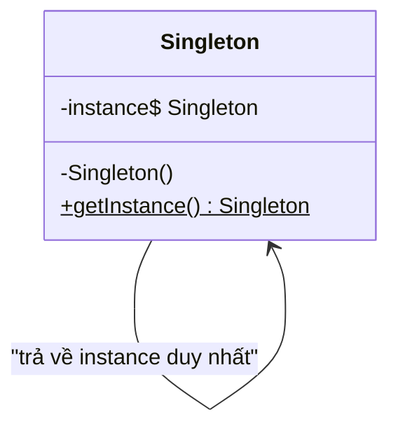
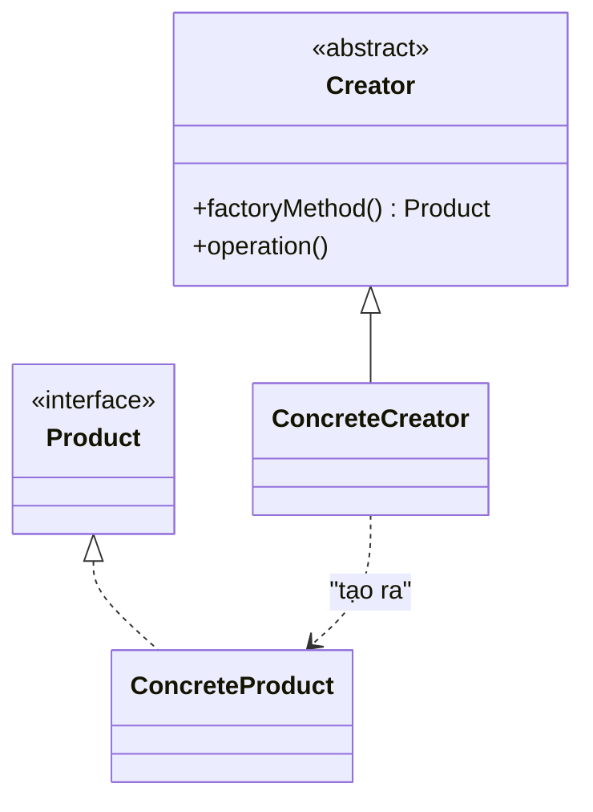
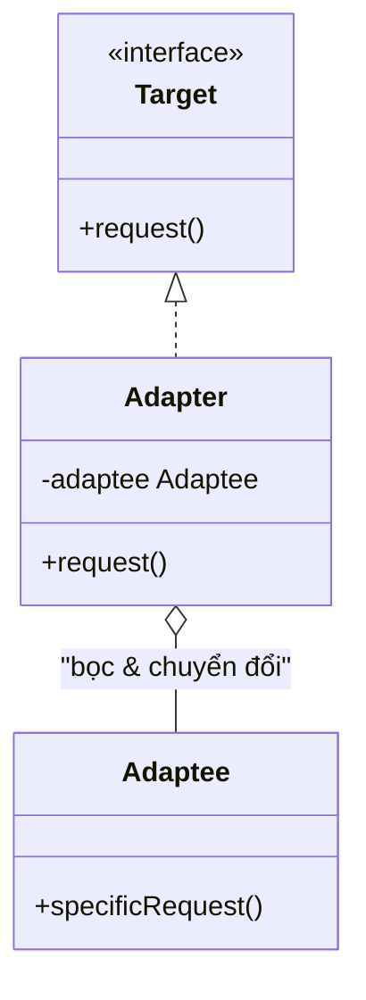
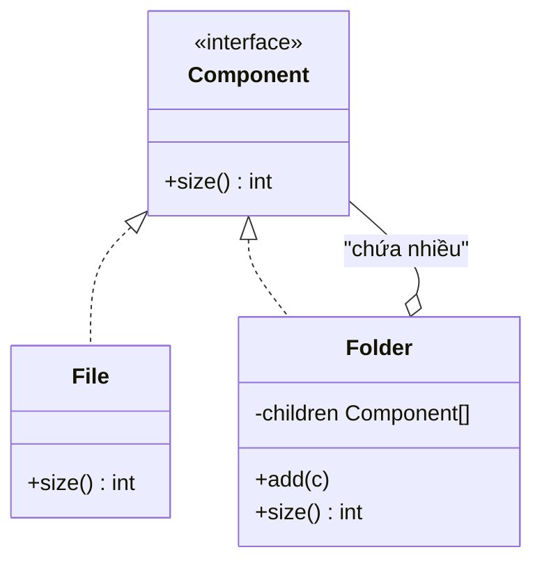
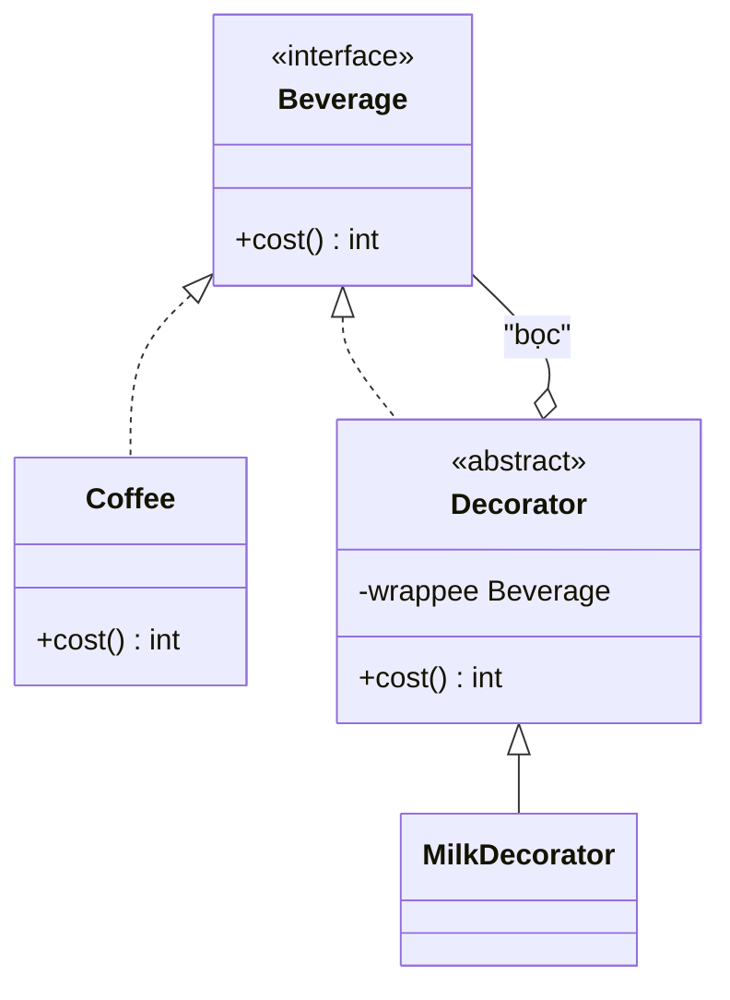
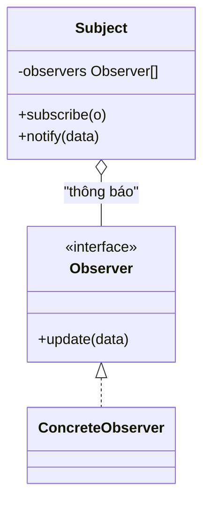
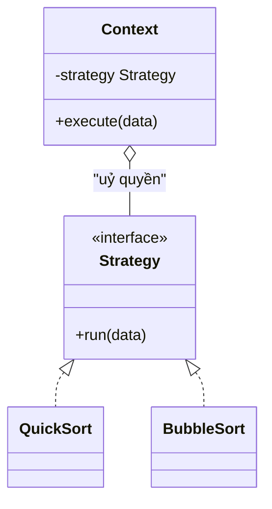

# Mẫu thiết kế (Design Patterns)

## Khái niệm
Mẫu thiết kế (design patterns) là các giải pháp tổng quát, đã được kiểm chứng cho những vấn đề thường gặp trong thiết kế phần mềm hướng đối tượng. Chúng không phải mã nguồn hoàn chỉnh mà là "khuôn mẫu" mô tả cách tổ chức lớp (class) và đối tượng (object) sao cho hệ thống dễ mở rộng, dễ bảo trì và giảm phụ thuộc chặt (tight coupling).

Bộ mẫu kinh điển đến từ nhóm **Gang of Four (GoF)** trong cuốn *Design Patterns: Elements of Reusable Object-Oriented Software* (1994), gồm **23 mẫu** chia thành ba nhóm: khởi tạo (creational), cấu trúc (structural) và hành vi (behavioral).

## Vì sao quan trọng
Mẫu thiết kế cung cấp một **từ vựng chung** cho lập trình viên: chỉ cần nói "dùng Observer" là mọi người hiểu cấu trúc. Chúng giúp tránh "phát minh lại bánh xe", giảm lỗi và làm thiết kế linh hoạt trước thay đổi. Ba nguyên tắc nền tảng đứng sau hầu hết các mẫu:

- **Lập trình theo giao diện (interface), không theo cài đặt cụ thể.**
- **Ưu tiên kết hợp (composition) hơn kế thừa (inheritance).**
- **Đóng gói phần hay thay đổi**, tách nó khỏi phần ổn định.

## Bảng tổng hợp 23 mẫu GoF

| # | Mẫu | Nhóm | Công dụng cốt lõi |
|---|-----|------|-------------------|
| 1 | Singleton | Khởi tạo | Đúng một thể hiện duy nhất, truy cập toàn cục |
| 2 | Factory Method | Khởi tạo | Lớp con quyết định lớp cụ thể nào được tạo |
| 3 | Abstract Factory | Khởi tạo | Tạo cả một họ đối tượng liên quan |
| 4 | Builder | Khởi tạo | Dựng đối tượng phức tạp theo từng bước |
| 5 | Prototype | Khởi tạo | Tạo đối tượng mới bằng cách sao chép (clone) |
| 6 | Adapter | Cấu trúc | Chuyển giao diện lớp này sang giao diện client cần |
| 7 | Bridge | Cấu trúc | Tách trừu tượng khỏi cài đặt để biến đổi độc lập |
| 8 | Composite | Cấu trúc | Xử lý cây phần–toàn thể đồng nhất |
| 9 | Decorator | Cấu trúc | Thêm hành vi động bằng cách bọc (wrap) |
| 10 | Facade | Cấu trúc | Giao diện đơn giản che hệ thống con phức tạp |
| 11 | Flyweight | Cấu trúc | Chia sẻ trạng thái chung để tiết kiệm bộ nhớ |
| 12 | Proxy | Cấu trúc | Đối tượng thay thế kiểm soát truy cập |
| 13 | Chain of Responsibility | Hành vi | Chuyền yêu cầu dọc chuỗi bộ xử lý |
| 14 | Command | Hành vi | Đóng gói yêu cầu thành đối tượng (undo, queue) |
| 15 | Interpreter | Hành vi | Diễn giải câu theo văn phạm (grammar) |
| 16 | Iterator | Hành vi | Duyệt tuần tự mà không lộ cấu trúc trong |
| 17 | Mediator | Hành vi | Trung gian điều phối tương tác nhiều đối tượng |
| 18 | Memento | Hành vi | Lưu/khôi phục trạng thái, giữ đóng gói |
| 19 | Observer | Hành vi | Thông báo tự động quan hệ một–nhiều |
| 20 | State | Hành vi | Đổi hành vi theo trạng thái nội bộ |
| 21 | Strategy | Hành vi | Hoán đổi thuật toán tại thời điểm chạy |
| 22 | Template Method | Hành vi | Khung thuật toán ở lớp cha, bước ở lớp con |
| 23 | Visitor | Hành vi | Tách thao tác khỏi cấu trúc đối tượng |

---

# Nhóm khởi tạo (Creational Patterns)

Nhóm này trừu tượng hoá **cách tạo đối tượng**, tách client khỏi việc phải biết lớp cụ thể được khởi tạo.

## 1. Singleton
- **Ý tưởng / vấn đề:** Đảm bảo một lớp chỉ có **duy nhất một thể hiện** và cung cấp điểm truy cập toàn cục tới nó. Giải quyết nhu cầu chia sẻ một tài nguyên chung (cấu hình, kết nối, bộ đếm) mà nhiều biến toàn cục rời rạc không kiểm soát được.
- **Khi nào dùng:** Bộ ghi nhật ký (logger), quản lý cấu hình, hồ kết nối (connection pool), bộ nhớ đệm (cache) dùng chung toàn ứng dụng.
- **Cạm bẫy:** Trở thành trạng thái toàn cục ẩn khó kiểm thử; cần chú ý an toàn luồng (thread-safety) khi khởi tạo lười (lazy).



=== "JavaScript"
    ```js
    class Logger {
      constructor() {
        if (Logger._instance) return Logger._instance; // trả về thể hiện cũ
        this.logs = [];
        Logger._instance = this;
      }
      log(msg) { this.logs.push(msg); }
    }
    const a = new Logger();
    const b = new Logger();
    console.log(a === b); // true — cùng một đối tượng
    ```
=== "Python"
    ```python
    class Logger:
        _instance = None
        def __new__(cls):
            if cls._instance is None:            # khởi tạo lười
                cls._instance = super().__new__(cls)
                cls._instance.logs = []
            return cls._instance

    a, b = Logger(), Logger()
    assert a is b  # cùng một thể hiện
    ```

## 2. Factory Method (Phương thức nhà máy)
- **Ý tưởng / vấn đề:** Định nghĩa một giao diện để tạo đối tượng nhưng **để lớp con quyết định** lớp cụ thể nào được khởi tạo. Tránh việc client gọi trực tiếp `new LopCuThe()` rải rác khắp nơi.
- **Khi nào dùng:** Khi lớp cha không biết trước loại đối tượng cần tạo; khi muốn tập trung logic khởi tạo về một chỗ để dễ mở rộng.
- **Cạm bẫy:** Sinh nhiều lớp con nếu mỗi sản phẩm cần một nhà máy riêng.



=== "JavaScript"
    ```js
    class Transport { deliver() {} }
    class Truck extends Transport { deliver() { return "giao bằng xe tải"; } }
    class Ship  extends Transport { deliver() { return "giao bằng tàu"; } }

    class Logistics {                 // Creator
      createTransport() {}            // factory method
      planDelivery() { return this.createTransport().deliver(); }
    }
    class RoadLogistics extends Logistics { createTransport() { return new Truck(); } }
    class SeaLogistics  extends Logistics { createTransport() { return new Ship();  } }

    console.log(new RoadLogistics().planDelivery()); // giao bằng xe tải
    ```
=== "Python"
    ```python
    from abc import ABC, abstractmethod

    class Transport(ABC):
        @abstractmethod
        def deliver(self) -> str: ...

    class Truck(Transport):
        def deliver(self): return "giao bằng xe tải"
    class Ship(Transport):
        def deliver(self): return "giao bằng tàu"

    class Logistics(ABC):
        @abstractmethod
        def create_transport(self) -> Transport: ...  # factory method
        def plan_delivery(self): return self.create_transport().deliver()

    class RoadLogistics(Logistics):
        def create_transport(self): return Truck()

    print(RoadLogistics().plan_delivery())  # giao bằng xe tải
    ```

## 3. Abstract Factory (Nhà máy trừu tượng)
- **Ý tưởng / vấn đề:** Cung cấp giao diện tạo ra **một họ (family) các đối tượng liên quan** mà không cần chỉ định lớp cụ thể, đảm bảo các sản phẩm trong họ luôn tương thích với nhau.
- **Khi nào dùng:** Giao diện người dùng đa nền tảng (nút, hộp thoại cho Windows/macOS); bộ driver cơ sở dữ liệu theo hãng.
- **Cạm bẫy:** Thêm một loại sản phẩm mới vào họ đòi hỏi sửa toàn bộ các nhà máy.

=== "JavaScript"
    ```js
    class WinButton  { render() { return "[Nút Windows]"; } }
    class MacButton  { render() { return "(Nút macOS)"; } }

    class WinFactory { createButton() { return new WinButton(); } }
    class MacFactory { createButton() { return new MacButton(); } }

    function buildUI(factory) { return factory.createButton().render(); }
    console.log(buildUI(new MacFactory())); // (Nút macOS)
    ```
=== "Python"
    ```python
    class WinButton:
        def render(self): return "[Nút Windows]"
    class MacButton:
        def render(self): return "(Nút macOS)"

    class WinFactory:
        def create_button(self): return WinButton()
    class MacFactory:
        def create_button(self): return MacButton()

    def build_ui(factory): return factory.create_button().render()
    print(build_ui(MacFactory()))  # (Nút macOS)
    ```

## 4. Builder (Người dựng)
- **Ý tưởng / vấn đề:** Tách việc xây dựng một đối tượng phức tạp khỏi biểu diễn của nó, cho phép dựng **từng bước** và tái dùng quy trình dựng cho nhiều biểu diễn khác nhau. Tránh "hàm khởi tạo khổng lồ" với hàng chục tham số.
- **Khi nào dùng:** Đối tượng cấu hình nhiều tham số tuỳ chọn, câu truy vấn SQL, tài liệu HTML/PDF.
- **Cạm bẫy:** Tăng số lớp; với ngôn ngữ hỗ trợ tham số tên (named args) đôi khi thừa thãi.

=== "JavaScript"
    ```js
    class Burger {
      constructor() { this.parts = []; }
      toString() { return "Burger: " + this.parts.join(", "); }
    }
    class BurgerBuilder {
      constructor() { this.burger = new Burger(); }
      addCheese() { this.burger.parts.push("phô mai"); return this; } // chuỗi hoá
      addBacon()  { this.burger.parts.push("thịt xông khói"); return this; }
      build() { return this.burger; }
    }
    console.log(new BurgerBuilder().addCheese().addBacon().build().toString());
    ```
=== "Python"
    ```python
    class Burger:
        def __init__(self): self.parts = []
        def __str__(self): return "Burger: " + ", ".join(self.parts)

    class BurgerBuilder:
        def __init__(self): self.burger = Burger()
        def add_cheese(self): self.burger.parts.append("phô mai"); return self
        def add_bacon(self):  self.burger.parts.append("thịt xông khói"); return self
        def build(self): return self.burger

    print(BurgerBuilder().add_cheese().add_bacon().build())
    ```

## 5. Prototype (Nguyên mẫu)
- **Ý tưởng / vấn đề:** Tạo đối tượng mới bằng cách **sao chép (clone)** một nguyên mẫu có sẵn thay vì khởi tạo từ đầu, giúp tránh chi phí khởi tạo tốn kém và giữ nguyên trạng thái hiện tại.
- **Khi nào dùng:** Khi khởi tạo tốn kém (đọc DB, tính toán nặng); khi cần nhân bản đối tượng cấu hình sẵn.
- **Cạm bẫy:** Sao chép sâu (deep copy) đối tượng có tham chiếu lồng nhau rất dễ sai.

=== "JavaScript"
    ```js
    class Shape {
      constructor(x, y) { this.x = x; this.y = y; }
      clone() { return new Shape(this.x, this.y); } // trả bản sao
    }
    const a = new Shape(1, 2);
    const b = a.clone();
    b.x = 99;
    console.log(a.x, b.x); // 1 99 — độc lập
    ```
=== "Python"
    ```python
    import copy
    class Shape:
        def __init__(self, x, y): self.x, self.y = x, y
        def clone(self): return copy.deepcopy(self)  # sao chép sâu

    a = Shape(1, 2)
    b = a.clone(); b.x = 99
    print(a.x, b.x)  # 1 99
    ```

---

# Nhóm cấu trúc (Structural Patterns)

Nhóm này tổ chức lớp và đối tượng thành **cấu trúc lớn hơn**, giữ cho hệ thống linh hoạt và hiệu quả.

## 6. Adapter (Bộ chuyển đổi)
- **Ý tưởng / vấn đề:** Chuyển giao diện của một lớp thành giao diện khác mà client mong đợi, giúp hai lớp có giao diện **không tương thích** làm việc cùng nhau.
- **Khi nào dùng:** Tích hợp thư viện cũ/bên thứ ba; bọc API có định dạng khác.
- **Cạm bẫy:** Nhiều tầng adapter chồng nhau làm khó lần vết.



=== "JavaScript"
    ```js
    class OldPrinter { printOld(text) { return "IN: " + text; } }   // Adaptee
    class PrinterAdapter {                                          // Adapter
      constructor(old) { this.old = old; }
      print(text) { return this.old.printOld(text); }              // giao diện mới
    }
    console.log(new PrinterAdapter(new OldPrinter()).print("xin chào"));
    ```
=== "Python"
    ```python
    class OldPrinter:
        def print_old(self, text): return "IN: " + text

    class PrinterAdapter:
        def __init__(self, old): self.old = old
        def print(self, text): return self.old.print_old(text)

    print(PrinterAdapter(OldPrinter()).print("xin chào"))
    ```

## 7. Bridge (Cầu nối)
- **Ý tưởng / vấn đề:** Tách phần **trừu tượng (abstraction)** khỏi phần **cài đặt (implementation)** để hai bên biến đổi độc lập, tránh bùng nổ tổ hợp lớp khi cả hai chiều đều có nhiều biến thể.
- **Khi nào dùng:** Hình dạng × cách vẽ; điều khiển từ xa × thiết bị; thông báo × kênh gửi.
- **Cạm bẫy:** Tăng độ phức tạp khi hệ thống nhỏ chưa cần.

=== "JavaScript"
    ```js
    class Red   { fill() { return "đỏ"; } }        // Implementation
    class Blue  { fill() { return "xanh"; } }
    class Shape {                                  // Abstraction
      constructor(color) { this.color = color; }
    }
    class Circle extends Shape {
      draw() { return `hình tròn màu ${this.color.fill()}`; }
    }
    console.log(new Circle(new Red()).draw()); // hình tròn màu đỏ
    ```
=== "Python"
    ```python
    class Red:
        def fill(self): return "đỏ"
    class Blue:
        def fill(self): return "xanh"

    class Shape:
        def __init__(self, color): self.color = color
    class Circle(Shape):
        def draw(self): return f"hình tròn màu {self.color.fill()}"

    print(Circle(Red()).draw())  # hình tròn màu đỏ
    ```

## 8. Composite (Kết hợp)
- **Ý tưởng / vấn đề:** Tổ chức đối tượng thành **cấu trúc cây** và xử lý đối tượng đơn lẻ (leaf) lẫn nhóm (composite) theo **cùng một giao diện**.
- **Khi nào dùng:** Cây thư mục, menu lồng nhau, cây DOM, tổ chức nhân sự.
- **Cạm bẫy:** Giao diện chung quá rộng khiến leaf phải cài phương thức vô nghĩa (như `add`).



=== "JavaScript"
    ```js
    class File   { constructor(s) { this.s = s; } size() { return this.s; } }
    class Folder {
      constructor() { this.children = []; }
      add(c) { this.children.push(c); return this; }
      size() { return this.children.reduce((t, c) => t + c.size(), 0); } // đệ quy
    }
    const root = new Folder().add(new File(10)).add(new Folder().add(new File(5)));
    console.log(root.size()); // 15
    ```
=== "Python"
    ```python
    class File:
        def __init__(self, s): self.s = s
        def size(self): return self.s
    class Folder:
        def __init__(self): self.children = []
        def add(self, c): self.children.append(c); return self
        def size(self): return sum(c.size() for c in self.children)

    root = Folder()
    root.add(File(10))
    root.add(Folder().add(File(5)))
    print(root.size())  # 15
    ```

## 9. Decorator (Trang trí)
- **Ý tưởng / vấn đề:** Bổ sung trách nhiệm mới cho đối tượng **một cách linh hoạt** bằng cách bọc nó trong lớp trang trí có cùng giao diện — thay thế linh hoạt cho kế thừa tĩnh.
- **Khi nào dùng:** Thêm chức năng (nén, mã hoá, log) cho luồng dữ liệu; thêm topping cho đồ uống.
- **Cạm bẫy:** Nhiều lớp bọc lồng nhau gây khó gỡ lỗi.



=== "JavaScript"
    ```js
    class Coffee { cost() { return 20; } }
    class MilkDecorator {                       // bọc, cùng giao diện cost()
      constructor(b) { this.b = b; }
      cost() { return this.b.cost() + 5; }
    }
    console.log(new MilkDecorator(new MilkDecorator(new Coffee())).cost()); // 30
    ```
=== "Python"
    ```python
    class Coffee:
        def cost(self): return 20
    class MilkDecorator:
        def __init__(self, b): self.b = b
        def cost(self): return self.b.cost() + 5

    print(MilkDecorator(MilkDecorator(Coffee())).cost())  # 30
    ```

## 10. Facade (Mặt tiền)
- **Ý tưởng / vấn đề:** Cung cấp một giao diện **đơn giản, thống nhất** che giấu độ phức tạp của một hệ thống con gồm nhiều lớp.
- **Khi nào dùng:** Đóng gói nhiều API phức tạp (khởi động rạp phim tại nhà, thư viện đa bước) thành một lời gọi dễ dùng.
- **Cạm bẫy:** Facade dễ phình thành "god object" ôm quá nhiều trách nhiệm.

=== "JavaScript"
    ```js
    class CPU { boot() { return "CPU chạy"; } }
    class Disk { load() { return "Đọc đĩa"; } }
    class Computer {                     // Facade
      start() { return [new CPU().boot(), new Disk().load()].join(" + "); }
    }
    console.log(new Computer().start()); // CPU chạy + Đọc đĩa
    ```
=== "Python"
    ```python
    class CPU:
        def boot(self): return "CPU chạy"
    class Disk:
        def load(self): return "Đọc đĩa"
    class Computer:
        def start(self): return " + ".join([CPU().boot(), Disk().load()])

    print(Computer().start())  # CPU chạy + Đọc đĩa
    ```

## 11. Flyweight (Hạng nhẹ)
- **Ý tưởng / vấn đề:** Chia sẻ phần **trạng thái nội tại (intrinsic)** chung giữa nhiều đối tượng để tiết kiệm bộ nhớ; phần **trạng thái ngoại lai (extrinsic)** được truyền vào khi dùng.
- **Khi nào dùng:** Hiển thị hàng nghìn ký tự/glyph phông chữ, hạt (particle) trong game, ô bản đồ.
- **Cạm bẫy:** Tách trạng thái nội tại/ngoại lai làm mã khó đọc; chỉ đáng khi số lượng đối tượng rất lớn.

=== "JavaScript"
    ```js
    class TreeType { constructor(name) { this.name = name; } } // trạng thái chung
    const pool = {};
    function getType(name) {                    // factory dùng lại thể hiện
      return pool[name] || (pool[name] = new TreeType(name));
    }
    const a = getType("thông"), b = getType("thông");
    console.log(a === b); // true — chỉ một đối tượng cho "thông"
    ```
=== "Python"
    ```python
    class TreeType:
        def __init__(self, name): self.name = name

    _pool = {}
    def get_type(name):
        if name not in _pool: _pool[name] = TreeType(name)
        return _pool[name]

    print(get_type("thông") is get_type("thông"))  # True
    ```

## 12. Proxy (Đại diện)
- **Ý tưởng / vấn đề:** Cung cấp một đối tượng **thay thế** kiểm soát truy cập tới đối tượng gốc, xen vào trước/sau khi chuyển tiếp lời gọi.
- **Khi nào dùng:** Nạp lười (lazy loading), kiểm soát quyền, bộ nhớ đệm, proxy từ xa (remote proxy).
- **Cạm bẫy:** Thêm độ trễ/độ phức tạp; dễ nhầm với Decorator (Proxy kiểm soát truy cập, Decorator thêm hành vi).

=== "JavaScript"
    ```js
    class RealImage {
      constructor(f) { this.f = f; console.log("Nạp " + f); } // tốn kém
      display() { return "hiển thị " + this.f; }
    }
    class ImageProxy {
      constructor(f) { this.f = f; this.real = null; }
      display() {
        if (!this.real) this.real = new RealImage(this.f); // nạp lười
        return this.real.display();
      }
    }
    const img = new ImageProxy("anh.png"); // chưa nạp
    console.log(img.display());            // giờ mới nạp
    ```
=== "Python"
    ```python
    class RealImage:
        def __init__(self, f): self.f = f; print("Nạp " + f)
        def display(self): return "hiển thị " + self.f
    class ImageProxy:
        def __init__(self, f): self.f = f; self.real = None
        def display(self):
            if self.real is None: self.real = RealImage(self.f)  # nạp lười
            return self.real.display()

    img = ImageProxy("anh.png")   # chưa nạp
    print(img.display())          # giờ mới nạp
    ```

---

# Nhóm hành vi (Behavioral Patterns)

Nhóm này phân chia **trách nhiệm và cách giao tiếp** giữa các đối tượng.

## 13. Chain of Responsibility (Chuỗi trách nhiệm)
- **Ý tưởng / vấn đề:** Chuyền yêu cầu dọc theo một **chuỗi các bộ xử lý** cho tới khi có bộ xử lý phù hợp, giúp người gửi không cần biết ai sẽ xử lý.
- **Khi nào dùng:** Middleware HTTP, xử lý sự kiện, phân cấp phê duyệt, lọc log theo mức.
- **Cạm bẫy:** Không đảm bảo yêu cầu được xử lý nếu không có mắt xích nào nhận.

=== "JavaScript"
    ```js
    class Handler {
      setNext(h) { this.next = h; return h; }
      handle(n) { return this.next ? this.next.handle(n) : "không ai xử lý"; }
    }
    class Positive extends Handler {
      handle(n) { return n > 0 ? "dương" : super.handle(n); }
    }
    class Zero extends Handler {
      handle(n) { return n === 0 ? "không" : super.handle(n); }
    }
    const h = new Positive(); h.setNext(new Zero());
    console.log(h.handle(0)); // không
    ```
=== "Python"
    ```python
    class Handler:
        def __init__(self): self.next = None
        def set_next(self, h): self.next = h; return h
        def handle(self, n): return self.next.handle(n) if self.next else "không ai xử lý"
    class Positive(Handler):
        def handle(self, n): return "dương" if n > 0 else super().handle(n)
    class Zero(Handler):
        def handle(self, n): return "không" if n == 0 else super().handle(n)

    h = Positive(); h.set_next(Zero())
    print(h.handle(0))  # không
    ```

## 14. Command (Lệnh)
- **Ý tưởng / vấn đề:** Đóng gói một yêu cầu thành **đối tượng**, cho phép tham số hoá, xếp hàng đợi, ghi nhật ký và **hoàn tác (undo)**.
- **Khi nào dùng:** Nút bấm giao diện, hàng đợi tác vụ, macro, undo/redo trong trình soạn thảo.
- **Cạm bẫy:** Mỗi thao tác một lớp lệnh làm tăng số lớp.

=== "JavaScript"
    ```js
    class AddCommand {
      constructor(doc, text) { this.doc = doc; this.text = text; }
      execute() { this.doc.push(this.text); }
      undo()    { this.doc.pop(); }             // hỗ trợ hoàn tác
    }
    const doc = [], history = [];
    const cmd = new AddCommand(doc, "xin chào");
    cmd.execute(); history.push(cmd);
    console.log(doc);            // ['xin chào']
    history.pop().undo();
    console.log(doc);            // []
    ```
=== "Python"
    ```python
    class AddCommand:
        def __init__(self, doc, text): self.doc, self.text = doc, text
        def execute(self): self.doc.append(self.text)
        def undo(self):    self.doc.pop()

    doc, history = [], []
    cmd = AddCommand(doc, "xin chào"); cmd.execute(); history.append(cmd)
    print(doc)              # ['xin chào']
    history.pop().undo()
    print(doc)              # []
    ```

## 15. Interpreter (Trình thông dịch)
- **Ý tưởng / vấn đề:** Định nghĩa biểu diễn cho **văn phạm (grammar)** của một ngôn ngữ và một trình diễn giải các câu trong ngôn ngữ đó.
- **Khi nào dùng:** Biểu thức toán học/logic đơn giản, quy tắc lọc, ngôn ngữ miền chuyên biệt (DSL) nhỏ.
- **Cạm bẫy:** Không phù hợp cho văn phạm phức tạp — khi đó dùng công cụ parser chuyên dụng.

=== "JavaScript"
    ```js
    class Num { constructor(v) { this.v = v; } eval() { return this.v; } }
    class Add {
      constructor(l, r) { this.l = l; this.r = r; }
      eval() { return this.l.eval() + this.r.eval(); } // diễn giải "l + r"
    }
    // Biểu thức (1 + 2) + 3
    console.log(new Add(new Add(new Num(1), new Num(2)), new Num(3)).eval()); // 6
    ```
=== "Python"
    ```python
    class Num:
        def __init__(self, v): self.v = v
        def eval(self): return self.v
    class Add:
        def __init__(self, l, r): self.l, self.r = l, r
        def eval(self): return self.l.eval() + self.r.eval()

    print(Add(Add(Num(1), Num(2)), Num(3)).eval())  # 6
    ```

## 16. Iterator (Lặp)
- **Ý tưởng / vấn đề:** Cung cấp cách **duyệt tuần tự** các phần tử của một tập hợp mà không lộ cấu trúc bên trong (mảng, cây, danh sách liên kết...).
- **Khi nào dùng:** Duyệt tập hợp tuỳ chỉnh với một giao diện thống nhất; hỗ trợ nhiều kiểu duyệt.
- **Cạm bẫy:** Với cấu trúc đơn giản, iterator dựng tay là thừa (ngôn ngữ đã có sẵn).

=== "JavaScript"
    ```js
    class Range {
      constructor(n) { this.n = n; }
      *[Symbol.iterator]() { for (let i = 0; i < this.n; i++) yield i; } // generator
    }
    console.log([...new Range(3)]); // [0, 1, 2]
    ```
=== "Python"
    ```python
    class Range:
        def __init__(self, n): self.n = n
        def __iter__(self):
            i = 0
            while i < self.n:
                yield i; i += 1

    print(list(Range(3)))  # [0, 1, 2]
    ```

## 17. Mediator (Trung gian)
- **Ý tưởng / vấn đề:** Đóng gói cách các đối tượng tương tác vào một **đối tượng trung gian**, biến mạng lưới phụ thuộc "mọi–với–mọi" thành hình sao, giảm ràng buộc chằng chịt.
- **Khi nào dùng:** Điều phối các thành phần giao diện phức tạp, phòng chat, điều khiển không lưu.
- **Cạm bẫy:** Mediator dễ phồng thành lớp trung tâm khổng lồ.

=== "JavaScript"
    ```js
    class ChatRoom {                        // Mediator
      show(user, msg) { return `[${user}]: ${msg}`; }
    }
    class User {
      constructor(name, room) { this.name = name; this.room = room; }
      send(msg) { return this.room.show(this.name, msg); } // qua trung gian
    }
    const room = new ChatRoom();
    console.log(new User("An", room).send("hi")); // [An]: hi
    ```
=== "Python"
    ```python
    class ChatRoom:
        def show(self, user, msg): return f"[{user}]: {msg}"
    class User:
        def __init__(self, name, room): self.name, self.room = name, room
        def send(self, msg): return self.room.show(self.name, msg)

    room = ChatRoom()
    print(User("An", room).send("hi"))  # [An]: hi
    ```

## 18. Memento (Kỷ vật)
- **Ý tưởng / vấn đề:** Lưu và khôi phục trạng thái trước đó của một đối tượng mà **không phá vỡ tính đóng gói** — trạng thái được đóng gói trong một "memento" mờ đục với bên ngoài.
- **Khi nào dùng:** Chức năng undo, ảnh chụp trạng thái (snapshot), checkpoint trong game.
- **Cạm bẫy:** Lưu nhiều snapshot lớn tốn bộ nhớ.

=== "JavaScript"
    ```js
    class Editor {
      constructor() { this.text = ""; }
      save()    { return this.text; }           // tạo memento
      restore(m) { this.text = m; }             // khôi phục
    }
    const e = new Editor(); e.text = "v1";
    const snap = e.save();
    e.text = "v2";
    e.restore(snap);
    console.log(e.text); // v1
    ```
=== "Python"
    ```python
    class Editor:
        def __init__(self): self.text = ""
        def save(self): return self.text
        def restore(self, m): self.text = m

    e = Editor(); e.text = "v1"
    snap = e.save(); e.text = "v2"; e.restore(snap)
    print(e.text)  # v1
    ```

## 19. Observer (Quan sát)
- **Ý tưởng / vấn đề:** Định nghĩa quan hệ **một–nhiều** để khi một đối tượng (subject) đổi trạng thái, mọi đối tượng phụ thuộc (observer) được **thông báo tự động**.
- **Khi nào dùng:** Hệ thống sự kiện, cập nhật giao diện, mô hình publish/subscribe, phản ứng dây chuyền dữ liệu.
- **Cạm bẫy:** Chuỗi thông báo lan man khó lần vết; rò rỉ bộ nhớ nếu quên huỷ đăng ký.



=== "JavaScript"
    ```js
    class Subject {
      constructor() { this.observers = []; }
      subscribe(o) { this.observers.push(o); }
      notify(data) { this.observers.forEach(o => o(data)); }
    }
    const s = new Subject();
    s.subscribe(d => console.log("A nhận:", d));
    s.subscribe(d => console.log("B nhận:", d));
    s.notify(42); // cả hai cùng nhận 42
    ```
=== "Python"
    ```python
    class Subject:
        def __init__(self): self.observers = []
        def subscribe(self, o): self.observers.append(o)
        def notify(self, data):
            for o in self.observers: o(data)

    s = Subject()
    s.subscribe(lambda d: print("A nhận:", d))
    s.subscribe(lambda d: print("B nhận:", d))
    s.notify(42)
    ```

## 20. State (Trạng thái)
- **Ý tưởng / vấn đề:** Cho phép một đối tượng thay đổi hành vi khi **trạng thái nội bộ** đổi, như thể nó đổi lớp — thay chuỗi `if/switch` theo trạng thái bằng các lớp trạng thái.
- **Khi nào dùng:** Máy trạng thái (state machine): đơn hàng, kết nối mạng (TCP), đèn giao thông.
- **Cạm bẫy:** Nhiều trạng thái sinh nhiều lớp; chuyển tiếp trạng thái rải rác khó theo dõi.

=== "JavaScript"
    ```js
    class RedLight   { next() { return new GreenLight(); } name() { return "đỏ"; } }
    class GreenLight { next() { return new RedLight();   } name() { return "xanh"; } }
    let light = new RedLight();
    console.log(light.name());        // đỏ
    light = light.next();
    console.log(light.name());        // xanh
    ```
=== "Python"
    ```python
    class RedLight:
        def next(self): return GreenLight()
        def name(self): return "đỏ"
    class GreenLight:
        def next(self): return RedLight()
        def name(self): return "xanh"

    light = RedLight(); print(light.name())   # đỏ
    light = light.next(); print(light.name())  # xanh
    ```

## 21. Strategy (Chiến lược)
- **Ý tưởng / vấn đề:** Đóng gói một **họ thuật toán** thành các lớp có thể **hoán đổi tại thời điểm chạy**, để client chọn thuật toán mà không sửa lớp dùng nó.
- **Khi nào dùng:** Nhiều cách sắp xếp/tính giá/thanh toán/nén khác nhau; thay chuỗi `if/else` lựa thuật toán.
- **Cạm bẫy:** Client phải biết sự khác biệt giữa các chiến lược để chọn đúng.



=== "JavaScript"
    ```js
    const strategies = {
      fast:   w => w * 5,   // giao nhanh, phí cao
      cheap:  w => w * 2,   // tiết kiệm
    };
    class Cart {
      constructor(strategy) { this.strategy = strategy; }
      fee(weight) { return this.strategy(weight); }
    }
    console.log(new Cart(strategies.cheap).fee(10)); // 20
    ```
=== "Python"
    ```python
    from abc import ABC, abstractmethod
    class Shipping(ABC):
        @abstractmethod
        def fee(self, w) -> float: ...
    class Fast(Shipping):
        def fee(self, w): return w * 5.0
    class Cheap(Shipping):
        def fee(self, w): return w * 2.0
    class Cart:
        def __init__(self, strategy): self.strategy = strategy
        def total(self, w): return self.strategy.fee(w)

    print(Cart(Cheap()).total(10))  # 20.0
    ```

## 22. Template Method (Phương thức khuôn mẫu)
- **Ý tưởng / vấn đề:** Định nghĩa **khung xương** của một thuật toán trong lớp cha, để lớp con định nghĩa (override) một số bước mà không đổi cấu trúc tổng thể.
- **Khi nào dùng:** Quy trình cố định nhưng có bước biến thể: phân tích tệp, quy trình build, thuật toán chơi game.
- **Cạm bẫy:** Dựa trên kế thừa nên cứng nhắc hơn Strategy (dùng composition).

=== "JavaScript"
    ```js
    class Game {
      play() { return [this.start(), this.end()].join(" -> "); } // khung cố định
      start() { return "bắt đầu"; }
      end()   { throw new Error("lớp con phải cài"); }
    }
    class Chess extends Game { end() { return "chiếu hết"; } }    // bước biến thể
    console.log(new Chess().play()); // bắt đầu -> chiếu hết
    ```
=== "Python"
    ```python
    from abc import ABC, abstractmethod
    class Game(ABC):
        def play(self): return f"{self.start()} -> {self.end()}"
        def start(self): return "bắt đầu"
        @abstractmethod
        def end(self): ...
    class Chess(Game):
        def end(self): return "chiếu hết"

    print(Chess().play())  # bắt đầu -> chiếu hết
    ```

## 23. Visitor (Người thăm)
- **Ý tưởng / vấn đề:** Tách một thuật toán khỏi **cấu trúc đối tượng** mà nó thao tác, cho phép thêm thao tác mới mà không sửa các lớp phần tử (element).
- **Khi nào dùng:** Thêm thao tác lên cây cú pháp (AST), báo cáo trên cấu trúc phức tạp, xuất nhiều định dạng.
- **Cạm bẫy:** Thêm loại element mới lại buộc sửa mọi visitor — ngược lại với ưu điểm chính.

=== "JavaScript"
    ```js
    class Circle { accept(v) { return v.visitCircle(this); } r = 2; }
    class Square { accept(v) { return v.visitSquare(this); } s = 3; }
    class AreaVisitor {                       // thao tác tách rời
      visitCircle(c) { return 3.14 * c.r * c.r; }
      visitSquare(s) { return s.s * s.s; }
    }
    const v = new AreaVisitor();
    console.log([new Circle(), new Square()].map(sh => sh.accept(v)));
    ```
=== "Python"
    ```python
    class Circle:
        r = 2
        def accept(self, v): return v.visit_circle(self)
    class Square:
        s = 3
        def accept(self, v): return v.visit_square(self)
    class AreaVisitor:
        def visit_circle(self, c): return 3.14 * c.r * c.r
        def visit_square(self, s): return s.s * s.s

    v = AreaVisitor()
    print([sh.accept(v) for sh in (Circle(), Square())])
    ```

---

## Playground: thử ngay trong trình duyệt

### Observer — hệ thống sự kiện phản ứng dây chuyền

<div class="js-demo" data-title="Observer: subject thông báo nhiều observer">
<textarea class="js-demo-src">
// Subject giữ danh sách observer và thông báo khi đổi trạng thái
class NhietKe {
  constructor() { this.observers = []; this.nhietDo = 0; }
  subscribe(fn) { this.observers.push(fn); }
  setNhietDo(t) {
    this.nhietDo = t;
    this.observers.forEach(fn => fn(t)); // thông báo tự động
  }
}

const nk = new NhietKe();
nk.subscribe(t => print('Màn hình hiển thị:', t + '°C'));
nk.subscribe(t => { if (t > 30) print('CẢNH BÁO: quá nóng!'); });
nk.subscribe(t => print('Ghi log nhiệt độ =', t));

print('--- Đặt 25°C ---'); nk.setNhietDo(25);
print('--- Đặt 35°C ---'); nk.setNhietDo(35);
</textarea>
</div>

### Strategy — hoán đổi thuật toán tính phí lúc chạy

<div class="js-demo" data-title="Strategy: đổi chiến lược vận chuyển">
<textarea class="js-demo-src">
// Mỗi chiến lược là một hàm; Context uỷ quyền cho hàm được tiêm vào
const chienLuoc = {
  nhanh:   w => w * 5,   // phí cao, giao nhanh
  tietKiem: w => w * 2,  // phí thấp, giao chậm
  mienPhi:  w => 0,      // khuyến mãi
};

class GioHang {
  constructor(fn) { this.tinhPhi = fn; }
  doiChienLuoc(fn) { this.tinhPhi = fn; } // hoán đổi lúc chạy
}

const gio = new GioHang(chienLuoc.nhanh);
print('Đơn 10kg giao nhanh:', gio.tinhPhi(10));
gio.doiChienLuoc(chienLuoc.tietKiem);
print('Đổi sang tiết kiệm:', gio.tinhPhi(10));
gio.doiChienLuoc(chienLuoc.mienPhi);
print('Khuyến mãi miễn phí:', gio.tinhPhi(10));
</textarea>
</div>

### Singleton — thể hiện duy nhất dùng chung

<div class="js-demo" data-title="Singleton: mọi lời gọi trả về cùng một đối tượng">
<textarea class="js-demo-src">
// getInstance luôn trả về cùng một đối tượng cấu hình
class Config {
  constructor() { this.data = {}; }
  static getInstance() {
    if (!Config._instance) Config._instance = new Config();
    return Config._instance;
  }
}

const a = Config.getInstance();
a.data.theme = 'tối';

const b = Config.getInstance();       // lấy lại cùng thể hiện
print('a === b ?', a === b);          // true
print('b thấy theme =', b.data.theme); // tối — chia sẻ trạng thái
</textarea>
</div>

---

## So sánh nhanh các mẫu dễ nhầm lẫn

Nhiều mẫu có cấu trúc tương tự nhưng khác **ý định (intent)** — đây là điểm phỏng vấn hay hỏi:

| Cặp mẫu | Điểm giống | Khác biệt về ý định |
|---------|-----------|----------------------|
| Adapter vs. Decorator | Đều bọc một đối tượng | Adapter *đổi* giao diện; Decorator *thêm* hành vi, giữ nguyên giao diện |
| Decorator vs. Proxy | Đều bọc và cùng giao diện | Decorator thêm chức năng; Proxy *kiểm soát truy cập* |
| Strategy vs. State | Đều đóng gói hành vi vào lớp | Strategy để client chọn thuật toán; State tự chuyển đổi theo trạng thái nội bộ |
| Factory Method vs. Abstract Factory | Đều tạo đối tượng | Factory Method tạo *một* sản phẩm qua kế thừa; Abstract Factory tạo *một họ* sản phẩm qua kết hợp |
| Composite vs. Decorator | Đều dùng cấu trúc cây/bọc | Composite biểu diễn quan hệ phần–toàn thể; Decorator gắn thêm trách nhiệm |
| Facade vs. Adapter | Đều bọc hệ thống khác | Facade *đơn giản hoá* nhiều lớp; Adapter *chuyển đổi* một giao diện |
| Strategy vs. Template Method | Đều đóng gói biến thể thuật toán | Strategy dùng composition (đổi lúc chạy); Template Method dùng kế thừa (cố định lúc dịch) |

## Mẹo chọn và áp dụng mẫu
- **Bắt đầu từ vấn đề, không từ mẫu.** Đừng ép một mẫu vào chỗ không cần; hãy để nhu cầu tái cấu trúc (refactoring) dẫn tới mẫu phù hợp.
- **Ưu tiên kết hợp (composition) hơn kế thừa (inheritance).** Nhiều mẫu (Strategy, Decorator, Bridge) dựa trên nguyên tắc này để linh hoạt hơn.
- **Lập trình theo giao diện, không theo cài đặt cụ thể.** Đây là nền tảng để hoán đổi thành phần.
- **Nhận biết "mùi mã" (code smells):** chuỗi `if/else` dài (→ Strategy/State), khởi tạo rải rác (→ Factory), phụ thuộc trực tiếp lớp cụ thể (→ Dependency Injection), lớp làm quá nhiều việc (→ tách trách nhiệm).

## Mẫu ngoài GoF thường gặp trong thiết kế hệ thống
Ngoài 23 mẫu GoF, thực tế còn nhiều mẫu quan trọng ở tầng kiến trúc:
- **Dependency Injection (Tiêm phụ thuộc):** cung cấp phụ thuộc từ bên ngoài thay vì tự khởi tạo, giúp dễ kiểm thử và giảm phụ thuộc chặt.
- **Repository:** trừu tượng hoá lớp truy cập dữ liệu, tách logic nghiệp vụ khỏi chi tiết lưu trữ.
- **Model-View-Controller (MVC):** tách dữ liệu (Model), trình bày (View) và điều khiển (Controller).
- **Publish-Subscribe (Pub/Sub):** mở rộng của Observer cho hệ phân tán qua message broker.

## Ưu / nhược điểm
- **Ưu:** cung cấp giải pháp đã kiểm chứng, tạo từ vựng chung, tăng khả năng tái sử dụng và mở rộng, giảm phụ thuộc chặt.
- **Nhược:** dễ bị lạm dụng gây "kỹ thuật quá đà" (over-engineering); áp mẫu không phù hợp làm mã phức tạp không cần thiết; một số mẫu tăng số lượng lớp.

## Câu hỏi phỏng vấn thường gặp
1. Ba nhóm mẫu thiết kế GoF là gì? Cho ví dụ mỗi nhóm.
2. Singleton khác gì so với biến toàn cục (global variable)? Làm sao đảm bảo an toàn luồng?
3. Phân biệt Factory Method và Abstract Factory.
4. Adapter, Decorator và Proxy đều "bọc" đối tượng — điểm khác nhau về ý định là gì?
5. Khi nào dùng Strategy thay vì hàng loạt câu lệnh `if/else`?
6. Observer giải quyết vấn đề gì trong kiến trúc hướng sự kiện? Rủi ro rò rỉ bộ nhớ ở đâu?
7. Vì sao nên "ưu tiên kết hợp hơn kế thừa"? Mẫu nào minh hoạ nguyên tắc này?
8. Command hỗ trợ chức năng undo/redo như thế nào?
9. Facade và Adapter khác nhau ra sao về mục đích?
10. Cho một tình huống lạm dụng mẫu thiết kế (over-engineering) mà bạn từng gặp.

## Tham khảo
- *Design Patterns: Elements of Reusable Object-Oriented Software* — Gang of Four
- *Head First Design Patterns* — Freeman & Robson
- Xem thêm: [Nguyên lý thiết kế hướng đối tượng & SOLID](nguyen-ly-oop.md)
