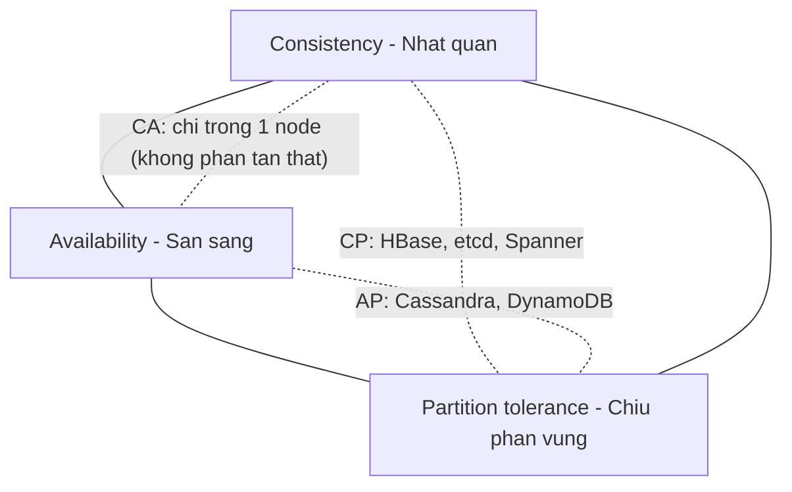
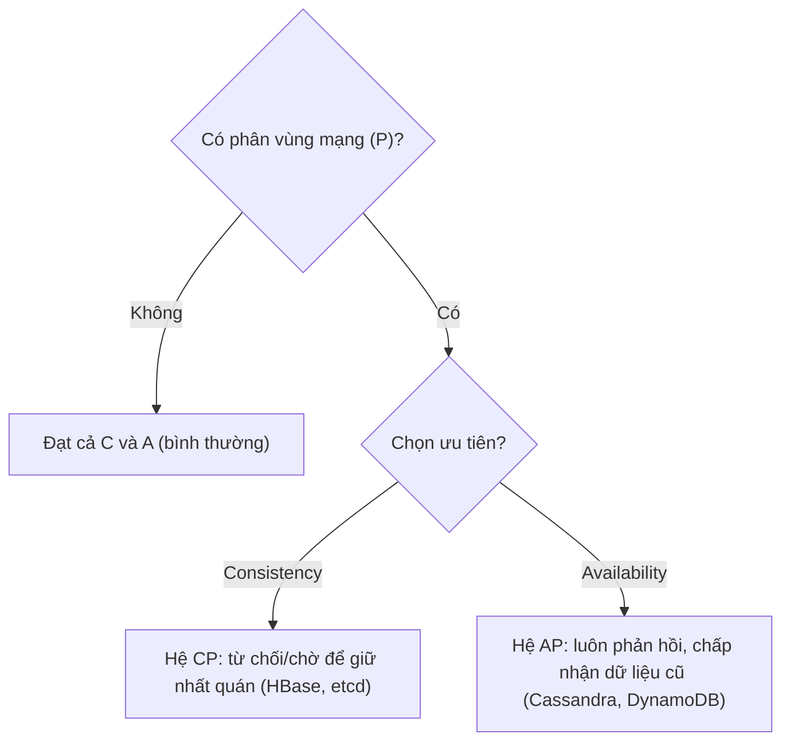
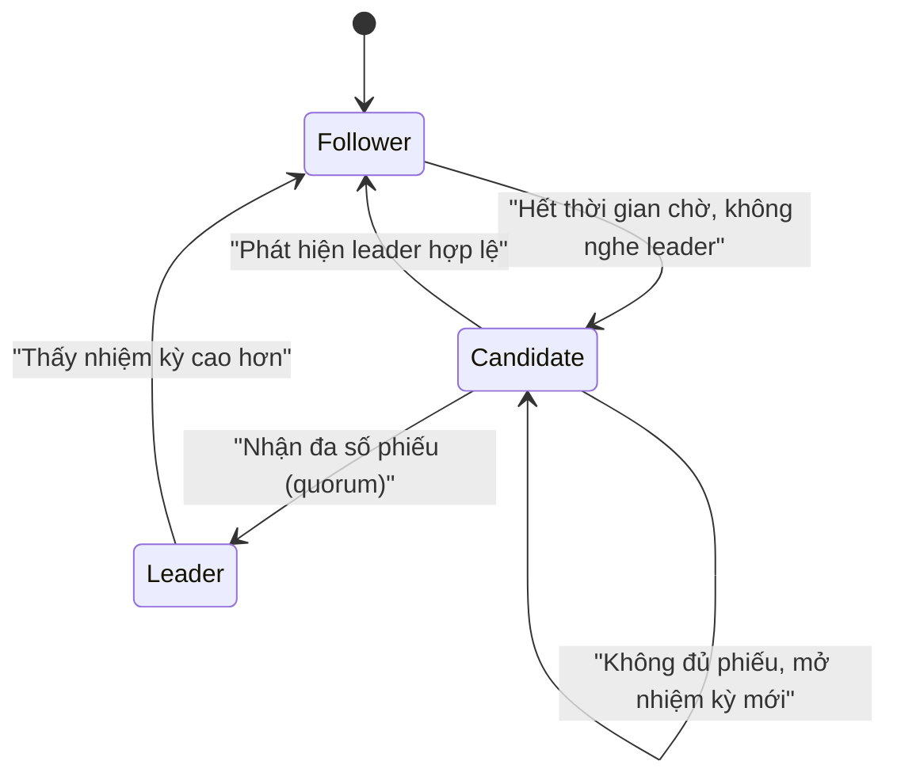
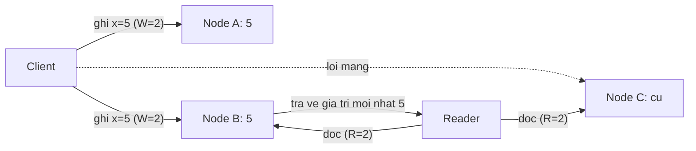

# Hệ phân tán (Distributed Systems)

## Khái niệm
Hệ phân tán (distributed system) là tập hợp các máy tính độc lập, kết nối qua mạng, phối hợp với nhau và với người dùng như thể là một hệ thống duy nhất, thống nhất. Vì các node có thể lỗi độc lập và mạng có thể chậm hay đứt, việc thiết kế hệ phân tán xoay quanh việc cân bằng giữa tính nhất quán (consistency), tính sẵn sàng (availability) và khả năng chịu lỗi (fault tolerance).

## Khi nào dùng / Vì sao quan trọng
Hầu hết hệ thống quy mô lớn (mạng xã hội, thương mại điện tử, ngân hàng, đám mây) đều là hệ phân tán vì không một máy nào đủ sức chứa toàn bộ dữ liệu/tải. Hiểu các mô hình nhất quán và cơ chế đồng thuận là cốt lõi để thiết kế hệ thống đáng tin cậy và trả lời các câu hỏi phỏng vấn thiết kế hệ thống.

## Cách hoạt động

### ACID vs. BASE
Hai triết lý đối lập về đảm bảo dữ liệu:

| ACID (thường ở CSDL quan hệ) | BASE (thường ở NoSQL phân tán) |
|------------------------------|--------------------------------|
| **A**tomicity — nguyên tử | **BA**sically **A**vailable — về cơ bản luôn sẵn sàng |
| **C**onsistency — nhất quán | **S**oft state — trạng thái mềm, có thể đổi theo thời gian |
| **I**solation — cô lập | **E**ventually consistent — nhất quán cuối cùng |
| **D**urability — bền vững | Ưu tiên tính sẵn sàng hơn nhất quán tức thời |

ACID phù hợp giao dịch tài chính cần chính xác tuyệt đối; BASE phù hợp hệ thống quy mô lớn cần sẵn sàng cao và chấp nhận trễ nhất quán.

### Nhất quán cuối cùng (Eventual Consistency)
Là mô hình nhất quán yếu (weak consistency) trong đó nếu không có cập nhật mới, tất cả các bản sao **cuối cùng** sẽ hội tụ về cùng một giá trị. Trong khoảng thời gian ngắn, các node có thể trả về giá trị khác nhau. Đổi lại, hệ thống đạt tính sẵn sàng cao và độ trễ thấp. Ví dụ: DNS, Amazon DynamoDB, Cassandra. Các biến thể mạnh hơn gồm **read-your-writes** và **causal consistency**.

### Định lý CAP (CAP Theorem)
Định lý CAP (Eric Brewer) phát biểu: trong một hệ phân tán, khi xảy ra **phân vùng mạng (network Partition — P)**, ta chỉ có thể chọn tối đa **một** trong hai:
- **Consistency (C)** — mọi lần đọc thấy dữ liệu mới nhất.
- **Availability (A)** — mọi yêu cầu đều nhận phản hồi (dù có thể cũ).

Vì phân vùng mạng là điều không thể tránh trong thực tế, lựa chọn thực chất là **CP** hay **AP**:
- **CP** (ví dụ HBase, MongoDB cấu hình mạnh, etcd): hy sinh sẵn sàng để giữ nhất quán.
- **AP** (ví dụ Cassandra, DynamoDB): hy sinh nhất quán tức thời để luôn phản hồi.

Mở rộng của CAP là **định lý PACELC**: khi có Partition thì chọn A hay C; Else (bình thường) thì đánh đổi giữa Latency và Consistency.

Sơ đồ tam giác CAP — mỗi hệ chỉ nằm trên một cạnh (chọn 2 trong 3 khi có phân vùng):



Sơ đồ ra quyết định theo CAP khi mạng bị phân vùng:



### Bầu leader & đồng thuận (Leader Election & Consensus)
Nhiều hệ phân tán cần một node "leader" điều phối (ví dụ node ghi duy nhất). Thuật toán đồng thuận (consensus) đảm bảo các node thống nhất về một giá trị/leader dù có lỗi:

- **Paxos**: thuật toán đồng thuận kinh điển, chứng minh đúng đắn về mặt lý thuyết nhưng khó hiểu và khó cài đặt. Dùng các vai trò proposer, acceptor, learner qua hai pha.
- **Raft**: thiết kế để **dễ hiểu hơn** Paxos với cùng độ mạnh. Chia bài toán thành: bầu leader (leader election), nhân bản nhật ký (log replication) và an toàn (safety). Node ở một trong ba trạng thái: follower, candidate, leader; leader được bầu qua bỏ phiếu đa số (majority quorum) theo từng nhiệm kỳ (term). Dùng trong etcd, Consul, TiKV.

Sơ đồ trạng thái bầu leader trong Raft:



### Khả năng chịu lỗi (Fault Tolerance)
Là khả năng hệ thống tiếp tục hoạt động đúng dù một số thành phần lỗi. Các kỹ thuật:
- **Dư thừa (redundancy)**: nhân bản dữ liệu và dịch vụ trên nhiều node/vùng.
- **Chuyển đổi dự phòng (failover)**: tự chuyển sang node dự phòng khi node chính hỏng.
- **Bỏ phiếu đa số (quorum)**: ghi/đọc thành công khi đủ số node đồng ý (ví dụ W + R > N).
- **Heartbeat & timeout**: phát hiện node chết.
- **Idempotency & retry**: thử lại an toàn khi lỗi tạm thời.
- **Chịu lỗi Byzantine (Byzantine fault tolerance)**: chịu được cả node "phản trắc" trả lời sai (dùng trong blockchain).

## CAP & PACELC — đào sâu và so sánh

CAP thường bị hiểu sai là "chọn 2 trong 3". Chính xác hơn: phân vùng mạng (P) là điều **bắt buộc phải chịu** trong hệ phân tán thực (mạng luôn có thể đứt/chậm), nên khi P xảy ra bạn chỉ được chọn **C hoặc A**. Khi mạng bình thường (không P), một hệ tốt có thể đạt **cả C và A** cùng lúc — đó là lỗ hổng mà **PACELC** lấp: *nếu Partition thì chọn A/C; Else (bình thường) thì đánh đổi Latency/Consistency*. Nghĩa là ngay cả lúc mạng ổn, muốn nhất quán mạnh (đồng bộ nhiều bản sao) vẫn phải trả giá bằng độ trễ.

| Hệ thống | Khi có Partition (PA/PC) | Khi bình thường (EL/EC) | Xếp loại PACELC |
|----------|--------------------------|--------------------------|-----------------|
| DynamoDB / Cassandra | PA (ưu tiên sẵn sàng) | EL (ưu tiên độ trễ) | **PA/EL** |
| MongoDB (mặc định) | PC (ưu tiên nhất quán) | EC (ưu tiên nhất quán) | **PC/EC** |
| Google Spanner | PC | EC (nhất quán mạnh nhờ TrueTime) | **PC/EC** |
| Cassandra (tinh chỉnh) | PA | EL | **PA/EL** |
| PostgreSQL (1 node) | — (không phân tán) | ưu tiên C | ~ **EC** |

## Eventual consistency — đào sâu

Nhất quán cuối cùng nói rằng nếu **ngừng ghi mới**, mọi bản sao sẽ hội tụ cùng giá trị "cuối cùng". Câu hỏi quan trọng là *hội tụ thế nào khi có xung đột*:

- **Last-Write-Wins (LWW)**: dùng timestamp, giá trị ghi sau thắng. Đơn giản nhưng có thể **mất cập nhật** nếu đồng hồ lệch.
- **Vector clock**: phát hiện ghi song song (concurrent) không có quan hệ nhân quả, để lộ xung đột cho tầng trên xử lý (như Dynamo).
- **CRDT (Conflict-free Replicated Data Types)**: cấu trúc dữ liệu tự hợp nhất không xung đột (bộ đếm G-Counter, tập OR-Set) — dùng trong soạn thảo cộng tác, Redis CRDT.
- **Read repair & anti-entropy**: khi đọc phát hiện bản sao lệch thì sửa ngay; nền chạy Merkle tree để đồng bộ dần (Cassandra).

Các mức đảm bảo lấy-người-dùng-làm-trung-tâm (client-centric) thường gặp: **read-your-writes** (thấy ghi của chính mình), **monotonic reads** (không "lùi" về giá trị cũ hơn), **monotonic writes** (ghi của một client áp dụng theo thứ tự), **writes-follow-reads**.

## Paxos vs. Raft — đào sâu và so sánh

Cả hai giải cùng bài toán **đồng thuận**: nhiều node thống nhất một giá trị/chuỗi lệnh dù có node lỗi (crash, không phản hồi — *không* xét node độc hại).

**Paxos** (Lamport) hoạt động theo hai pha với các vai trò *proposer / acceptor / learner*:
1. **Pha 1 (Prepare/Promise)**: proposer chọn số hiệu `n`, hỏi đa số acceptor; acceptor hứa không chấp nhận đề xuất số nhỏ hơn `n`, và trả về giá trị đã chấp nhận (nếu có).
2. **Pha 2 (Accept/Accepted)**: proposer gửi giá trị (giá trị đã chấp nhận cao nhất, hoặc giá trị của mình nếu chưa có) tới đa số; khi đa số chấp nhận thì giá trị được chốt.

*Multi-Paxos* tối ưu bằng cách bầu một leader ổn định để bỏ qua pha 1 lặp lại. Paxos đúng đắn nhưng nổi tiếng **khó hiểu và khó cài đúng**.

**Raft** chia bài toán thành ba mảnh dễ nắm:
1. **Bầu leader (leader election)**: node ở trạng thái follower; hết *election timeout* mà không nghe leader → thành candidate, tăng *term*, xin phiếu; nhận đa số → thành leader.
2. **Nhân bản nhật ký (log replication)**: leader nhận lệnh, ghi vào log, gửi `AppendEntries` tới follower; khi đa số ghi xong thì *commit* và áp dụng vào máy trạng thái.
3. **An toàn (safety)**: chỉ bầu leader có log đủ mới; một term chỉ một leader; entry đã commit không bao giờ mất.

| Tiêu chí | Paxos | Raft |
|----------|-------|------|
| Mục tiêu thiết kế | Đúng đắn lý thuyết | Dễ hiểu, dễ cài |
| Vai trò | proposer/acceptor/learner | leader/follower/candidate |
| Leader | Tuỳ chọn (Multi-Paxos) | Bắt buộc, trung tâm |
| Nhân bản log | Không quy định rõ | Quy định chặt chẽ |
| Độ khó cài đặt | Cao | Trung bình |
| Hệ dùng | Google Chubby, Spanner | etcd, Consul, TiKV, CockroachDB |

Điểm chung cốt lõi: **cần đa số (quorum = ⌊N/2⌋+1)** để tiến; cụm N node chịu được tối đa ⌊(N−1)/2⌋ node hỏng (5 node chịu 2 hỏng). Đây là lý do cụm đồng thuận thường có số node **lẻ**.

## Ví dụ

Sơ đồ quorum đọc/ghi với N = 3, W = 2, R = 2 (vì W + R > N nên tập ghi và tập đọc luôn giao nhau ≥ 1 node mới nhất):



```text
Bỏ phiếu đa số (quorum) với N = 3 bản sao, W = 2, R = 2:

  Ghi giá trị x = 5:
     Node A ✔ (5)   Node B ✔ (5)   Node C ✘ (mạng lỗi, vẫn = cũ)
     → W = 2 node xác nhận  ⇒ GHI THÀNH CÔNG

  Đọc x:
     Đọc Node B (5) + Node C (cũ) → R = 2
     Vì W + R = 4 > N = 3 ⇒ chắc chắn giao nhau ≥ 1 node mới nhất
     → trả về giá trị mới nhất (5)
```

## Các mô hình nhất quán (Consistency Models)

Nhất quán không phải chuyện "có hay không" mà là một phổ (spectrum), từ mạnh đến yếu:

| Mô hình | Đảm bảo | Đánh đổi |
|---------|---------|----------|
| Nhất quán tuyến tính (Linearizability) | Mọi thao tác như xảy ra tức thời theo thứ tự thực | Độ trễ cao, khó ở quy mô lớn |
| Nhất quán tuần tự (Sequential) | Mọi node thấy các thao tác theo cùng một thứ tự | Yếu hơn tuyến tính một chút |
| Nhất quán nhân quả (Causal) | Bảo toàn quan hệ nhân–quả giữa các thao tác | Không đảm bảo thứ tự các thao tác độc lập |
| Đọc-được-cái-vừa-ghi (Read-your-writes) | Người dùng luôn thấy ghi của chính mình | Người khác có thể thấy trễ |
| Nhất quán cuối cùng (Eventual) | Cuối cùng hội tụ nếu ngừng cập nhật | Có thể đọc dữ liệu cũ tạm thời |

## Các thách thức cốt lõi của hệ phân tán

- **Đồng hồ không đáng tin (unreliable clocks)**: đồng hồ vật lý giữa các máy lệch nhau; dùng **đồng hồ logic (logical clock)** như Lamport timestamp hoặc **vector clock** để suy ra thứ tự sự kiện.
- **Phát hiện lỗi (failure detection)**: khó phân biệt node chết thật với node chỉ chậm/mạng lag; dựa vào heartbeat + timeout, chấp nhận sai số.
- **Bài toán tướng Byzantine (Byzantine Generals)**: đạt đồng thuận khi một số node có thể gửi thông tin sai/độc hại — nền tảng của blockchain.
- **Exactly-once vs. at-least-once**: bảo đảm giao nhận thông điệp; "đúng một lần" rất khó, thường dùng "ít nhất một lần" + tính bất biến (idempotency).

## Sao chép dữ liệu (Replication) trong hệ phân tán
- **Single-leader (một leader)**: một node nhận ghi, nhân bản sang follower. Đơn giản, tránh xung đột ghi, nhưng leader là điểm nghẽn/lỗi.
- **Multi-leader (nhiều leader)**: nhiều node cùng nhận ghi, phù hợp đa vùng địa lý, nhưng phải giải quyết xung đột (conflict resolution).
- **Leaderless (không leader)**: mọi node nhận ghi/đọc, dùng quorum (Dynamo, Cassandra); cần cơ chế như read repair và hinted handoff.

## Ưu / nhược điểm
- **Ưu:** khả năng mở rộng cao, chịu lỗi tốt, tính sẵn sàng cao, không có điểm lỗi đơn nếu thiết kế đúng.
- **Nhược:** phức tạp cao; khó gỡ lỗi (debug) và kiểm thử; các đánh đổi CAP buộc hy sinh nhất quán hoặc sẵn sàng; đồng thuận tốn thêm độ trễ.

## Ứng dụng thực tế
- **Amazon DynamoDB / Cassandra (AP)**: ưu tiên sẵn sàng, dùng quorum điều chỉnh được và nhất quán cuối cùng cho quy mô cực lớn.
- **Google Spanner (CP nghiêng)**: dùng đồng hồ nguyên tử TrueTime để đạt nhất quán mạnh trên phạm vi toàn cầu.
- **etcd / ZooKeeper / Consul (CP)**: dùng đồng thuận (Raft/ZAB) để lưu cấu hình và điều phối cụm — ưu tiên nhất quán hơn sẵn sàng.
- **Kafka**: nhật ký phân tán bền vững, dùng bản sao (replica) và leader theo partition để chịu lỗi.
- **Blockchain**: đạt đồng thuận không cần tin cậy (trustless) giữa các node có thể phản trắc, dùng cơ chế như Proof of Work / Proof of Stake — một dạng chịu lỗi Byzantine.

## Kết nối với các chủ đề khác
Hệ phân tán là nền tảng lý thuyết cho [Khả năng mở rộng](scalability.md) (nhân bản, sharding), [Microservices](microservices-kien-truc.md) (saga, nhất quán cuối cùng) và [Thiết kế CSDL](thiet-ke-csdl.md) (NoSQL, quorum). Nắm vững CAP và các mô hình nhất quán giúp lý giải mọi đánh đổi kiến trúc ở các tầng đó.

## Câu hỏi phỏng vấn thường gặp
1. Phát biểu định lý CAP; cho ví dụ hệ thống CP và AP.
2. So sánh ACID và BASE; khi nào chọn mỗi loại.
3. Nhất quán cuối cùng là gì? Nêu vài biến thể nhất quán.
4. Vì sao Raft được xem là dễ hiểu hơn Paxos?
5. Công thức quorum W + R > N đảm bảo điều gì?
6. Các kỹ thuật đạt khả năng chịu lỗi trong hệ phân tán.
7. Định lý PACELC bổ sung gì cho CAP?
8. Vì sao đồng hồ vật lý không đáng tin? Vector clock giải quyết ra sao?
9. Phân biệt sao chép single-leader, multi-leader và leaderless.
10. "Exactly-once delivery" khó ở đâu, và idempotency giúp gì?

## Tham khảo
- *Designing Data-Intensive Applications* — Martin Kleppmann
- *Bài báo gốc: "In Search of an Understandable Consensus Algorithm (Raft)" — Ongaro & Ousterhout*
- Bài báo: "Dynamo: Amazon's Highly Available Key-value Store" — DeCandia et al.
- Xem thêm: [Khả năng mở rộng](scalability.md), [Kiến trúc Microservices](microservices-kien-truc.md)
