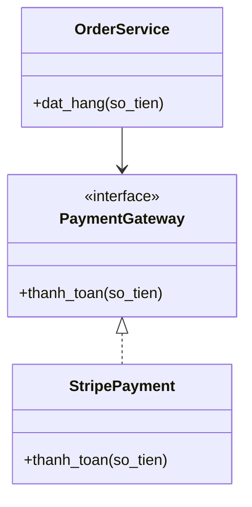

# Nguyên lý thiết kế hướng đối tượng & SOLID (OOP Design Principles & SOLID)

## Khái niệm
Nguyên lý thiết kế (design principles) là các quy tắc và hướng dẫn giúp viết mã dễ đọc, dễ bảo trì, dễ mở rộng và ít lỗi. Khác với mẫu thiết kế (là giải pháp cụ thể), nguyên lý là triết lý nền tảng định hướng cách ta cấu trúc mã. Nhóm quan trọng nhất là **SOLID** cùng các nguyên lý tổng quát như DRY, KISS, YAGNI và Law of Demeter.

## Khi nào dùng / Vì sao quan trọng
Áp dụng các nguyên lý này giúp giảm nợ kỹ thuật (technical debt), làm cho hệ thống chống chịu tốt trước thay đổi yêu cầu và giảm phụ thuộc chặt (tight coupling) giữa các thành phần. Trong phỏng vấn thiết kế, khả năng giải thích và áp dụng SOLID cho thấy tư duy thiết kế trưởng thành.

## Cách hoạt động

### Các nguyên lý tổng quát

- **DRY (Don't Repeat Yourself — Đừng lặp lại chính mình)**: Mỗi mẩu tri thức/logic chỉ nên tồn tại ở một nơi duy nhất trong hệ thống. Trùng lặp mã dẫn đến việc sửa một chỗ mà quên chỗ khác. *Cách áp dụng:* trích xuất logic lặp thành hàm, lớp hoặc mô-đun dùng chung.
- **KISS (Keep It Simple, Stupid — Giữ cho đơn giản)**: Ưu tiên giải pháp đơn giản nhất giải quyết được vấn đề. Sự phức tạp không cần thiết làm tăng khả năng phát sinh lỗi và khó bảo trì.
- **YAGNI (You Aren't Gonna Need It — Bạn sẽ không cần nó đâu)**: Đừng cài đặt chức năng chỉ vì "có thể sau này cần". Chỉ xây dựng những gì yêu cầu hiện tại đòi hỏi, tránh phình to không cần thiết.
- **Law of Demeter (Luật Demeter / nguyên lý ít hiểu biết nhất)**: Một đối tượng chỉ nên "nói chuyện" với các bạn bè gần gũi của nó, không truy sâu vào chuỗi đối tượng (tránh `a.b().c().d()`). Giảm phụ thuộc và tăng tính đóng gói (encapsulation).

### SOLID — 5 nguyên lý

**S — Single Responsibility Principle (SRP — Nguyên lý trách nhiệm đơn)**
Một lớp chỉ nên có một lý do để thay đổi, tức chỉ đảm nhận một trách nhiệm. Ví dụ: lớp `Invoice` không nên vừa tính toán, vừa in ấn, vừa lưu vào cơ sở dữ liệu — hãy tách thành `InvoiceCalculator`, `InvoicePrinter`, `InvoiceRepository`.

**O — Open/Closed Principle (OCP — Nguyên lý đóng/mở)**
Thực thể phần mềm nên **mở** cho việc mở rộng nhưng **đóng** cho việc sửa đổi. Ví dụ: thêm loại hình học mới bằng cách tạo lớp mới kế thừa `Shape` thay vì sửa hàm `tinh_dien_tich` với chuỗi if/else.

**L — Liskov Substitution Principle (LSP — Nguyên lý thay thế Liskov)**
Đối tượng của lớp con phải thay thế được cho đối tượng của lớp cha mà không làm hỏng tính đúng đắn của chương trình. Ví dụ điển hình sai: lớp `Square` kế thừa `Rectangle` nhưng ghi đè setter làm hỏng kỳ vọng về chiều rộng/cao độc lập.

**I — Interface Segregation Principle (ISP — Nguyên lý phân tách giao diện)**
Không nên buộc client phụ thuộc vào các phương thức mà nó không dùng. Hãy chia giao diện lớn thành nhiều giao diện nhỏ, chuyên biệt. Ví dụ: tách `Printer` khỏi `Scanner` thay vì một giao diện `Machine` khổng lồ.

**D — Dependency Inversion Principle (DIP — Nguyên lý đảo ngược phụ thuộc)**
Mô-đun cấp cao không nên phụ thuộc vào mô-đun cấp thấp; cả hai nên phụ thuộc vào trừu tượng (abstraction). Ví dụ: `OrderService` phụ thuộc vào giao diện `PaymentGateway` chứ không phụ thuộc trực tiếp lớp `StripePayment` cụ thể.

Sơ đồ lớp minh hoạ DIP: cả `OrderService` (cấp cao) và `StripePayment` (cấp thấp) đều phụ thuộc vào trừu tượng `PaymentGateway`:



## Ví dụ
```python
# Vi phạm SRP: một lớp làm quá nhiều việc
class BaoCao:
    def tao_du_lieu(self): ...
    def dinh_dang_pdf(self): ...   # trách nhiệm trình bày
    def gui_email(self): ...       # trách nhiệm gửi

# Tuân thủ SRP: tách trách nhiệm
class DuLieuBaoCao:
    def tao(self): ...

class TrinhBayPDF:
    def dinh_dang(self, du_lieu): ...

class GuiEmail:
    def gui(self, tep): ...

# Tuân thủ DIP: phụ thuộc vào trừu tượng
from abc import ABC, abstractmethod

class CongThanhToan(ABC):        # trừu tượng
    @abstractmethod
    def thanh_toan(self, so_tien): ...

class DichVuDonHang:
    def __init__(self, cong: CongThanhToan):
        self.cong = cong          # không phụ thuộc lớp cụ thể
    def dat_hang(self, so_tien):
        self.cong.thanh_toan(so_tien)
```

## Các nguyên lý bổ trợ

Ngoài SOLID và bộ tổng quát ở trên, một số nguyên lý khác thường xuất hiện trong phỏng vấn:

- **Composition over Inheritance (Ưu tiên kết hợp hơn kế thừa)**: kế thừa tạo phụ thuộc chặt và cây lớp cứng nhắc; kết hợp (chứa đối tượng khác) linh hoạt hơn và dễ thay đổi tại thời điểm chạy.
- **Separation of Concerns (Tách biệt mối quan tâm)**: mỗi phần của hệ thống chỉ giải quyết một khía cạnh (giao diện, nghiệp vụ, dữ liệu). Là nền tảng của kiến trúc phân tầng (layered architecture).
- **Encapsulation (Đóng gói)**: che giấu trạng thái nội bộ, chỉ lộ ra giao diện tối thiểu; giảm khả năng phá vỡ khi thay đổi.
- **Principle of Least Astonishment (Nguyên lý ít gây ngạc nhiên nhất)**: mã nên hành xử đúng như tên gọi/kỳ vọng của nó, tránh tác dụng phụ bất ngờ.

## Cân bằng giữa các nguyên lý

Các nguyên lý đôi khi kéo về hướng khác nhau, cần cân nhắc ngữ cảnh:

| Tình huống | Nguyên lý nhấn mạnh | Rủi ro nếu quá đà |
|-----------|---------------------|--------------------|
| Trừu tượng hoá trước cho "tương lai" | Bị YAGNI phản đối | Phình to, phức tạp thừa |
| Chia nhỏ mọi lớp theo SRP | SRP, ISP | Quá nhiều lớp vụn, khó theo dõi |
| Gộp logic để tránh lặp | DRY | Ghép nối sai các phần vốn nên độc lập |
| Giữ mọi thứ đơn giản | KISS | Bỏ qua trừu tượng cần thiết, khó mở rộng |

*Kinh nghiệm:* áp dụng nguyên lý khi có **nhu cầu thực tế** (đau ở đâu chữa ở đó), không áp dụng máy móc ngay từ dòng mã đầu tiên. Quy tắc "Rule of Three": chỉ trừu tượng hoá khi thấy một mẫu lặp lại lần thứ ba.

## Mối liên hệ với mẫu thiết kế
Nhiều mẫu thiết kế chính là hiện thực hoá của các nguyên lý SOLID: Strategy và Template Method áp dụng OCP; Dependency Injection áp dụng DIP; Adapter áp dụng SRP + OCP. Nắm nguyên lý giúp hiểu **vì sao** một mẫu tồn tại, không chỉ **cách** dùng nó.

## Ưu / nhược điểm
- **Ưu:** mã dễ đọc, dễ kiểm thử (testable), dễ mở rộng, giảm phụ thuộc chặt, giảm nợ kỹ thuật.
- **Nhược:** áp dụng cứng nhắc dễ dẫn tới quá nhiều lớp/giao diện nhỏ, làm tăng độ phức tạp cấu trúc; cần cân bằng với KISS và YAGNI.

## Ví dụ áp dụng Open/Closed Principle
```python
# VI PHẠM OCP: thêm hình mới phải sửa hàm tính diện tích
def tinh_dien_tich(hinh):
    if hinh.loai == "tron":
        return 3.14 * hinh.r ** 2
    elif hinh.loai == "vuong":       # mỗi loại mới → sửa hàm này
        return hinh.canh ** 2

# TUÂN THỦ OCP: mở rộng bằng lớp mới, không sửa mã cũ
from abc import ABC, abstractmethod

class Hinh(ABC):
    @abstractmethod
    def dien_tich(self) -> float: ...

class HinhTron(Hinh):
    def __init__(self, r): self.r = r
    def dien_tich(self): return 3.14 * self.r ** 2

class HinhVuong(Hinh):            # thêm hình mới: chỉ tạo lớp mới
    def __init__(self, canh): self.canh = canh
    def dien_tich(self): return self.canh ** 2

def tong_dien_tich(ds_hinh):     # không bao giờ phải sửa
    return sum(h.dien_tich() for h in ds_hinh)
```

## Câu hỏi phỏng vấn thường gặp
1. Giải thích từng chữ cái trong SOLID kèm ví dụ thực tế.
2. Phân biệt DRY và YAGNI — chúng có mâu thuẫn nhau không?
3. Cho một ví dụ vi phạm Liskov Substitution Principle và cách khắc phục.
4. Dependency Inversion khác gì với Dependency Injection?
5. Law of Demeter giúp giảm phụ thuộc như thế nào?
6. Vì sao "ưu tiên kết hợp hơn kế thừa"?
7. Quy tắc "Rule of Three" liên quan gì tới DRY?
8. Cho ví dụ vi phạm Single Responsibility Principle trong một lớp thực tế.
9. Open/Closed Principle được hiện thực hoá bằng mẫu thiết kế nào?
10. Khi nào việc áp dụng SOLID quá đà lại gây hại?

## Tham khảo
- *Clean Code* & *Agile Software Development* — Robert C. Martin (Uncle Bob)
- *The Pragmatic Programmer* — Hunt & Thomas
- Xem thêm: [Mẫu thiết kế (Design Patterns)](design-patterns.md)
