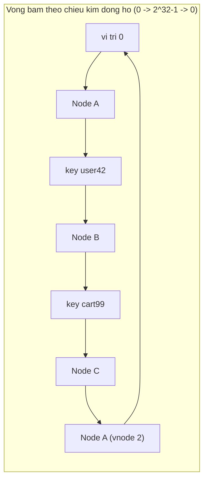
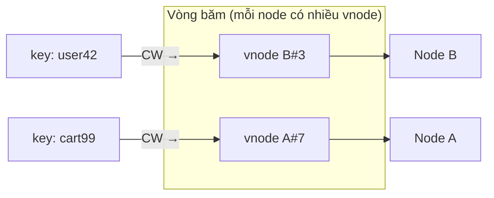
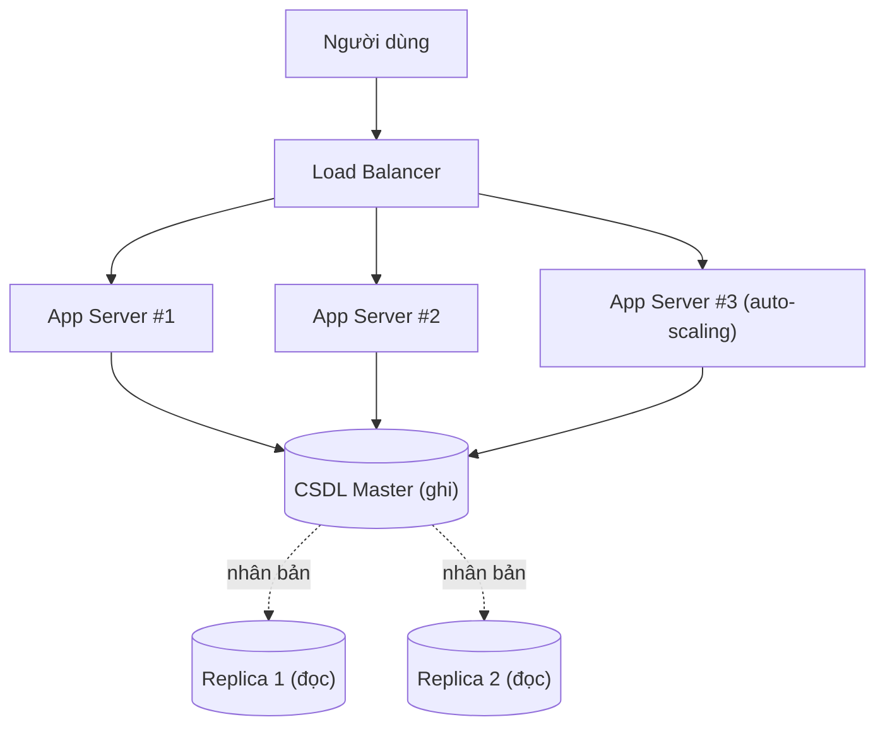

# Khả năng mở rộng (Scalability)

## Khái niệm
Khả năng mở rộng (scalability) là năng lực của một hệ thống xử lý được lượng công việc tăng lên (nhiều người dùng, nhiều dữ liệu, nhiều yêu cầu hơn) bằng cách bổ sung tài nguyên, mà vẫn giữ hiệu năng chấp nhận được. Một hệ thống mở rộng tốt cho phép tăng thông lượng gần tuyến tính với tài nguyên được thêm vào.

## Khi nào dùng / Vì sao quan trọng
Khi ứng dụng phát triển, một máy chủ đơn lẻ nhanh chóng chạm giới hạn về CPU, bộ nhớ, băng thông hay số kết nối. Thiết kế có tính mở rộng ngay từ đầu giúp tránh việc phải viết lại toàn bộ hệ thống khi lượng tải bùng nổ, đồng thời đảm bảo tính sẵn sàng cao (high availability) và độ trễ (latency) thấp.

## Cách hoạt động

### Mở rộng dọc vs. mở rộng ngang

| Tiêu chí | Mở rộng dọc (Vertical / Scale Up) | Mở rộng ngang (Horizontal / Scale Out) |
|----------|-----------------------------------|-----------------------------------------|
| Cách làm | Nâng cấp một máy mạnh hơn (thêm CPU, RAM) | Thêm nhiều máy chạy song song |
| Giới hạn | Bị chặn bởi phần cứng tối đa | Gần như không giới hạn |
| Chi phí | Tăng theo cấp số nhân | Tăng tuyến tính, dùng máy phổ thông |
| Điểm lỗi đơn | Có (single point of failure) | Giảm nhờ dư thừa (redundancy) |
| Độ phức tạp | Thấp | Cao (cần phối hợp, cân bằng tải) |

### Nhân bản (Replication) vs. phân mảnh (Partitioning)

- **Nhân bản (replication)**: Tạo nhiều bản sao giống nhau của cùng dữ liệu trên nhiều node. Tăng khả năng đọc (read scalability) và tính sẵn sàng. Mô hình phổ biến: **master-slave** (một node ghi, nhiều node đọc) và **multi-master**. Thách thức: giữ các bản sao đồng bộ (consistency).
- **Phân mảnh / phân vùng (partitioning / sharding)**: Chia tập dữ liệu lớn thành các mảnh (shard) nhỏ, mỗi mảnh nằm trên một node khác nhau. Tăng khả năng ghi (write scalability) và cho phép lưu tập dữ liệu vượt dung lượng một máy. Thách thức: chọn khoá phân mảnh (shard key) tốt để tránh "điểm nóng" (hotspot) và xử lý truy vấn liên mảnh.

Trong thực tế, hệ thống lớn kết hợp cả hai: dữ liệu được phân mảnh rồi mỗi mảnh lại được nhân bản.

### Băm nhất quán (Consistent Hashing)
Khi thêm/bớt node trong hệ phân tán, cách băm đơn giản `hash(key) % N` buộc phải sắp xếp lại gần như toàn bộ dữ liệu. **Băm nhất quán (consistent hashing)** đặt cả node và khoá lên một "vòng tròn băm" (hash ring); mỗi khoá thuộc về node kế tiếp theo chiều kim đồng hồ. Khi thêm/bớt một node, chỉ một phần nhỏ khoá bị dịch chuyển. **Node ảo (virtual nodes)** được dùng để phân bố tải đều hơn. Đây là nền tảng của DynamoDB, Cassandra, và nhiều bộ nhớ đệm phân tán.

### Cân bằng tải (Load Balancing)
Bộ cân bằng tải (load balancer) phân phối yêu cầu đến nhiều instance dịch vụ để không máy nào bị quá tải. Các thuật toán phổ biến:
- **Round Robin**: luân phiên lần lượt.
- **Least Connections**: gửi tới node đang có ít kết nối nhất.
- **IP Hash / Sticky Session**: cùng một client luôn tới cùng node (giữ phiên).
- **Weighted**: node mạnh hơn nhận nhiều tải hơn.

Load balancer hoạt động ở tầng 4 (TCP/UDP) hoặc tầng 7 (HTTP), thường kèm kiểm tra tình trạng (health check) để loại bỏ node hỏng. Ví dụ: NGINX, HAProxy, AWS ELB.

### Tự động mở rộng (Auto-Scaling)
Tự động mở rộng tự thêm hoặc bớt instance dựa trên số liệu thời gian thực (CPU, số yêu cầu, độ dài hàng đợi):
- **Reactive scaling**: phản ứng khi tải vượt ngưỡng.
- **Predictive / scheduled scaling**: dự đoán trước theo lịch (ví dụ giờ cao điểm).

Auto-scaling tiết kiệm chi phí (chỉ trả cho tài nguyên đang dùng) và duy trì hiệu năng khi tải biến động. Nó đòi hỏi dịch vụ phải **không trạng thái (stateless)** để instance mới có thể phục vụ ngay.

## Mở rộng dọc vs. ngang — đào sâu

**Mở rộng dọc (scale up)** phù hợp giai đoạn đầu: đơn giản, không cần đổi kiến trúc, giữ được nhất quán mạnh vì vẫn một máy/một CSDL. Nhưng nó có trần cứng (cỗ máy lớn nhất trên thị trường), chi phí tăng phi tuyến (máy gấp đôi sức mạnh thường đắt hơn gấp đôi), và vẫn là **điểm lỗi đơn** — máy chết là hệ thống chết.

**Mở rộng ngang (scale out)** gần như không giới hạn và loại bỏ điểm lỗi đơn nhờ dư thừa, nhưng đẩy độ phức tạp lên: cần cân bằng tải, đồng bộ trạng thái, xử lý nhất quán dữ liệu giữa các node, và đối mặt với các đánh đổi CAP. Quy tắc thực tế: **scale up trước cho đến khi chạm giới hạn hợp lý, rồi mới scale out** — nhưng thiết kế stateless ngay từ đầu để việc chuyển sang scale out không phải viết lại.

Một điểm dễ nhầm: mở rộng dọc và ngang **không loại trừ nhau**. Hệ thống lớn thường dùng nhiều máy khá mạnh (kết hợp cả hai) thay vì hàng nghìn máy tí hon hay một siêu máy duy nhất.

## Băm nhất quán — đào sâu

Với băm modulo `hash(key) % N`, khi N đổi (thêm/bớt node) **hầu hết** khoá đổi node vì mẫu số đổi. Ví dụ N=4 → N=5: khoảng 80% khoá phải di chuyển — thảm hoạ với cache (cache miss hàng loạt) và CSDL (rebalance khổng lồ).

**Băm nhất quán** giải bài toán này:

1. Ánh xạ không gian băm thành một **vòng tròn** (ví dụ 0 … 2³²−1, nối đuôi 0).
2. Băm mỗi **node** lên vòng (theo tên/IP) → mỗi node chiếm một điểm.
3. Băm mỗi **khoá** lên vòng; khoá thuộc về node **đầu tiên gặp khi đi theo chiều kim đồng hồ**.
4. Thêm node mới: chỉ các khoá nằm giữa node mới và node liền trước nó bị di chuyển — trung bình chỉ **K/N khoá** (K = tổng khoá). Bớt node: chỉ khoá của node đó chuyển sang node kế tiếp.

**Vấn đề phân bố lệch:** nếu chỉ đặt mỗi node một điểm, các cung trên vòng dài ngắn khác nhau → tải lệch. **Node ảo (virtual nodes / vnodes)** khắc phục: mỗi node vật lý được băm thành nhiều điểm ảo (ví dụ 100–200 vnode/node) rải khắp vòng. Càng nhiều vnode, phân bố càng đều và khi một node chết, tải của nó được chia đều cho các node còn lại thay vì dồn hết vào một node kế tiếp.

Sơ đồ vòng băm với node ảo:



Mỗi khoá đi theo chiều kim đồng hồ tới node đầu tiên gặp: `user42` thuộc Node B, `cart99` thuộc Node C. Khi thêm/bớt một node, chỉ các khoá trong cung liền kề bị dịch chuyển.



<div class="js-demo" data-title="Consistent hashing — phân bố key → node (có vnode)">
<textarea class="js-demo-src">
// Băm chuỗi đơn giản (FNV-1a rút gọn) -> số 32-bit không âm
function hashStr(s) {
  let h = 2166136261 >>> 0;
  for (let i = 0; i < s.length; i++) {
    h ^= s.charCodeAt(i);
    h = Math.imul(h, 16777619) >>> 0;
  }
  return h >>> 0;
}

// Xây vòng băm với node ảo
function buildRing(nodes, vnodesPerNode) {
  const ring = []; // {pos, node}
  for (const node of nodes)
    for (let v = 0; v < vnodesPerNode; v++)
      ring.push({ pos: hashStr(node + '#' + v), node });
  ring.sort((a, b) => a.pos - b.pos);
  return ring;
}

// Tìm node phụ trách một key: node đầu tiên theo chiều kim đồng hồ
function lookup(ring, key) {
  const h = hashStr(key);
  for (const e of ring) if (e.pos >= h) return e.node;
  return ring[0].node; // vòng lại đầu
}

function phanBo(nodes, vnodes, soKey) {
  const ring = buildRing(nodes, vnodes);
  const dem = Object.fromEntries(nodes.map(n => [n, 0]));
  for (let i = 0; i < soKey; i++) dem[lookup(ring, 'key' + i)]++;
  return dem;
}

const nodes = ['NodeA', 'NodeB', 'NodeC'];
const SO_KEY = 3000;

print('=== Chỉ 1 vnode/node (phân bố lệch) ===');
let d1 = phanBo(nodes, 1, SO_KEY);
for (const n of nodes) print(n + ': ' + d1[n] + ' key (' + (100*d1[n]/SO_KEY).toFixed(1) + '%)');

print('\n=== 150 vnode/node (phân bố đều hơn) ===');
let d2 = phanBo(nodes, 150, SO_KEY);
for (const n of nodes) print(n + ': ' + d2[n] + ' key (' + (100*d2[n]/SO_KEY).toFixed(1) + '%)');

// Thêm NodeD: đo tỉ lệ key phải di chuyển
const ringBefore = buildRing(nodes, 150);
const ringAfter  = buildRing([...nodes, 'NodeD'], 150);
let moved = 0;
for (let i = 0; i < SO_KEY; i++) {
  const k = 'key' + i;
  if (lookup(ringBefore, k) !== lookup(ringAfter, k)) moved++;
}
print('\n=== Thêm NodeD (từ 3 -> 4 node) ===');
print('Số key phải di chuyển: ' + moved + '/' + SO_KEY +
      ' (' + (100*moved/SO_KEY).toFixed(1) + '%)');
print('So sánh: băm modulo (hash % N) khi 3 -> 4 node sẽ dời ~75% key,');
print('còn consistent hashing chỉ dời ~K/N ≈ 25% — nhỏ hơn nhiều.');
</textarea>
</div>

## Ví dụ
```text
Sơ đồ mở rộng ngang có cân bằng tải:

                    ┌──────────────┐
   Người dùng ───▶  │ Load Balancer│
                    └──────┬───────┘
             ┌─────────────┼─────────────┐
             ▼             ▼             ▼
        ┌────────┐    ┌────────┐    ┌────────┐
        │ App #1 │    │ App #2 │    │ App #3 │   ◀─ Auto-scaling thêm/bớt
        └───┬────┘    └───┬────┘    └───┬────┘
            └─────────────┼─────────────┘
                          ▼
                 ┌──────────────────┐
                 │  CSDL: 1 master  │  (ghi)
                 │  + N replica     │  (đọc)  ◀─ Nhân bản
                 └──────────────────┘
```

Sơ đồ kiến trúc mở rộng ngang: load balancer phân phối tới nhiều server, phía sau là CSDL nhân bản:



## Các kỹ thuật hỗ trợ mở rộng

- **Bộ nhớ đệm (caching)**: lưu kết quả hay truy cập vào bộ nhớ nhanh (Redis, Memcached) để giảm tải CSDL và độ trễ. Có nhiều tầng: cache trình duyệt, CDN, cache ứng dụng, cache CSDL.
- **Mạng phân phối nội dung (CDN)**: đặt bản sao nội dung tĩnh gần người dùng về mặt địa lý, giảm độ trễ và tải cho máy chủ gốc.
- **Hàng đợi thông điệp (message queue)**: tách rời (decouple) và làm mượt tải đột biến bằng cách xử lý bất đồng bộ (Kafka, RabbitMQ). Tác vụ nặng đưa vào hàng đợi để xử lý dần.
- **Kiến trúc không trạng thái (stateless)**: đẩy trạng thái phiên ra kho ngoài (Redis, DB) để mọi instance đều tương đương, sẵn sàng cho auto-scaling và cân bằng tải.

## Các chỉ số đo lường khả năng mở rộng

| Chỉ số | Ý nghĩa |
|--------|---------|
| Thông lượng (throughput) | Số yêu cầu/giao dịch xử lý được mỗi giây (RPS/TPS) |
| Độ trễ (latency) | Thời gian phản hồi một yêu cầu; quan tâm p50, p95, p99 |
| Khả năng chịu tải (capacity) | Tải tối đa trước khi hiệu năng suy giảm |
| Độ co giãn (elasticity) | Tốc độ hệ thống thích ứng khi tải thay đổi |

**Định luật Amdahl (Amdahl's Law)** nhắc rằng phần tuần tự (không song song hoá được) của chương trình đặt giới hạn trần cho lợi ích khi thêm tài nguyên — không phải cứ thêm máy là nhanh gấp bội.

## Các bẫy thường gặp
- **Điểm nóng (hotspot)**: khoá phân mảnh chọn sai khiến một shard nhận phần lớn tải.
- **Trạng thái phiên dính (sticky session)**: gắn người dùng vào một máy làm khó cân bằng lại tải khi máy đó quá tải hoặc chết.
- **Nghẽn cổ chai ở CSDL**: mở rộng tầng ứng dụng nhưng quên CSDL vẫn là điểm nghẽn chung.
- **Nhất quán bộ nhớ đệm**: dữ liệu cache cũ (stale) khi nguồn thay đổi mà không vô hiệu hoá kịp thời.

## Ưu / nhược điểm
- **Ưu:** xử lý được lượng tải tăng, tăng tính sẵn sàng và độ tin cậy, tối ưu chi phí với auto-scaling.
- **Nhược:** mở rộng ngang tăng độ phức tạp (phối hợp, nhất quán dữ liệu); consistent hashing và sharding khó thiết kế đúng; trạng thái phiên gây khó khi scale.

## Chiến lược khi thiết kế cho khả năng mở rộng
Một quy trình tư duy thường dùng trong phỏng vấn thiết kế hệ thống:

1. **Ước lượng tải (capacity estimation)**: số người dùng, QPS, dung lượng dữ liệu, tỉ lệ đọc/ghi.
2. **Xác định nghẽn cổ chai (bottleneck)**: CPU, bộ nhớ, I/O đĩa, băng thông mạng hay CSDL?
3. **Áp dụng theo thứ tự chi phí tăng dần**: tối ưu mã & truy vấn → thêm cache → nhân bản đọc → mở rộng dọc → mở rộng ngang & sharding.
4. **Đo và lặp lại**: mở rộng là quá trình liên tục, không phải quyết định một lần.

Nguyên tắc vàng: **"đừng tối ưu sớm"** — chỉ mở rộng khi có dữ liệu đo lường chứng minh nhu cầu, tránh phức tạp hoá không cần thiết (đúng tinh thần YAGNI).

## Kết nối với các chủ đề khác
Khả năng mở rộng gắn chặt với [Hệ phân tán](he-phan-tan.md) (nhân bản, quorum, đánh đổi CAP), [Thiết kế CSDL](thiet-ke-csdl.md) (sharding, chỉ mục, cache) và [Microservices](microservices-kien-truc.md) (mở rộng độc lập từng dịch vụ). Consistent hashing xuất hiện lại ở cả bộ nhớ đệm phân tán lẫn sharding CSDL.

## Câu hỏi phỏng vấn thường gặp
1. Phân biệt mở rộng dọc và mở rộng ngang; ưu nhược của mỗi cách.
2. Khi nào chọn nhân bản, khi nào chọn phân mảnh?
3. Tại sao consistent hashing tốt hơn `hash % N` khi cụm thay đổi số node?
4. Các thuật toán cân bằng tải phổ biến và trường hợp dùng.
5. Vì sao dịch vụ cần stateless để auto-scaling hiệu quả?
6. Làm sao xử lý "hotspot" khi phân mảnh dữ liệu?
7. Định luật Amdahl nói gì về giới hạn của việc thêm tài nguyên?
8. Phân biệt latency p50, p95, p99 và vì sao quan tâm phần đuôi (tail latency)?
9. CDN giúp mở rộng như thế nào?
10. Vai trò của message queue trong việc làm mượt tải đột biến.

## Tham khảo
- *Designing Data-Intensive Applications* — Martin Kleppmann
- Xem thêm: [Hệ phân tán](he-phan-tan.md), [Thiết kế & tối ưu cơ sở dữ liệu](thiet-ke-csdl.md)
