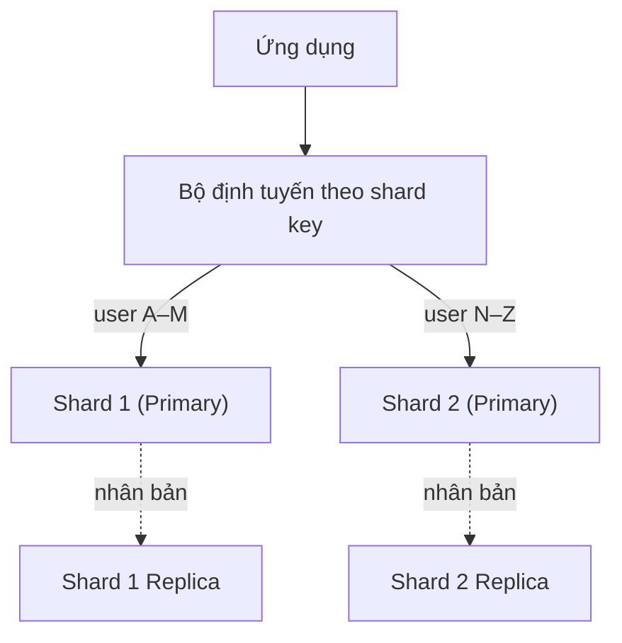

# Thiết kế & tối ưu cơ sở dữ liệu (Database Design & Optimization)

## Khái niệm
Thiết kế cơ sở dữ liệu (database design) là quá trình tổ chức dữ liệu thành các bảng/tập hợp, quan hệ và chỉ mục sao cho vừa toàn vẹn (integrity), vừa hiệu năng cao và dễ mở rộng. Tối ưu bao gồm việc chọn mô hình dữ liệu phù hợp (quan hệ hay NoSQL), chuẩn hoá (normalization) hợp lý, và các kỹ thuật như phân vùng (partitioning) hay khung nhìn vật chất hoá (materialized view).

## Khi nào dùng / Vì sao quan trọng
Cơ sở dữ liệu thường là nút thắt hiệu năng của hệ thống. Thiết kế sai từ đầu (chọn sai khoá, không chuẩn hoá, thiếu chỉ mục) dẫn tới truy vấn chậm, dữ liệu mâu thuẫn và khó mở rộng khi dữ liệu lớn lên. Hiểu các đánh đổi giữa các mô hình và kỹ thuật là kỹ năng thiết kế hệ thống cốt lõi.

## Cách hoạt động

### Phân vùng (Partitioning)
Chia một bảng/tập dữ liệu lớn thành nhiều phần nhỏ để tăng hiệu năng và khả năng mở rộng:
- **Phân vùng ngang (horizontal partitioning / sharding)**: chia theo **hàng** — mỗi phần chứa một tập bản ghi khác nhau (ví dụ user A–M ở shard 1, N–Z ở shard 2). Cho phép lưu dữ liệu vượt một máy và tăng khả năng ghi.
- **Phân vùng dọc (vertical partitioning)**: chia theo **cột** — tách các cột ít dùng hoặc lớn (ảnh, blob) sang bảng riêng để bảng chính gọn, truy vấn nhanh.

Chọn **khoá phân vùng (partition/shard key)** tốt là then chốt để tránh dữ liệu lệch (data skew) và điểm nóng (hotspot). Xem thêm băm nhất quán ở trang [Khả năng mở rộng](scalability.md).

Sơ đồ dưới minh hoạ sharding (chia theo hàng) kết hợp replication (mỗi shard nhân bản để đọc và chịu lỗi):



### Khung nhìn vật chất hoá (Materialized View)
Khung nhìn thông thường (view) là truy vấn được lưu, tính lại mỗi lần gọi. **Materialized view** lưu **kết quả đã tính sẵn** ra đĩa như một bảng thực. Ưu điểm: truy vấn tổng hợp phức tạp (join, group by) trả về gần như tức thì. Nhược điểm: dữ liệu có thể cũ, cần **làm mới (refresh)** định kỳ hoặc theo sự kiện. Dùng nhiều trong báo cáo, dashboard, kho dữ liệu (data warehouse).

### NoSQL — bốn họ chính
NoSQL ("Not Only SQL") hy sinh một phần tính nhất quán/quan hệ để đổi lấy khả năng mở rộng ngang và mô hình dữ liệu linh hoạt:

| Loại | Mô hình dữ liệu | Trường hợp dùng | Ví dụ |
|------|-----------------|-----------------|-------|
| **Document (tài liệu)** | JSON/BSON lồng nhau, schema linh hoạt | Hồ sơ người dùng, catalog sản phẩm, CMS | MongoDB, Couchbase |
| **Key-Value (khoá–giá trị)** | Cặp khoá → giá trị đơn giản, truy cập cực nhanh | Cache, phiên đăng nhập (session), giỏ hàng | Redis, DynamoDB |
| **Column-family (họ cột)** | Lưu theo cột, tối ưu ghi và truy vấn theo cột trên tập dữ liệu khổng lồ | Chuỗi thời gian, ghi log quy mô lớn | Cassandra, HBase |
| **Graph (đồ thị)** | Node và cạnh, tối ưu truy vấn quan hệ | Mạng xã hội, hệ gợi ý, phát hiện gian lận | Neo4j, Amazon Neptune |

*Khi nào chọn SQL vs NoSQL:* cần giao dịch ACID chặt, quan hệ phức tạp, truy vấn đa dạng → SQL. Cần mở rộng ngang cực lớn, schema thay đổi liên tục, mô hình dữ liệu đơn giản/phi cấu trúc → NoSQL.

### Chuẩn hoá (Normalization) — từ 1NF đến BCNF
Chuẩn hoá là quá trình tổ chức dữ liệu để giảm dư thừa (redundancy) và tránh các dị thường (anomaly) khi thêm/xoá/sửa:

- **1NF (First Normal Form)**: mỗi ô chứa một giá trị nguyên tử (atomic), không có nhóm lặp hay danh sách trong một cột. Mỗi bản ghi là duy nhất.
- **2NF (Second Normal Form)**: đạt 1NF **và** mọi thuộc tính không khoá phụ thuộc hoàn toàn vào **toàn bộ** khoá chính (loại bỏ phụ thuộc bộ phận — partial dependency). Chỉ liên quan khi khoá chính là khoá phức hợp.
- **3NF (Third Normal Form)**: đạt 2NF **và** không có phụ thuộc bắc cầu (transitive dependency) — thuộc tính không khoá không phụ thuộc vào thuộc tính không khoá khác.
- **BCNF (Boyce-Codd Normal Form)**: phiên bản chặt hơn 3NF — với mọi phụ thuộc hàm X → Y, X phải là siêu khoá (superkey). Xử lý một số trường hợp biên mà 3NF còn để lọt.

**Chuẩn hoá** giảm dư thừa và tăng toàn vẹn nhưng làm truy vấn cần nhiều phép nối (join). **Phi chuẩn hoá (denormalization)** cố ý thêm dư thừa để tăng tốc đọc — thường dùng trong kho dữ liệu và hệ thống đọc nhiều.

### Chỉ mục & tối ưu truy vấn (nhắc nhanh)
Chỉ mục (index — thường là cây B-tree hoặc bảng băm) tăng tốc đọc nhưng làm chậm ghi và tốn dung lượng. Dùng công cụ `EXPLAIN` để phân tích kế hoạch truy vấn, tránh quét toàn bảng (full table scan), và đặt chỉ mục trên cột hay lọc/nối/sắp xếp.

## Ví dụ
```text
Chuẩn hoá: tách bảng để loại bỏ dư thừa

  CHƯA CHUẨN HOÁ (dư thừa tên khách ở mỗi dòng đơn):
  ┌────────┬───────────┬──────────┬─────────┐
  │ don_id │ khach_ten │ sp_ten   │ so_luong│
  ├────────┼───────────┼──────────┼─────────┤
  │ 1      │ An        │ Bút      │ 2       │
  │ 1      │ An        │ Vở       │ 3       │   ◀─ "An" lặp lại
  └────────┴───────────┴──────────┴─────────┘

  ĐÃ CHUẨN HOÁ (3NF): tách thành 3 bảng
  KhachHang(khach_id, khach_ten)
  DonHang(don_id, khach_id)          ── khoá ngoại → KhachHang
  ChiTietDon(don_id, sp_id, so_luong)
```

## Độ phức tạp (nếu có)
| Thao tác | Có chỉ mục B-tree | Không chỉ mục |
|----------|-------------------|---------------|
| Tìm theo khoá | O(log n) | O(n) |
| Chèn/xoá | O(log n) | O(1) ghi thô nhưng chậm tìm |

## Mô hình quan hệ (Relational) — nền tảng cần nắm

CSDL quan hệ tổ chức dữ liệu thành các bảng gồm hàng và cột, liên kết qua **khoá**:
- **Khoá chính (primary key)**: định danh duy nhất mỗi bản ghi.
- **Khoá ngoại (foreign key)**: tham chiếu tới khoá chính của bảng khác, thực thi toàn vẹn tham chiếu (referential integrity).
- **Khoá phức hợp (composite key)**: khoá gồm nhiều cột.
- **Khoá dự tuyển (candidate key)** và **siêu khoá (superkey)**: các tập cột có thể định danh duy nhất, liên quan trực tiếp tới định nghĩa BCNF.

## Chọn khoá phân mảnh (Shard Key)
Khoá phân mảnh quyết định thành bại của sharding:
- **Range-based (theo khoảng)**: chia theo dải giá trị (ví dụ theo ngày). Dễ truy vấn khoảng nhưng dễ tạo hotspot ở dải mới nhất.
- **Hash-based (theo băm)**: băm khoá để phân bố đều, tránh hotspot, nhưng truy vấn khoảng trở nên kém hiệu quả.
- **Directory-based (theo thư mục)**: dùng bảng tra cứu ánh xạ khoá → shard, linh hoạt nhất nhưng thêm một tầng phụ thuộc.

## Tối ưu truy vấn — thực hành

| Kỹ thuật | Lợi ích |
|----------|---------|
| Đặt chỉ mục đúng cột (WHERE, JOIN, ORDER BY) | Tránh quét toàn bảng |
| Chỉ mục phức hợp (composite index) đúng thứ tự cột | Phục vụ nhiều truy vấn |
| Chỉ mục bao phủ (covering index) | Trả kết quả không cần đọc bảng gốc |
| Tránh `SELECT *` | Giảm dữ liệu truyền và I/O |
| Phân trang bằng keyset thay vì OFFSET lớn | Tránh quét/bỏ qua nhiều hàng |
| Gộp truy vấn (batch), tránh N+1 query | Giảm số vòng gọi CSDL |

Dùng `EXPLAIN ANALYZE` để đọc kế hoạch thực thi và phát hiện quét tuần tự (sequential scan) ngoài ý muốn.

## Giao dịch & mức cô lập (Isolation Levels)
CSDL quan hệ hỗ trợ các mức cô lập giao dịch, đánh đổi giữa tính đúng đắn và hiệu năng:

| Mức | Ngăn được | Còn cho phép |
|-----|-----------|--------------|
| Read Uncommitted | — | Dirty read |
| Read Committed | Dirty read | Non-repeatable read |
| Repeatable Read | Non-repeatable read | Phantom read |
| Serializable | Tất cả | (chậm nhất) |

## Ưu / nhược điểm
- **Ưu:** thiết kế tốt cho truy vấn nhanh, dữ liệu toàn vẹn, dễ mở rộng; NoSQL cho linh hoạt và mở rộng ngang; materialized view tăng tốc báo cáo.
- **Nhược:** chuẩn hoá cao làm truy vấn nhiều join; sharding tăng độ phức tạp; materialized view có dữ liệu cũ; NoSQL thường chỉ nhất quán cuối cùng.

## Câu hỏi phỏng vấn thường gặp
1. Phân biệt phân vùng ngang và phân vùng dọc.
2. Bốn họ NoSQL và trường hợp dùng điển hình của mỗi loại.
3. Giải thích 1NF, 2NF, 3NF, BCNF kèm ví dụ.
4. Khi nào nên phi chuẩn hoá dữ liệu?
5. View và materialized view khác nhau ra sao?
6. Chỉ mục tăng tốc đọc nhưng đánh đổi gì?
7. Khi nào chọn SQL, khi nào chọn NoSQL?

## Tham khảo
- *Designing Data-Intensive Applications* — Martin Kleppmann
- *Database System Concepts* — Silberschatz, Korth, Sudarshan
- Xem thêm: [Khả năng mở rộng](scalability.md), [Hệ phân tán](he-phan-tan.md)
