# Designing Data-Intensive Applications — Martin Kleppmann

**Ghi chú học tập chi tiết bằng tiếng Việt theo từng chương.** Cuốn *Designing Data-Intensive Applications* (DDIA, 2017) không dạy một công nghệ cụ thể mà xây dựng nền tảng tư duy để đánh giá và kết hợp các hệ thống dữ liệu (cơ sở dữ liệu, hàng đợi, cache, công cụ tìm kiếm, xử lý theo lô và luồng). Kleppmann tổ chức nội dung quanh ba mục tiêu xuyên suốt: **tin cậy (reliability)**, **mở rộng được (scalability)** và **bảo trì được (maintainability)**, rồi phân tích các đánh đổi (trade-off) mà mọi kiến trúc phải đối mặt. Bản ghi chú này diễn giải lại các ý tưởng cốt lõi để ôn tập phỏng vấn SDE, **không chép nguyên văn** sách gốc.

> Quy ước: thuật ngữ tiếng Anh được ghi trong ngoặc ở lần xuất hiện đầu tiên để dễ tra cứu tài liệu gốc. Các sơ đồ Mermaid và đoạn mã dưới đây do người ghi chú tự vẽ/tự viết để minh hoạ ý tưởng, không sao chép hình trong sách.

## Mục lục

- [Chương 1 — Ứng dụng tin cậy, mở rộng được, bảo trì được](#chuong-1)
- [Chương 2 — Mô hình dữ liệu & ngôn ngữ truy vấn](#chuong-2)
- [Chương 3 — Lưu trữ và truy xuất](#chuong-3)
- [Chương 4 — Mã hoá và tiến hoá](#chuong-4)
- [Chương 5 — Nhân bản](#chuong-5)
- [Chương 6 — Phân mảnh](#chuong-6)
- [Chương 7 — Giao dịch](#chuong-7)
- [Chương 8 — Những rắc rối của hệ phân tán](#chuong-8)
- [Chương 9 — Nhất quán và đồng thuận](#chuong-9)
- [Chương 10 — Xử lý theo lô](#chuong-10)
- [Chương 11 — Xử lý luồng](#chuong-11)
- [Chương 12 — Tương lai của hệ thống dữ liệu](#chuong-12)

---

## Chương 1 — Ứng dụng tin cậy, mở rộng được, bảo trì được (Reliable, Scalable, and Maintainable Applications) {#chuong-1}

Chương mở đầu định nghĩa "ứng dụng thâm dụng dữ liệu" (data-intensive) — nơi khối lượng, độ phức tạp và tốc độ thay đổi của dữ liệu, chứ không phải sức mạnh CPU, mới là ràng buộc chính. Một hệ thống hiện đại thường ghép nhiều thành phần chuẩn: cơ sở dữ liệu, cache, chỉ mục tìm kiếm (search index), hàng đợi thông điệp (message queue) và các khung xử lý. Điểm mấu chốt là ranh giới giữa các "loại" hệ thống này đang mờ dần: một message queue có thể bền như CSDL, một CSDL có thể dùng như cache. Kỹ sư phải xem toàn bộ tổ hợp này như một "hệ thống dữ liệu tổng hợp (composite data system)" duy nhất, tự mình bảo đảm những đảm bảo mà từng thành phần con không cung cấp sẵn.

**Tin cậy (reliability)** là khả năng hoạt động đúng ngay cả khi có nghịch cảnh (adversity). Tác giả phân biệt **lỗi (fault)** — một thành phần lệch khỏi đặc tả — với **hỏng hệ thống (failure)** — cả hệ ngừng phục vụ người dùng. Mục tiêu là xây dựng hệ **chịu lỗi (fault-tolerant)** để fault không leo thang thành failure. Nguồn lỗi gồm: phần cứng (đĩa hỏng với MTTF ~10–50 năm cho một đĩa, nên trong cụm hàng nghìn đĩa thì gần như ngày nào cũng hỏng; mất điện), phần mềm (bug hệ thống lan truyền đồng loạt, nguy hiểm hơn vì tương quan) và con người (cấu hình sai — nguyên nhân phổ biến nhất của sự cố lớn). Netflix Chaos Monkey được nêu như cách chủ động tiêm lỗi để kiểm chứng khả năng phục hồi thay vì chỉ hy vọng.

**Mở rộng được (scalability)** là khả năng đối phó khi tải tăng. Cần mô tả tải bằng **tham số tải (load parameters)** cụ thể — ví dụ kinh điển là fan-out của Twitter timeline: tiếp cận 1 (truy vấn khi đọc) so với tiếp cận 2 (ghi sẵn vào cache người theo dõi khi đăng), lựa chọn tuỳ tỉ lệ đọc/ghi và số người theo dõi. Hiệu năng phải đo bằng **phân vị (percentiles)** như p95, p99, p999 thay vì trung bình, vì **đuôi trễ (tail latency)** ảnh hưởng trực tiếp tới những người dùng giá trị nhất. Cần phân biệt độ trễ (latency — thời gian chờ) với thời gian phản hồi (response time — tổng thời gian client cảm nhận), cùng hiện tượng nghẽn đầu hàng (head-of-line blocking) làm khuếch đại trễ.

**Bảo trì được (maintainability)** gồm ba khía cạnh: **vận hành được (operability)** giúp đội ngũ dễ giữ hệ khỏe mạnh; **đơn giản (simplicity)** thông qua trừu tượng hoá tốt để giảm phức tạp phát sinh (accidental complexity); và **tiến hoá được (evolvability)** để dễ thay đổi theo yêu cầu mới.

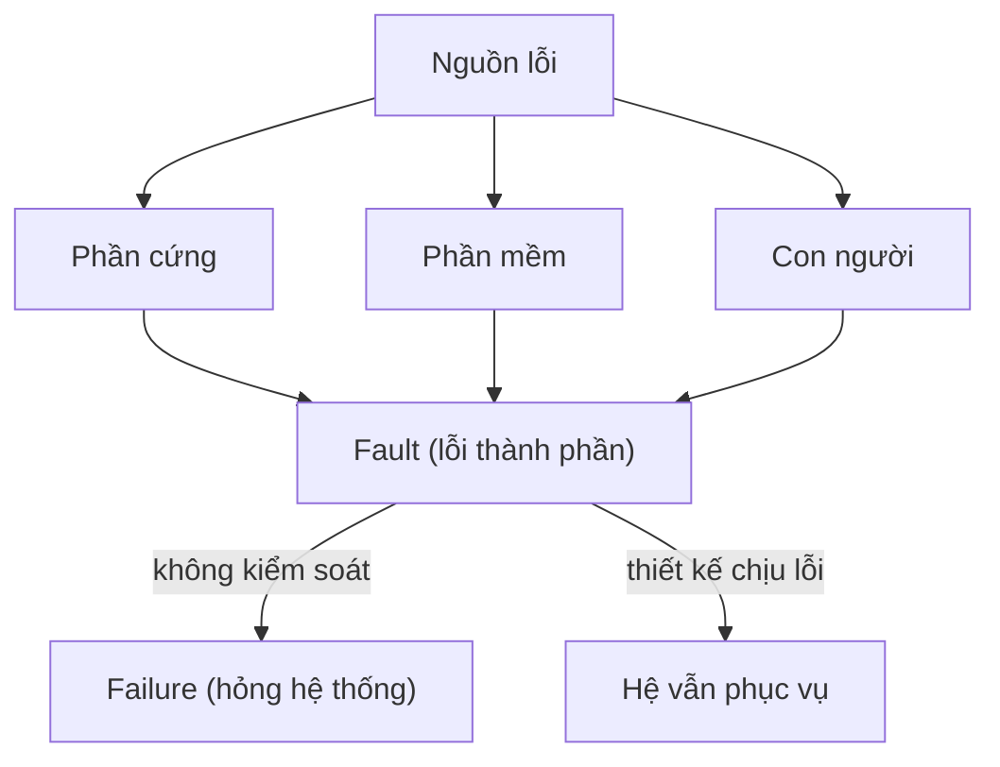

| Thuộc tính | Câu hỏi cốt lõi | Kỹ thuật điển hình | Đánh đổi |
|---|---|---|---|
| Reliability | Vẫn đúng khi có lỗi? | Dư thừa, chaos testing, WAL | Chi phí hạ tầng cao hơn |
| Scalability | Đối phó tải tăng thế nào? | Phân vị p99, sharding | Tối ưu đọc vs ghi |
| Maintainability | Dễ vận hành/đổi? | Trừu tượng, tài liệu, tự động hoá | Đầu tư trước, chậm ban đầu |

Đánh đổi cốt lõi của chương: không có giải pháp vạn năng; mọi lựa chọn (mở rộng dọc — scale up hay ngang — scale out, tối ưu đọc hay ghi) đều phải xét theo bối cảnh tải và yêu cầu cụ thể.

---

## Chương 2 — Mô hình dữ liệu & ngôn ngữ truy vấn (Data Models and Query Languages) {#chuong-2}

Mô hình dữ liệu định hình cách ta suy nghĩ về bài toán lẫn cách viết phần mềm, nên việc chọn mô hình là quyết định sâu sắc và khó đảo ngược. Chương so sánh ba họ lớn cùng nền tảng ngôn ngữ truy vấn.

**Mô hình quan hệ (relational)** tổ chức dữ liệu thành bảng gồm hàng và cột, truy vấn bằng SQL — một ngôn ngữ **khai báo (declarative)**: ta nói *muốn gì*, còn bộ tối ưu (query optimizer) tự quyết định *cách lấy*, tự tận dụng chỉ mục và chạy song song. Ưu điểm là hỗ trợ tốt quan hệ nhiều-nhiều và phép nối (join).

```sql
-- Khai báo: mô tả kết quả, bộ tối ưu tự chọn kế hoạch thực thi
SELECT u.ten, COUNT(o.id) AS so_don
FROM nguoi_dung u
JOIN don_hang o ON o.user_id = u.id
WHERE o.trang_thai = 'paid'
GROUP BY u.ten;
```

**Mô hình tài liệu (document)** (MongoDB, CouchDB) lưu dữ liệu dạng cây JSON tự chứa, hợp với dữ liệu có tính cục bộ cao (locality) và quan hệ một-nhiều (như một hồ sơ CV với danh sách công việc). Nó khắc phục **lệch trở kháng đối tượng-quan hệ (object-relational impedance mismatch)** — sự chênh giữa cấu trúc đối tượng trong mã và bảng phẳng — và cho **linh hoạt lược đồ (schema flexibility)** — thực chất là **schema-on-read** (lược đồ áp lúc đọc) trái với **schema-on-write** của quan hệ (giống kiểm kiểu động vs tĩnh). Nhược điểm: join yếu, phải xử lý quan hệ nhiều-nhiều và tham chiếu ở tầng ứng dụng, và không thể cập nhật cục bộ hiệu quả một phần tử sâu trong tài liệu lớn.

**Mô hình đồ thị (graph)** (Neo4j, Datomic; ngôn ngữ Cypher, SPARQL, Datalog) phù hợp khi kết nối nhiều-nhiều dày đặc và tiến hoá liên tục — mạng xã hội, bản đồ đường, quan hệ nguồn gốc dữ liệu. Đồ thị thuộc tính (property graph) và bộ ba (triple-store) là hai biến thể phổ biến.

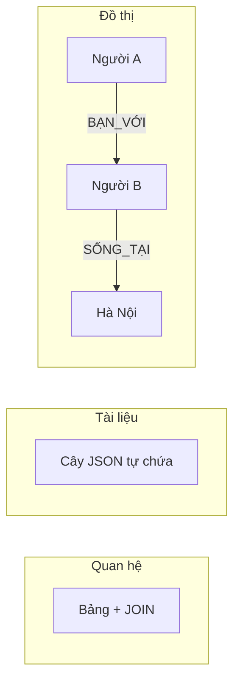

| Mô hình | Hợp với | Điểm mạnh | Điểm yếu |
|---|---|---|---|
| Quan hệ | Dữ liệu đều, nhiều join | Join mạnh, chuẩn hoá, giao dịch | Lệch trở kháng, lược đồ cứng |
| Tài liệu | Cấu trúc cây, 1-nhiều | Locality, linh hoạt lược đồ | Join yếu, nhiều-nhiều khó |
| Đồ thị | Mạng nhiều-nhiều | Duyệt quan hệ tuỳ biến | Học đường cong, ít phổ biến |

Chương cũng nhắc lịch sử: mô hình phân cấp (hierarchical) và mạng (network — CODASYL) từng dùng truy vấn **mệnh lệnh (imperative)** buộc lập trình viên tự đi theo con trỏ đường dẫn, khiến khó thay đổi. Mô hình quan hệ thắng thế nhờ tính khai báo. Đánh đổi trung tâm: chọn mô hình theo hình dạng quan hệ dữ liệu — tài liệu cho cây, đồ thị cho mạng lưới, quan hệ cho dữ liệu đều đặn nhiều join. Ngày nay các CSDL hội tụ (relational hỗ trợ JSON, document hỗ trợ join), làm ranh giới mờ dần. MapReduce cũng được giới thiệu như mô hình truy vấn lai giữa khai báo và mệnh lệnh.

---

## Chương 3 — Lưu trữ và truy xuất (Storage and Retrieval) {#chuong-3}

Chương mở "nắp ca-pô" để xem CSDL lưu và tìm dữ liệu ra sao, chia làm hai họ động cơ lưu trữ (storage engine) với triết lý ghi trái ngược nhau.

**Họ log-structured** dựa trên ý tưởng chỉ ghi nối tiếp (append-only). Ví dụ đơn giản nhất là hash index trong bộ nhớ trỏ tới offset trong file log:

```python
# Hash index tối giản: khoá -> offset trong file log
index = {}                       # trong RAM
def set(key, value):
    offset = log.tell()
    log.write(f"{key},{value}\n")  # chỉ ghi nối tiếp -> nhanh
    index[key] = offset            # cập nhật con trỏ
def get(key):
    log.seek(index[key])           # nhảy thẳng tới vị trí
    return log.readline().split(",")[1]
```

Nâng cao hơn là **LSM-tree (Log-Structured Merge-Tree)** dùng trong LevelDB, RocksDB, Cassandra: dữ liệu ghi vào **memtable** (cây cân bằng trong RAM), khi đầy thì đổ xuống đĩa thành **SSTable (Sorted String Table)** đã sắp xếp theo khoá, rồi hợp nhất nền (compaction/merge) để gộp file và loại bản ghi cũ. Ghi tuần tự nên throughput ghi cao; đọc dùng **bộ lọc Bloom (Bloom filter)** để nhanh chóng bỏ qua SSTable chắc chắn không chứa khoá.

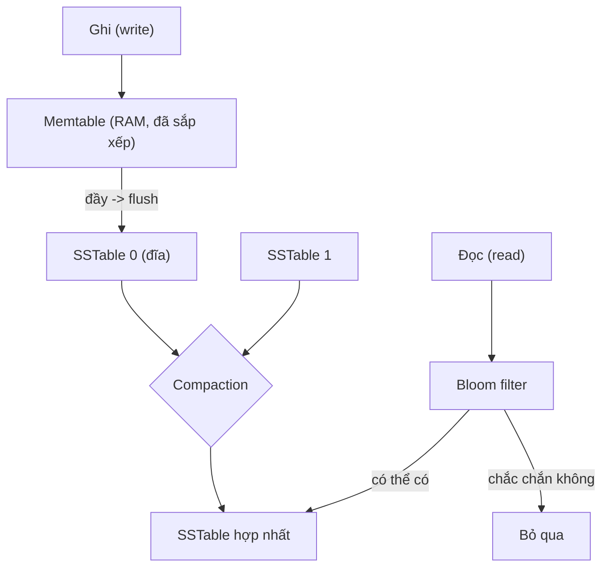

**Họ cập nhật tại chỗ (update-in-place)** đại diện là **B-tree** — cấu trúc chuẩn của hầu hết CSDL quan hệ. B-tree chia dữ liệu thành trang (page) cố định (thường 4 KB), giữ cây cân bằng với độ sâu O(log n), cập nhật đè lên trang cũ và dùng **write-ahead log (WAL)** để phục hồi nhất quán sau sự cố mất điện giữa chừng.

| Tiêu chí | LSM-tree | B-tree |
|---|---|---|
| Throughput ghi | Cao (ghi tuần tự) | Thấp hơn (ghi ngẫu nhiên) |
| Khuếch đại ghi | Có (do compaction) | Ít hơn nhưng ghi 2 lần (WAL) |
| Độ trễ đọc | Khó đoán (nhiều SSTable) | Ổn định, mỗi khoá 1 chỗ |
| Nén dung lượng | Tốt hơn | Có phân mảnh trang |
| Khoá/giao dịch | Khó (khoá rải nhiều nơi) | Thuận (khoá tại chỗ) |

Chương phân biệt **xử lý giao dịch trực tuyến (OLTP)** — nhiều truy vấn nhỏ, hướng bản ghi, chỉ mục quyết định hiệu năng — với **phân tích trực tuyến (OLAP)** — ít truy vấn nhưng quét khối lượng lớn để tổng hợp. OLAP dùng **kho dữ liệu (data warehouse)** riêng, lược đồ **sao (star schema)** với bảng sự kiện (fact) trung tâm và các bảng chiều (dimension), và **lưu trữ theo cột (column-oriented storage)** để chỉ đọc cột cần thiết, nén mạnh bằng mã hoá bitmap và tận dụng cache CPU (vectorized processing). Chỉ mục thứ cấp (secondary index), clustered index và **khung nhìn thực thể hoá (materialized view)/data cube** cũng được bàn.

---

## Chương 4 — Mã hoá và tiến hoá (Encoding and Evolution) {#chuong-4}

Ứng dụng luôn thay đổi, nên lược đồ dữ liệu và mã nguồn tiến hoá theo thời gian. Chương tập trung vào cách dữ liệu được **mã hoá (encoding/serialization)** để lưu trữ hoặc truyền đi, và làm sao giữ **tương thích tiến (forward compatibility)** — mã cũ đọc được dữ liệu do mã mới tạo — cùng **tương thích lùi (backward compatibility)** — mã mới đọc được dữ liệu cũ. Hai chiều này thiết yếu cho **triển khai luân phiên (rolling upgrade)**, khi các phiên bản dịch vụ cũ và mới chạy song song trong lúc nâng cấp.

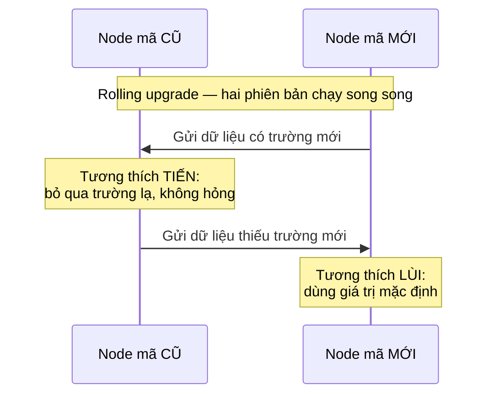

Tác giả so sánh các định dạng. Định dạng **văn bản** như JSON, XML, CSV dễ đọc cho người nhưng cồng kềnh, mơ hồ về kiểu số (số nguyên lớn vượt độ chính xác float của JSON) và không có lược đồ chặt. Các định dạng **nhị phân theo lược đồ (schema-driven binary)** hiệu quả và an toàn hơn: **Apache Thrift** và **Protocol Buffers (Protobuf)** dùng thẻ số (field tag) để nhận diện trường thay vì tên, cho phép thêm/xoá trường tuỳ chọn mà vẫn tương thích (miễn không tái dùng tag cũ và trường mới không bắt buộc); **Apache Avro** dùng lược đồ ghi (writer's schema) và lược đồ đọc (reader's schema) tách rời, đối chiếu để giải quyết lúc đọc, đặc biệt hợp với dữ liệu sinh động và Hadoop nơi lược đồ đổi thường xuyên.

```protobuf
message NguoiDung {
  required int32 id  = 1;   // tag 1: KHÔNG BAO GIỜ đổi/tái dùng
  optional string ten = 2;  // tag 2
  optional string email = 3; // THÊM trường mới: dùng tag mới + optional
}                            // -> mã cũ bỏ qua tag 3; mã mới đọc dữ liệu cũ (email = null)
```

Chương phân tích ba **luồng dữ liệu (dataflow)**:

| Luồng | Cơ chế | Lưu ý tiến hoá |
|---|---|---|
| Qua cơ sở dữ liệu | Ghi rồi đọc lại | Giữ trường lạ khi mã cũ đọc-sửa-ghi, tránh mất dữ liệu |
| Qua dịch vụ (REST/RPC) | Gọi mạng | RPC che sự khác biệt gọi cục bộ/mạng; API phải bền qua nhiều phiên bản |
| Qua thông điệp bất đồng bộ | Message broker, actor | Giảm khớp nối (decoupling), người gửi/nhận độc lập |

RPC (Remote Procedure Call) đáng chú ý vì che giấu sự khác biệt giữa gọi cục bộ và gọi mạng — nhưng mạng có thể mất gói, chậm, thất bại một phần, nên API cần idempotent và bền vững qua phiên bản. Đánh đổi cốt lõi của chương: đầu tư vào lược đồ tường minh (thêm công sức định nghĩa, quản lý phiên bản) đổi lấy khả năng tiến hoá độc lập giữa các thành phần và đội ngũ, cùng dữ liệu gọn và tự kiểm tra.

---

## Chương 5 — Nhân bản (Replication) {#chuong-5}

Nhân bản là giữ nhiều bản sao dữ liệu trên các nút (node) khác nhau nhằm tăng khả dụng (availability), giảm độ trễ (đặt dữ liệu gần người dùng về địa lý) và tăng thông lượng đọc. Thách thức không nằm ở việc chép dữ liệu tĩnh mà ở việc lan truyền **thay đổi (writes)** một cách nhất quán. Chương trình bày ba kiến trúc.

**Một lãnh đạo (single-leader)**: mọi ghi đi qua nút leader rồi phát tán tới các follower qua luồng bản ghi thay đổi (replication log). Đây là mô hình phổ biến nhất (PostgreSQL, MySQL, MongoDB). Nhân bản có thể **đồng bộ (synchronous)** — bảo đảm bản sao cập nhật nhưng chậm và dễ nghẽn nếu follower chậm — hoặc **bất đồng bộ (asynchronous)** — nhanh nhưng có nguy cơ mất ghi khi leader hỏng trước khi kịp sao. Thực tế thường dùng **semi-synchronous**: một follower đồng bộ, còn lại bất đồng bộ.

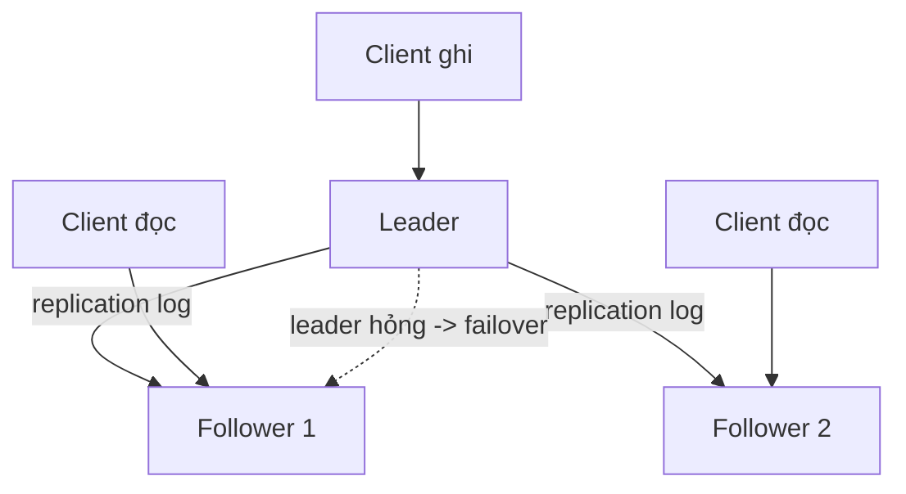

Xử lý follower mới bằng snapshot rồi bắt kịp từ log; xử lý leader hỏng bằng **failover** — vốn đầy rủi ro: split-brain (hai leader cùng lúc), chọn nhầm leader tụt hậu, hoặc mất dữ liệu chưa kịp sao. Vấn đề trung tâm là **độ trễ nhân bản (replication lag)** trong hệ **nhất quán cuối cùng (eventual consistency)**. Ba đảm bảo cần thiết cho trải nghiệm hợp lý:

| Đảm bảo | Vấn đề nó chống | Ví dụ hỏng nếu thiếu |
|---|---|---|
| Đọc-thấy-ghi (read-your-writes) | User không thấy chính sửa đổi của mình | Vừa post comment mà tải lại thì mất |
| Đọc đơn điệu (monotonic reads) | "Đi ngược thời gian" | Thấy comment rồi refresh lại biến mất |
| Đọc nhất quán tiền tố (consistent prefix) | Vi phạm thứ tự nhân quả | Thấy câu trả lời trước câu hỏi |

**Nhiều lãnh đạo (multi-leader)**: cho phép ghi ở nhiều trung tâm dữ liệu hoặc thiết bị offline (như lịch trên điện thoại), nhưng phải giải quyết **xung đột ghi (write conflict)** qua các chiến lược như last-write-wins (LWW — dễ mất dữ liệu âm thầm), gộp thủ công theo ứng dụng, hoặc **CRDT (Conflict-free Replicated Data Type)**. **Không lãnh đạo (leaderless)** (Dynamo, Cassandra, Riak) cho client ghi/đọc tới nhiều bản sao song song, dùng **quorum** (w + r > n, với n bản sao) để đảm bảo tập đọc và tập ghi giao nhau, cùng **đọc sửa lỗi (read repair)** và **anti-entropy** nền để đồng bộ. Chương giới thiệu **đồng hồ vector (version vector)** để phát hiện ghi đồng thời (concurrent) cần hoà giải. Đánh đổi lớn: đơn giản-nhất quán (single-leader) đối lại khả dụng cao khi ghi phân tán-linh hoạt-nhưng-phức tạp giải xung đột (multi/leaderless).

---

## Chương 6 — Phân mảnh (Partitioning) {#chuong-6}

Khi dữ liệu quá lớn cho một nút, ta chia thành các **phân mảnh (partition/shard)** để mỗi nút giữ một phần, giúp mở rộng ngang. Phân mảnh thường kết hợp với nhân bản: mỗi phân mảnh vẫn có nhiều bản sao đặt trên các nút khác nhau. Mục tiêu là phân bổ dữ liệu và tải đều, tránh **điểm nóng (hot spot)** và tình trạng **lệch tải (skew)** khi một phân mảnh gánh quá nhiều so với phần còn lại.

Có hai cách phân mảnh dữ liệu khoá-giá trị:

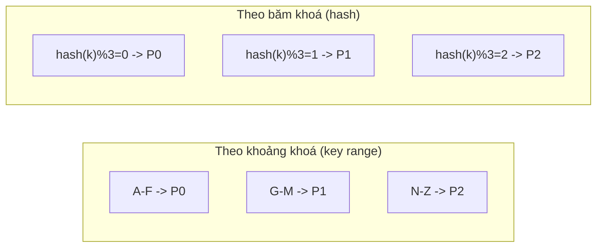

**Theo khoảng khoá (key range)**: sắp xếp khoá và chia thành dải liên tục, cho phép truy vấn khoảng (range scan) hiệu quả nhưng dễ tạo hot spot nếu khoá tăng đơn điệu (ví dụ timestamp — mọi ghi mới dồn vào một phân mảnh cuối). **Theo băm khoá (hash of key)**: rải khoá đều bằng hàm băm, tránh hot spot nhưng mất khả năng quét khoảng liền kề. Có thể lai bằng khoá phức hợp (compound key): băm phần đầu (ví dụ user_id), sắp xếp phần sau (ví dụ timestamp) để quét khoảng trong phạm vi một user. Ngay cả vậy, một khoá "siêu nóng" (celebrity) vẫn cần tách thủ công bằng hậu tố ngẫu nhiên.

Vấn đề khó là **chỉ mục thứ cấp (secondary index)**:

| Chiến lược | Ghi | Đọc theo chỉ mục |
|---|---|---|
| Theo tài liệu (local index) | Rẻ (chỉ 1 phân mảnh) | Đắt: scatter/gather mọi phân mảnh |
| Theo từ khoá (global index) | Đắt: cập nhật nhiều phân mảnh, thường bất đồng bộ | Rẻ: đọc đúng phân mảnh chứa từ khoá |

**Cân bằng lại (rebalancing)** khi thêm/bớt nút phải di chuyển ít dữ liệu và giữ hệ hoạt động. Kleppmann cảnh báo **tránh `hash mod N`** vì đổi N buộc dời gần hết dữ liệu; thay vào đó dùng:

```text
# Chiến lược rebalancing
1. Số phân mảnh cố định lớn (vd 1000 partition cho 10 node)
   -> thêm node: chuyển vài partition nguyên vẹn, không băm lại.
2. Phân mảnh động (dynamic): partition tự tách khi quá lớn, gộp khi quá nhỏ.
3. Băm nhất quán (consistent hashing): vòng băm, thêm/bớt node dời ít khoá.
```

Cuối cùng là **định tuyến yêu cầu (request routing)**: client hỏi node bất kỳ (node tự chuyển tiếp), qua lớp định tuyến (routing tier), hoặc client biết trước sơ đồ phân mảnh — thường nhờ dịch vụ điều phối như ZooKeeper giữ ánh xạ partition→node. Đánh đổi: mọi lựa chọn phân mảnh đều cân bằng giữa hiệu quả đọc khoảng, chi phí ghi và độ phức tạp vận hành/cân bằng lại.

---

## Chương 7 — Giao dịch (Transactions) {#chuong-7}

Giao dịch (transaction) là cơ chế nhóm nhiều thao tác đọc/ghi thành một đơn vị logic, hoặc thành công trọn vẹn (commit) hoặc huỷ toàn bộ (abort/rollback). Nó là công cụ trừu tượng giúp lập trình viên khỏi phải tự xử lý vô số tình huống lỗi và cạnh tranh đồng thời. Bộ đảm bảo kinh điển là **ACID**: **nguyên tử (Atomicity)** — không có trạng thái nửa vời khi lỗi; **nhất quán (Consistency)** — bảo toàn bất biến ứng dụng (thực chất là trách nhiệm của ứng dụng, chữ C hơi lạc lõng); **cô lập (Isolation)** — các giao dịch đồng thời không giẫm chân nhau; **bền vững (Durability)** — dữ liệu đã commit không mất. Tác giả chỉ ra ACID bị dùng lỏng lẻo trong tiếp thị, và đối lập nó với BASE (Basically Available, Soft state, Eventual consistency) vốn định nghĩa mơ hồ.

Trọng tâm chương là **cô lập (isolation)** và các dị thường (anomaly) khi bỏ qua nó:

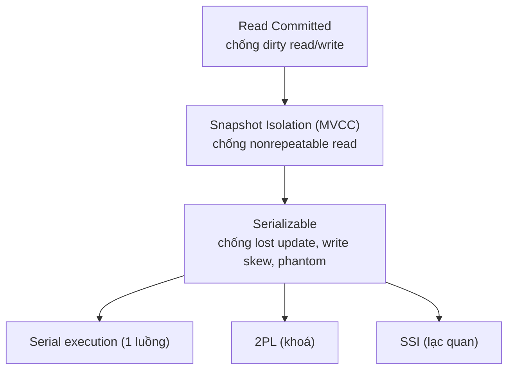

**Đọc-cam-kết (Read Committed)** ngăn đọc bẩn (dirty read — thấy dữ liệu chưa commit) và ghi bẩn (dirty write). **Cô lập ảnh chụp (Snapshot Isolation)** — hiện thực bằng **kiểm soát đồng thời đa phiên bản (MVCC — Multi-Version Concurrency Control)** — cho mỗi giao dịch một ảnh nhất quán tại thời điểm bắt đầu, ngăn đọc không lặp lại (nonrepeatable read); đây là mức thường được gọi là "repeatable read". Nhưng các mức yếu vẫn để lọt lỗi tinh vi: **cập nhật mất (lost update)** khi hai giao dịch đọc-sửa-ghi cùng giá trị; **lệch ghi (write skew)** khi hai giao dịch đọc cùng tiền đề rồi ghi khác chỗ làm vi phạm bất biến; và **hiện tượng bóng ma (phantom)** khi một giao dịch thay đổi tập kết quả mà giao dịch khác dựa vào.

```sql
-- Lost update và cách chống bằng khoá đọc tường minh:
BEGIN;
SELECT so_du FROM tai_khoan WHERE id = 1 FOR UPDATE;  -- khoá hàng
UPDATE tai_khoan SET so_du = so_du - 100 WHERE id = 1;
COMMIT;
```

Giải pháp mạnh nhất là **khả tuần tự (Serializability)** — kết quả tương đương với *một* thứ tự chạy tuần tự nào đó:

| Kỹ thuật | Cơ chế | Ưu | Nhược |
|---|---|---|---|
| Serial execution | Một luồng, dữ liệu trong RAM (VoltDB, Redis) | Đơn giản, không khoá | Không mở rộng đa lõi, cần thủ tục lưu sẵn |
| 2PL (Two-Phase Locking) | Khoá đọc/ghi + khoá phạm vi (predicate) | An toàn, cổ điển | Chậm, dễ deadlock, đuôi trễ tệ |
| SSI (Serializable Snapshot Isolation) | Lạc quan, phát hiện xung đột lúc commit | Hiệu năng tốt, không khoá | Abort nhiều khi tranh chấp cao |

Đánh đổi cốt lõi: mức cô lập càng mạnh càng an toàn nhưng càng đắt về hiệu năng và khả năng mở rộng — nên hiểu rõ ứng dụng cần mức nào thay vì mặc định chọn cực đoan.

---

## Chương 8 — Những rắc rối của hệ phân tán (The Trouble with Distributed Systems) {#chuong-8}

Chương này mang giọng bi quan có chủ đích: liệt kê mọi thứ có thể sai trong hệ phân tán để buộc kỹ sư đối diện thực tế. Khác với một máy đơn (nơi lỗi thường là "toàn bộ dừng" một cách tất định), hệ phân tán chịu **lỗi cục bộ (partial failure)** — một số phần hỏng theo cách phi tất định (nondeterministic), khó phát hiện và khó tái hiện.

**Mạng không tin cậy (unreliable networks)**: gói tin có thể mất, chậm, trùng hoặc bị đảo thứ tự. Điều nguy hiểm nhất là ta **không thể phân biệt** một nút chết với một nút chỉ đang chậm hay đường mạng bị nghẽn — công cụ duy nhất là timeout, và chọn ngưỡng timeout luôn là đánh đổi giữa phát hiện lỗi nhanh và báo động giả (đánh dấu nhầm nút còn sống là chết, gây failover thừa). Mạng thực tế bất đồng bộ (asynchronous), không đảm bảo giới hạn độ trễ.

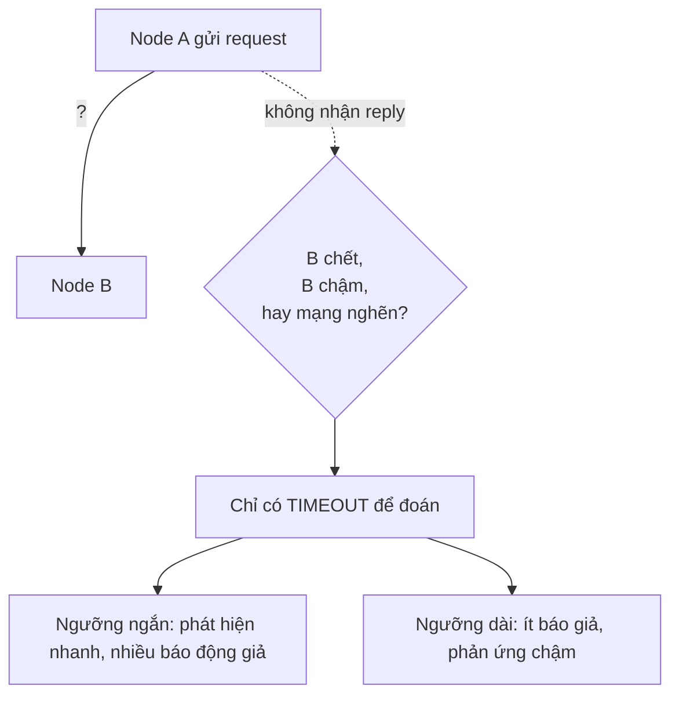

**Đồng hồ không tin cậy (unreliable clocks)**: mỗi máy có đồng hồ riêng, lệch nhau (clock drift) và được đồng bộ lỏng lẻo qua NTP. Tác giả phân biệt **đồng hồ thời gian trong ngày (time-of-day clock)** — có thể nhảy lùi khi NTP hiệu chỉnh — với **đồng hồ đơn điệu (monotonic clock)** — chỉ tăng, dùng để đo khoảng thời gian chứ không phải mốc thời gian tuyệt đối. Dùng dấu thời gian để quyết thứ tự sự kiện (như last-write-wins) rất nguy hiểm vì có thể âm thầm mất ghi khi đồng hồ hai máy lệch nhau. Google Spanner dùng **TrueTime** trả về khoảng bất định `[earliest, latest]` và chủ động chờ qua khoảng đó để đảm bảo thứ tự.

| Loại đồng hồ | Đặc điểm | Dùng cho | Không dùng cho |
|---|---|---|---|
| Time-of-day | Có thể nhảy lùi, đồng bộ NTP | Hiển thị, log gần đúng | Sắp thứ tự sự kiện |
| Monotonic | Chỉ tăng, cục bộ | Đo timeout, độ trễ | So sánh giữa các máy |

**Tạm dừng tiến trình (process pauses)**: một luồng có thể bị dừng bất ngờ vì **thu gom rác (GC pause)** kéo dài, di trú máy ảo (VM live migration), hoặc hoán trang (swap), khiến giả định về thời gian thực bị phá vỡ — một leader có thể tạm dừng, mất khoá thuê (lease), rồi tỉnh dậy tưởng mình còn hợp lệ và ghi đè. Đây là lý do cần **token vây hãm (fencing token)**: mỗi lần cấp khoá kèm số tăng dần, storage từ chối ghi mang token cũ hơn, chặn client "zombie".

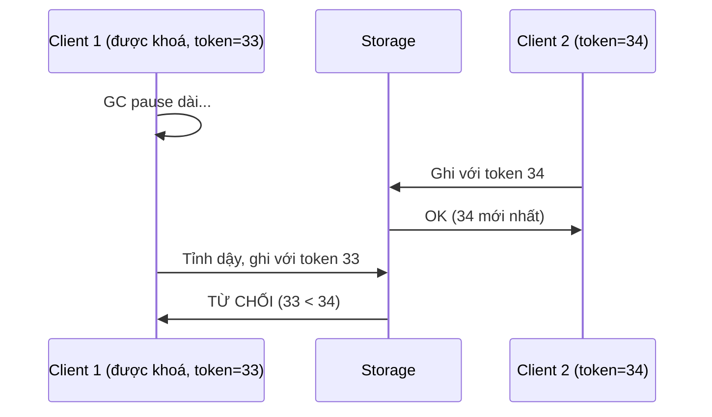

Chương kết bằng khái niệm **sự thật theo số đông (truth defined by majority)** — không nút đơn nào được tự tin về trạng thái toàn cục, quyết định phải qua quorum; mô hình lỗi **Byzantine** (nút nói dối/lỗi tuỳ tiện); và tầm quan trọng của việc chọn đúng **mô hình hệ thống (system model)** — các giả định (đồng bộ/bán đồng bộ/bất đồng bộ, crash-stop/crash-recovery) làm nền cho chứng minh tính đúng. Bài học: đừng tin tưởng mù quáng; hãy thiết kế để hệ vẫn đúng dù các giả định thời gian và mạng bị vi phạm.

---

## Chương 9 — Nhất quán và đồng thuận (Consistency and Consensus) {#chuong-9}

Sau khi liệt kê mọi thứ có thể hỏng ở Chương 8, chương này xây các trừu tượng giúp hệ phân tán vẫn đúng. Trọng tâm là các mức đảm bảo nhất quán và bài toán **đồng thuận (consensus)** — làm cho nhiều nút thống nhất một quyết định duy nhất và không đảo ngược.

**Nhất quán tuyến tính (linearizability)** là mức mạnh: hệ hành xử như thể chỉ có một bản sao dữ liệu duy nhất, mọi thao tác đọc đều thấy giá trị mới nhất đã ghi — tạo ảo giác về một bản sao nguyên tử (recency guarantee). Nó cần cho bầu leader (chỉ một leader), khoá phân tán và ràng buộc duy nhất (uniqueness như username). Nhưng linearizability đắt và, theo **định lý CAP**, xung khắc với khả dụng khi có **phân vùng mạng (network partition)**: hệ phải chọn giữa nhất quán (CP — từ chối phục vụ bên thiểu số) và khả dụng (AP — phục vụ nhưng có thể trả dữ liệu cũ). Nó cũng chậm vì đòi hỏi phối hợp qua mạng, nên nhiều hệ chọn mức yếu hơn.

Tác giả tách biệt **thứ tự nhân quả (causal order)** — chỉ sắp xếp các sự kiện có quan hệ nhân quả, là **thứ tự bộ phận (partial order)** — với thứ tự toàn phần (total order) của linearizability. **Nhất quán nhân quả (causal consistency)** là mức mạnh nhất vẫn còn khả dụng khi phân vùng. **Bộ sinh dấu thời gian Lamport (Lamport timestamp)** cho thứ tự toàn phần tôn trọng nhân quả, nhưng để hiện thực ràng buộc như uniqueness ngay lúc ghi, ta cần **quảng bá theo thứ tự toàn phần (total order broadcast)** — chứng minh được là *tương đương* với đồng thuận.

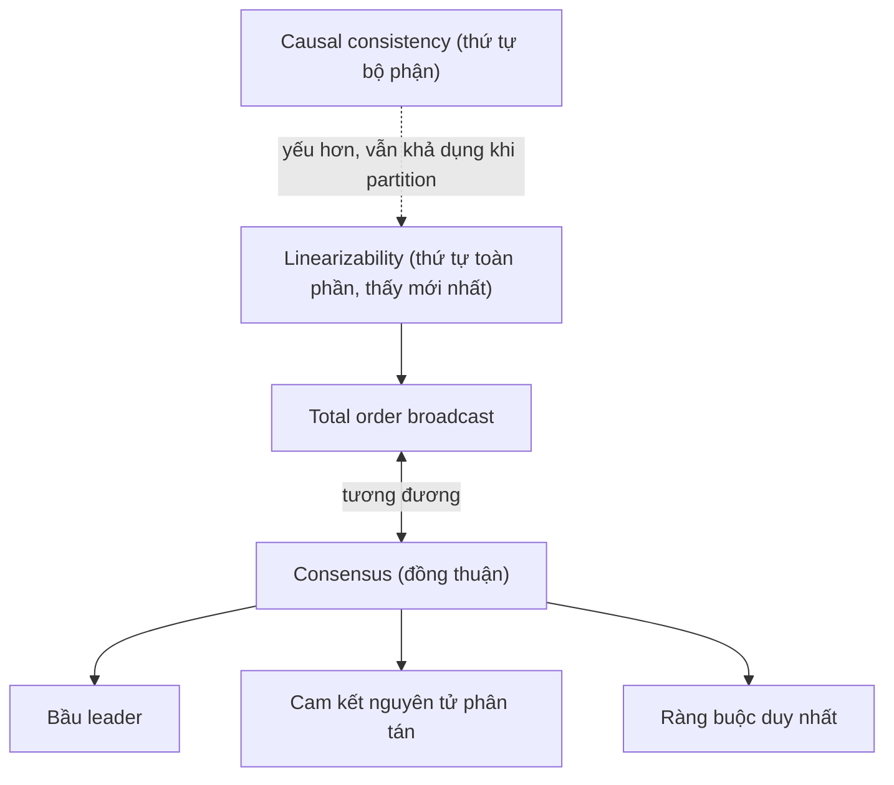

**Đồng thuận (consensus)** giải các bài toán: bầu leader, cam kết nguyên tử. **Cam kết hai pha (2PC — Two-Phase Commit)** cho giao dịch phân tán qua coordinator (pha chuẩn bị → pha commit) nhưng có điểm hỏng đơn: nếu coordinator chết sau khi mọi bên đã "prepared", các bên bị treo (blocking) giữ khoá vô định.

| Giao thức | Chịu lỗi coordinator? | Dùng cho |
|---|---|---|
| 2PC | Không (blocking) | Giao dịch phân tán XA |
| Paxos / Raft / Zab / VSR | Có (cần đa số quorum) | Bầu leader, replicated log |

Các thuật toán đồng thuận chịu lỗi thực thụ — **Paxos, Raft, Zab, Viewstamped Replication** — bảo đảm bốn tính chất: thống nhất (uniform agreement), tính hợp lệ (validity), tính toàn vẹn (integrity) và kết thúc (termination) khi đa số nút sống. Chúng là nền tảng cho các dịch vụ điều phối như **ZooKeeper/etcd**, vốn cung cấp khoá, bầu chọn leader, phát hiện nút và giữ metadata cấu hình. Đánh đổi: đồng thuận đắt (cần quorum, nhiều vòng thông điệp, chậm khi phân vùng) nên hãy giới hạn nó cho quyết định thật sự cần, và tái dùng qua các dịch vụ chuyên biệt thay vì tự cài đặt từ đầu.

---

## Chương 10 — Xử lý theo lô (Batch Processing) {#chuong-10}

Ba chương cuối chuyển từ hệ lưu trữ/truy vấn sang hệ **xử lý dữ liệu phái sinh (derived data)**. Chương 10 bàn **xử lý theo lô (batch processing)**: nhận một tập dữ liệu lớn *hữu hạn* làm đầu vào, chạy một tác vụ, sinh ra dữ liệu đầu ra — không tương tác thời gian thực, đo bằng **thông lượng (throughput)** thay vì độ trễ.

Điểm khởi đầu là **triết lý Unix**: các công cụ nhỏ (`awk`, `sort`, `grep`, `uniq`) nối với nhau qua pipe, mỗi công cụ làm một việc thật tốt, giao tiếp bằng luồng byte/dòng thống nhất, tách logic khỏi luồng vào/ra.

```bash
# Đếm 5 URL được truy cập nhiều nhất từ log — triết lý Unix qua pipe
cat access.log | awk '{print $7}' | sort | uniq -c | sort -rn | head -5
```

**MapReduce** đưa triết lý này lên quy mô cụm hàng nghìn máy: lập trình viên viết hai hàm **map** (trích cặp khoá-giá trị từ mỗi bản ghi) và **reduce** (tổng hợp mọi giá trị cùng khoá), còn framework lo phân phối, sắp xếp và chịu lỗi. Bước **sắp xếp-trộn (sort-merge)** giữa map và reduce là cốt lõi, cho phép gom mọi giá trị cùng khoá về một reducer, đọc/ghi qua hệ tệp phân tán như HDFS.

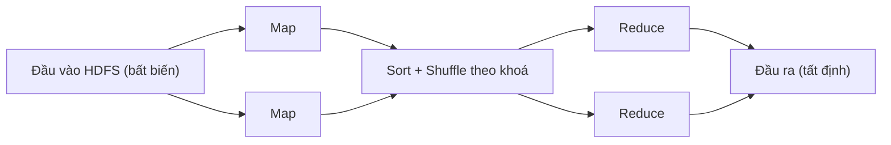

Bài toán khó là **join phân tán**:

| Kiểu join | Cách làm | Hợp khi |
|---|---|---|
| Sort-merge join | Đưa cả hai phía về cùng reducer theo khoá | Cả hai bảng lớn |
| Broadcast hash join | Phát tán bảng nhỏ vào RAM mọi mapper | Một bảng đủ nhỏ |
| Partitioned hash join | Tận dụng dữ liệu đã phân mảnh sẵn cùng cách | Hai bảng cùng sơ đồ phân mảnh |

Lệch tải (hot key/skew) là kẻ thù, cần kỹ thuật như "skewed/sharded join". MapReduce chịu lỗi tốt nhờ ghi trung gian ra đĩa và chạy lại đúng tác vụ hỏng, nhưng chính việc **thực thể hoá trạng thái trung gian (materialization)** giữa các bước làm nó chậm.

Các **công cụ dòng chảy dữ liệu (dataflow engines)** thế hệ sau — **Spark, Tez, Flink** — mô hình hoá công việc thành đồ thị không chu trình có hướng (DAG), giữ dữ liệu trung gian trong bộ nhớ và tránh ghi đĩa thừa, nhanh hơn nhiều lần. Chúng cũng hỗ trợ **xử lý đồ thị (graph)** lặp theo mô hình Pregel (bulk synchronous parallel). Nguyên tắc vàng của batch: đầu vào **bất biến (immutable)** và đầu ra **tất định (deterministic)**, nên có thể chạy lại an toàn, thử nghiệm dễ và cách ly lỗi — đây chính là nền tảng cho tư duy dữ liệu phái sinh của cả cuốn sách.

---

## Chương 11 — Xử lý luồng (Stream Processing) {#chuong-11}

Xử lý theo lô giả định đầu vào hữu hạn, nhưng dữ liệu thực tế đến liên tục và không bao giờ "kết thúc". **Xử lý luồng (stream processing)** áp dụng tư duy dữ liệu phái sinh cho dòng vô hạn, giảm độ trễ từ hàng giờ (lô) xuống gần thời gian thực. Đơn vị cơ bản là **sự kiện (event)** — một bản ghi bất biến, nhỏ, tự chứa, gắn dấu thời gian, được sinh ra một lần bởi producer và tiêu thụ bởi nhiều consumer.

Việc truyền sự kiện dùng **hệ môi giới thông điệp (message broker)**. Tác giả phân biệt hai kiểu:

| Kiểu | Ví dụ | Sau khi tiêu thụ | Hợp cho |
|---|---|---|---|
| Hàng đợi truyền thống (AMQP/JMS) | RabbitMQ | Xoá thông điệp | Công việc rời rạc, phân phối tác vụ |
| Nhật ký phân mảnh (log-based) | Apache Kafka | Giữ lại, đọc theo offset, tua lại được | Luồng sự kiện, nhiều consumer, replay |

**Log-based broker** như Kafka nối sự kiện vào một log bền phân mảnh, nhiều consumer đọc độc lập theo offset riêng và có thể tua lại (replay) từ đầu — kết hợp độ bền của cơ sở dữ liệu với ngữ nghĩa luồng.

Một ý tưởng thống nhất mạnh mẽ là **thu bắt thay đổi dữ liệu (CDC — Change Data Capture)** và **truy tìm sự kiện (event sourcing)**: coi mọi thay đổi trạng thái như một luồng sự kiện bất biến, từ đó **cơ sở dữ liệu chính là một luồng** và ngược lại. Đây là nguyên lý **đối ngẫu (duality) giữa luồng và trạng thái**: trạng thái hiện tại là kết quả gấp (fold) toàn bộ luồng sự kiện.

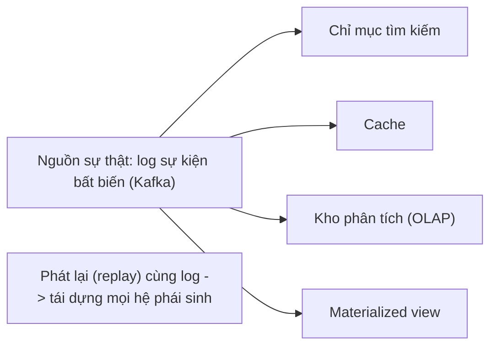

Xử lý luồng có ba mục đích: theo dõi sự kiện phức (CEP — Complex Event Processing), phân tích chỉ số thời gian thực, và duy trì khung nhìn thực thể hoá cập nhật liên tục. Thách thức cốt lõi là **suy luận về thời gian**: phân biệt **thời gian sự kiện (event time — lúc việc xảy ra)** với **thời gian xử lý (processing time — lúc hệ nhận được)**, xử lý **sự kiện đến muộn/lạc (straggler)** bằng **watermark** (mốc báo "đã nhận đủ sự kiện trước thời điểm t"), và chọn kiểu **cửa sổ (window)**:

| Loại cửa sổ | Đặc điểm |
|---|---|
| Tumbling (nhảy) | Không chồng lấn, cố định (mỗi phút) |
| Hopping (trượt-nhảy) | Cố định nhưng chồng lấn |
| Sliding (trượt) | Theo mỗi sự kiện, khoảng cố định lùi |
| Session | Gom theo hoạt động, đóng khi im lặng |

**Join luồng** có ba dạng (stream-stream, stream-table, table-table), đều phải đối phó dữ liệu thay đổi theo thời gian. Về chịu lỗi, để đạt ngữ nghĩa **đúng-một-lần (exactly-once)** *về hiệu ứng*, hệ dùng **microbatching, checkpoint, giao dịch nguyên tử và thao tác idempotent** (khử trùng lặp). Đánh đổi: luồng cho độ trễ thấp và phản ứng liên tục, đổi lại độ phức tạp cao về thời gian, thứ tự và bảo đảm chính xác so với batch tất định.

---

## Chương 12 — Tương lai của hệ thống dữ liệu (The Future of Data Systems) {#chuong-12}

Chương kết là tổng hợp và tầm nhìn: Kleppmann đề xuất cách ghép các mảnh của cuốn sách thành kiến trúc mạch lạc, đồng thời bàn khía cạnh đạo đức của nghề.

Ý tưởng trung tâm là **tích hợp dữ liệu (data integration)**. Không có công cụ nào phù hợp mọi việc, nên thực tế ta luôn phải kết hợp nhiều hệ chuyên biệt (CSDL, chỉ mục tìm kiếm, cache, kho phân tích) và giữ chúng đồng bộ. Tác giả đề xuất coi luồng sự kiện bất biến làm **nguồn sự thật (source of truth)**, rồi phái sinh mọi thứ khác từ đó bằng xử lý luồng/lô — nhờ vậy các hệ phái sinh luôn nhất quán cuối cùng theo cùng thứ tự log.

Ông gọi đây là tư duy **cơ sở dữ liệu tháo rời (unbundling the database)**: các chức năng vốn gộp trong một CSDL — lưu trữ, chỉ mục thứ cấp, nhân bản, khung nhìn thực thể hoá — được tách thành các thành phần độc lập nối với nhau qua log, dùng **dòng chảy dữ liệu (dataflow)** làm chất keo thay cho lời gọi đồng bộ rối rắm.

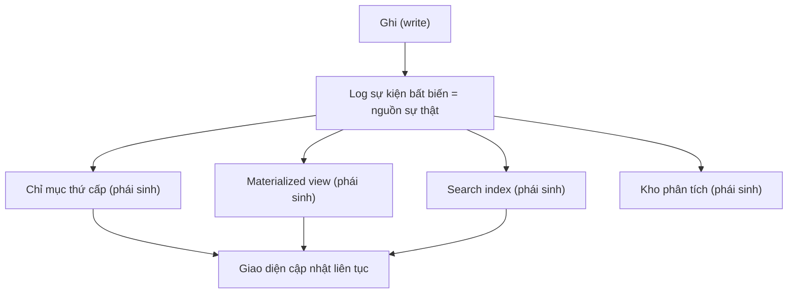

Từ đó nảy ra ý tưởng ứng dụng như **hệ đăng ký-nhận phái sinh (subscribe to changes)**: giao diện người dùng, cache và trạng thái client đều được cập nhật liên tục bằng cách theo dõi luồng thay đổi, hướng tới trải nghiệm thời gian thực end-to-end (như dataflow chạy suốt tới trình duyệt).

Về **tính đúng đắn (correctness)**, tác giả lập luận rằng thay vì cố ép giao dịch phân tán mạnh và đắt (2PC toàn cục), ta có thể đạt đúng đắn nhờ **thao tác idempotent, khử trùng lặp bằng định danh yêu cầu (request ID / operation ID), và ràng buộc bất đối xứng theo thời gian**: chấp nhận thao tác trước rồi kiểm tra vi phạm sau và bù trừ (compensating transaction) thay vì khoá chặt trước.

| Cách tiếp cận đúng đắn | Cơ chế | Ưu điểm |
|---|---|---|
| Giao dịch phân tán mạnh | 2PC, khoá toàn cục | Chặt chẽ tức thời |
| End-to-end idempotency | ID duy nhất + khử trùng lặp | Rẻ, mở rộng tốt, chịu lỗi mạng |
| Kiểm chứng sau (audit) | Compensating tx, đối soát | Linh hoạt, phát hiện lỗi ngầm |

Ông nhấn mạnh nguyên tắc **tin nhưng phải kiểm chứng (trust but verify)**: kiểm toán và đối soát liên tục thay vì tin mù vào phần cứng/phần mềm không bao giờ hỏng ngầm. Cuối cùng, chương chuyển sang **đạo đức**: dữ liệu có thể bị lạm dụng cho giám sát hàng loạt, phân biệt đối xử qua thuật toán thiên lệch, và tích luỹ quyền lực bất cân xứng. Kleppmann kêu gọi kỹ sư xem dữ liệu người dùng như tài sản được uỷ thác (data as an asset held in trust) cần bảo vệ, tôn trọng quyền riêng tư và tự quyết, khép lại cuốn sách bằng lời nhắc rằng trách nhiệm kỹ thuật đi kèm trách nhiệm xã hội.
