# System Design Interview — Alex Xu (Tóm tắt theo chương)

*System Design Interview: An Insider's Guide* của Alex Xu là cuốn sách kinh điển giúp
chuẩn bị cho vòng phỏng vấn thiết kế hệ thống (system design interview). Sách không chỉ
cung cấp kiến thức nền về xây dựng hệ thống có khả năng mở rộng (scalable) mà còn đưa ra
một khung tư duy (framework) 4 bước để giải quyết các bài toán mở, mơ hồ đặc trưng của
dạng phỏng vấn này. Bản ghi chú dưới đây trình bày chi tiết từng chương với: (a) phân tích
vấn đề/yêu cầu, (b) các quyết định thiết kế chính, (c) đánh đổi (trade-off), (d) sơ đồ
kiến trúc/luồng dữ liệu bằng Mermaid, và (e) code minh hoạ cho các chương có thuật toán.
Đây là ghi chú ôn tập diễn đạt lại bằng lời người viết, không thay thế việc đọc bản gốc.

## Mục lục

1. [Scale từ 0 đến hàng triệu người dùng](#chuong-1-scale-tu-0-en-hang-trieu-nguoi-dung-scale-from-zero-to-millions-of-users)
2. [Ước lượng back-of-the-envelope](#chuong-2-uoc-luong-back-of-the-envelope-back-of-the-envelope-estimation)
3. [Khung 4 bước cho phỏng vấn thiết kế hệ thống](#chuong-3-khung-4-buoc-cho-phong-van-thiet-ke-he-thong-a-framework-for-system-design-interviews)
4. [Thiết kế Rate Limiter](#chuong-4-thiet-ke-rate-limiter-design-a-rate-limiter)
5. [Consistent Hashing](#chuong-5-consistent-hashing-design-consistent-hashing)
6. [Kho lưu trữ Key-Value](#chuong-6-kho-luu-tru-key-value-design-a-key-value-store)
7. [Bộ sinh ID duy nhất phân tán](#chuong-7-bo-sinh-id-duy-nhat-phan-tan-unique-id-generator-in-distributed-systems)
8. [URL Shortener](#chuong-8-url-shortener-design-a-url-shortener)
9. [Web Crawler](#chuong-9-web-crawler-design-a-web-crawler)
10. [Hệ thống thông báo](#chuong-10-he-thong-thong-bao-design-a-notification-system)
11. [News Feed](#chuong-11-news-feed-design-a-news-feed-system)
12. [Hệ thống chat](#chuong-12-he-thong-chat-design-a-chat-system)
13. [Gợi ý tìm kiếm tự động](#chuong-13-goi-y-tim-kiem-tu-ong-design-a-search-autocomplete-system)
14. [Thiết kế YouTube](#chuong-14-thiet-ke-youtube-design-youtube)
15. [Thiết kế Google Drive](#chuong-15-thiet-ke-google-drive-design-google-drive)
16. [Học tiếp](#chuong-16-hoc-tiep-the-learning-continues)

---

## Chương 1: Scale từ 0 đến hàng triệu người dùng (Scale From Zero to Millions of Users)

**Vấn đề:** Chương mở đầu kể một câu chuyện tiến hoá: hệ thống ban đầu chỉ chạy trên một
máy chủ đơn (single server) phục vụ vài người dùng, rồi qua từng bước cải tiến trở thành
kiến trúc phân tán phục vụ hàng triệu người. Mỗi bước giải quyết một nút thắt cổ chai
(bottleneck) cụ thể xuất hiện khi lưu lượng tăng, và mỗi giải pháp lại kéo theo đánh đổi mới.

**Phân tích và các quyết định thiết kế chính:** Điểm khởi đầu là một máy chủ gói cả web
server, cơ sở dữ liệu (database) và cache. Dòng đời mở rộng diễn ra theo trình tự:

1. **Tách tầng dữ liệu khỏi tầng web** để hai tầng mở rộng độc lập. Đây là bước đầu tiên
   phá vỡ sự phụ thuộc phần cứng chung.
2. **Chọn loại cơ sở dữ liệu:** RDBMS (MySQL, PostgreSQL) cho dữ liệu quan hệ, giao dịch;
   NoSQL (key-value, document, column, graph) khi cần độ trễ cực thấp, dữ liệu phi cấu trúc,
   hoặc khối lượng khổng lồ khó join.
3. **Bộ cân bằng tải (load balancer):** phân phối lưu lượng tới nhiều web server, che giấu
   IP nội bộ, chống lỗi (failover) khi một server chết.
4. **Nhân bản cơ sở dữ liệu (replication):** mô hình master-slave (leader-follower) — master
   nhận ghi, slave phục vụ đọc, tăng thông lượng đọc và độ sẵn sàng.
5. **Cache và CDN:** cache (Redis/Memcached) giảm tải đọc DB theo mẫu read-through; CDN phục
   vụ tài nguyên tĩnh (ảnh, JS, CSS) từ edge gần người dùng.
6. **Tầng web không trạng thái (stateless):** đưa session ra kho dùng chung (Redis/NoSQL) để
   mọi request có thể tới bất kỳ server nào, giúp auto-scaling dễ dàng.
7. **Nhiều trung tâm dữ liệu (data center):** định tuyến người dùng tới DC gần nhất bằng
   geoDNS, tăng độ trễ tốt và chịu thảm hoạ vùng.
8. **Message queue:** tách rời (decouple) producer và consumer, xử lý tác vụ nặng bất đồng bộ.
9. **Sharding tầng dữ liệu:** chia dữ liệu theo shard key để vượt giới hạn một DB.

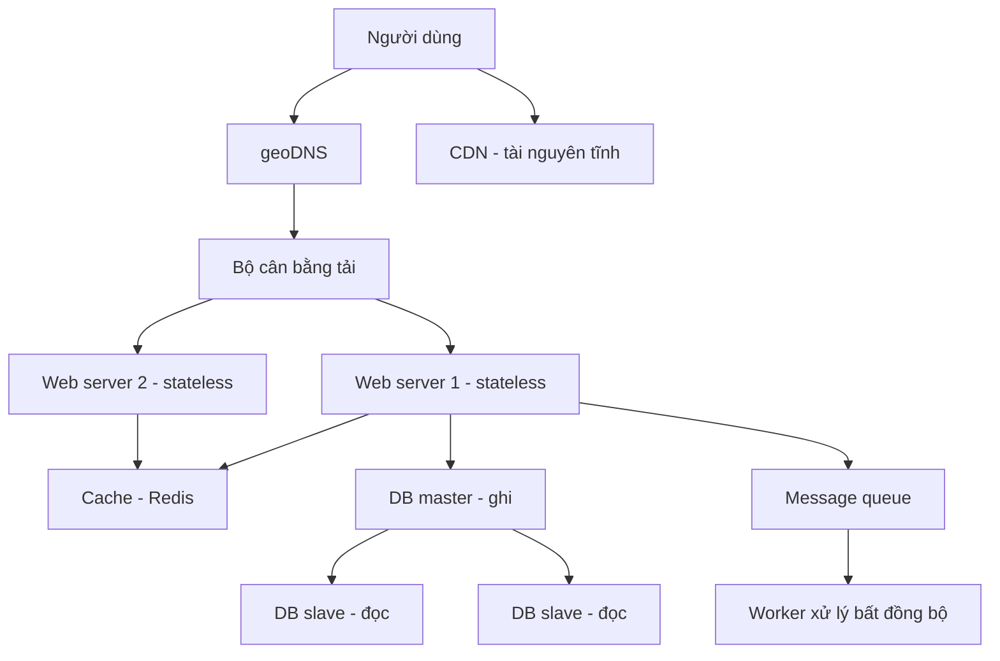

**Đánh đổi:**

| Tiêu chí | Mở rộng dọc (vertical) | Mở rộng ngang (horizontal) |
|---|---|---|
| Cách làm | Thêm CPU/RAM cho một máy | Thêm nhiều máy |
| Độ phức tạp | Đơn giản | Cao (đồng bộ, phân tán) |
| Giới hạn | Chạm trần phần cứng | Gần như không giới hạn |
| Chịu lỗi | Kém (SPOF) | Tốt (dự phòng) |

Sharding tuy mở rộng vô hạn nhưng gây khó join, sinh vấn đề hotspot key (celebrity problem)
và tái phân mảnh (resharding) tốn kém — cần consistent hashing (chương 5) để giảm đau.

---

## Chương 2: Ước lượng back-of-the-envelope (Back-of-the-Envelope Estimation)

**Vấn đề:** Trong phỏng vấn, ứng viên thường phải ước lượng nhanh dung lượng, thông lượng
hoặc hiệu năng hệ thống để đánh giá tính khả thi và định cỡ (sizing) hạ tầng. Mục tiêu không
phải con số chính xác tuyệt đối mà là thể hiện tư duy định lượng có cơ sở.

**Kiến thức nền cần nắm:** Ba nhóm số liệu cốt lõi:

- **Lũy thừa của 2:** 2^10 = 1 KB, 2^20 = 1 MB, 2^30 = 1 GB, 2^40 = 1 TB, 2^50 = 1 PB.
- **Latency numbers every programmer should know (Jeff Dean):** truy cập cache L1 ~0.5 ns,
  đọc RAM ~100 ns, gửi gói qua data center ~500 μs, round-trip trong cùng DC ~1 ms, đọc đĩa
  tuần tự 1 MB ~30 ms, round-trip California ↔ Hà Lan ~150 ms. Kết luận: bộ nhớ nhanh, đĩa
  chậm, mạng liên vùng rất chậm — tránh disk seek, nén trước khi truyền, giảm chuyến đi mạng.
- **Tính sẵn sàng (availability):** đo bằng "số chín" — 99.9% ≈ 8.76 giờ downtime/năm,
  99.99% ≈ 52.6 phút, 99.999% ≈ 5.26 phút; ràng buộc bởi SLA (service level agreement).

**Ví dụ điển hình — ước lượng Twitter:** Giả định 300 triệu MAU, 50% dùng hằng ngày → DAU
150 triệu; mỗi người đăng 2 tweet/ngày → 300 triệu tweet/ngày. Tweet QPS ≈ 300 triệu /
86400 giây ≈ 3500; peak QPS ≈ 2× ≈ 7000. Nếu 10% tweet có media 1 MB → 30 TB/ngày media,
lưu 5 năm ≈ 30 TB × 365 × 5 ≈ 55 PB.

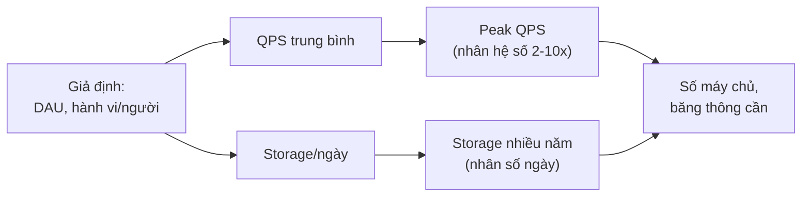

**Đánh đổi và nguyên tắc:** Trọng tâm là *quá trình* chứ không phải con số. Nên làm tròn
(rounding) để tính nhẩm nhanh, ghi rõ giả định (assumptions), luôn kèm đơn vị (labels) và
phân biệt QPS trung bình với peak QPS. Ước lượng giúp trả lời sớm các câu hỏi: cần bao nhiêu
server, có cần cache/CDN không, dữ liệu có vừa RAM không — định hướng toàn bộ thiết kế sau đó.

---

## Chương 3: Khung 4 bước cho phỏng vấn thiết kế hệ thống (A Framework for System Design Interviews)

**Vấn đề:** Câu hỏi thiết kế hệ thống cố tình mơ hồ, phạm vi rộng và không có đáp án đúng
duy nhất. Người phỏng vấn không tìm "lời giải hoàn hảo" mà đánh giá khả năng cộng tác, xử lý
sự mơ hồ, đưa ra và bảo vệ các lựa chọn thiết kế dựa trên trade-off. Một ứng viên giỏi kỹ
thuật vẫn có thể trượt nếu lao ngay vào giải pháp mà bỏ qua làm rõ yêu cầu.

**Khung 4 bước:**

- **Bước 1 — Hiểu vấn đề và xác định phạm vi (understand & scope):** Đặt câu hỏi làm rõ,
  không vội đưa giải pháp. Xác định tính năng cần có, ai dùng, quy mô (số user, QPS), ràng
  buộc và giả định. Ghi lại yêu cầu chức năng và phi chức năng.
- **Bước 2 — Đề xuất thiết kế cấp cao và lấy đồng thuận (get buy-in):** Vẽ sơ đồ khối các
  thành phần chính (client, API, DB, cache, queue...), thống nhất hướng đi với người phỏng
  vấn, làm vài phép tính back-of-the-envelope để kiểm chứng khả thi.
- **Bước 3 — Đào sâu thiết kế (design deep dive):** Cùng người phỏng vấn chọn 1-2 thành
  phần hoặc nút thắt quan trọng để phân tích chi tiết (ví dụ schema DB, thuật toán, cách xử
  lý hotkey), thảo luận các phương án và đánh đổi.
- **Bước 4 — Tổng kết (wrap up):** Nêu điểm nghẽn còn lại, hướng cải tiến, cách mở rộng, xử
  lý lỗi, logging/monitoring và vận hành.

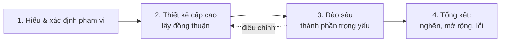

**Phân bổ thời gian tham khảo (buổi 45 phút):** Bước 1 ~3-10 phút, Bước 2 ~10-15 phút,
Bước 3 ~10-25 phút, Bước 4 ~3-5 phút.

**Đánh đổi và cảnh báo "red flag":** Tránh over-engineering (vẽ thừa thành phần, phớt lờ
trade-off), giữ khư khư một công nghệ ưa thích, hoặc im lặng suy nghĩ một mình. Nên "suy
nghĩ thành lời", chủ động đề xuất và luôn giải thích *vì sao* chọn phương án này thay vì
phương án kia. Đây là chương khung tư duy, được áp dụng lặp lại xuyên suốt các chương thiết
kế từ chương 4 trở đi.

---

## Chương 4: Thiết kế Rate Limiter (Design a Rate Limiter)

**Vấn đề:** Xây dựng bộ giới hạn tốc độ (rate limiter) chặn bớt request vượt ngưỡng nhằm
chống lạm dụng/tấn công DoS, giảm chi phí (đặc biệt với API tính tiền theo lượt gọi) và
tránh quá tải máy chủ. Yêu cầu phi chức năng: chính xác, độ trễ thấp, tốn ít bộ nhớ, hoạt
động phân tán, có thông báo rõ ràng cho client, và chịu lỗi tốt.

**Vị trí đặt:** Nên đặt phía server hoặc trong API gateway (dạng middleware) thay vì client
— vì client dễ bị giả mạo và không kiểm soát được. API gateway là nơi lý tưởng vì đã tập
trung xác thực, SSL termination và whitelist.

**So sánh các thuật toán:**

| Thuật toán | Ưu điểm | Nhược điểm |
|---|---|---|
| Token bucket | Cho phép burst, ít bộ nhớ | Chỉnh 2 tham số (rate, capacity) khó |
| Leaking bucket | Đầu ra ổn định, mượt | Burst cũ chặn request mới; 2 tham số |
| Fixed window counter | Đơn giản, ít bộ nhớ | Burst ở rìa cửa sổ vượt quota gấp đôi |
| Sliding window log | Chính xác tuyệt đối | Tốn bộ nhớ (lưu mọi timestamp) |
| Sliding window counter | Mượt, tiết kiệm bộ nhớ | Chỉ là xấp xỉ |

Token bucket được Amazon và Stripe dùng phổ biến. Nguyên lý: một "xô" chứa tối đa `capacity`
token, được nạp lại với tốc độ `refill_rate` token/giây; mỗi request tiêu một token — hết
token thì bị từ chối.

```python
import time

class TokenBucket:
    def __init__(self, capacity: int, refill_rate: float):
        self.capacity = capacity          # số token tối đa
        self.refill_rate = refill_rate    # token nạp mỗi giây
        self.tokens = capacity
        self.last = time.monotonic()

    def allow(self, cost: int = 1) -> bool:
        now = time.monotonic()
        # nạp token theo thời gian đã trôi qua
        self.tokens = min(self.capacity,
                          self.tokens + (now - self.last) * self.refill_rate)
        self.last = now
        if self.tokens >= cost:
            self.tokens -= cost
            return True
        return False   # vượt ngưỡng -> trả HTTP 429
```

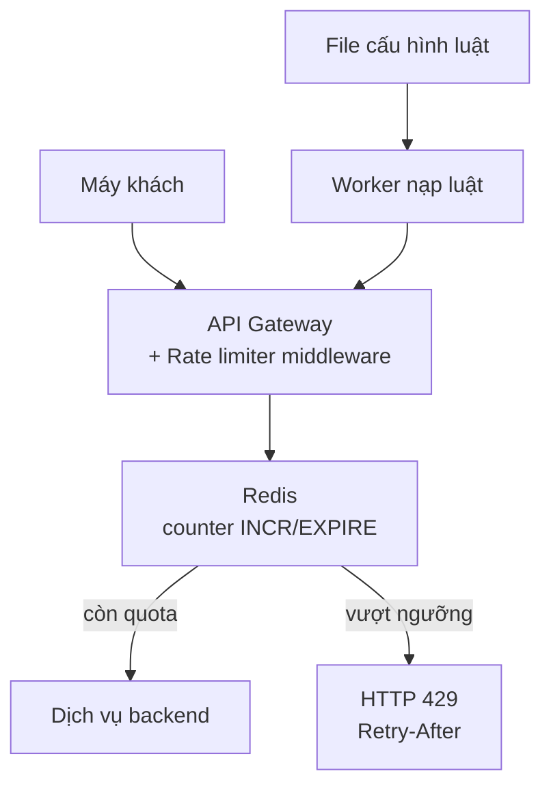

**Đánh đổi và môi trường phân tán:** Độ chính xác đổi lấy bộ nhớ. Khi triển khai nhiều node,
xuất hiện **race condition** (giải bằng Lua script atomic hoặc sorted set trong Redis) và
**vấn đề đồng bộ** (dùng kho tập trung Redis theo mô hình eventual consistency thay vì
sticky session). Khi vượt ngưỡng, trả HTTP 429 kèm header `X-Ratelimit-Remaining`,
`X-Ratelimit-Limit`, `Retry-After`. Luật giới hạn lưu ở file cấu hình, worker định kỳ nạp
vào cache.

---

## Chương 5: Consistent Hashing (Design Consistent Hashing)

**Vấn đề:** Khi phân phối key qua N server bằng `hash(key) % N`, việc thêm hoặc bớt một
server làm thay đổi N và khiến gần như *toàn bộ* key bị ánh xạ lại (remap), gây một cơn bão
cache miss và di chuyển dữ liệu khổng lồ. Cần một kỹ thuật sao cho khi cụm thay đổi kích
thước, chỉ một phần nhỏ key phải di chuyển.

**Ý tưởng vòng băm (hash ring):** Ánh xạ cả server lẫn key lên cùng một không gian băm hình
tròn (ví dụ 0 → 2^160 của SHA-1, nối đầu và cuối thành vòng). Mỗi key thuộc về server đầu
tiên gặp được khi đi theo chiều kim đồng hồ từ vị trí của key. Khi thêm/bớt một server, chỉ
những key nằm giữa server đó và server liền trước trên vòng mới cần tái phân bố.

**Hai nhược điểm và cách khắc phục:** (1) Kích thước phân vùng không đều khi thêm/bớt server;
(2) Phân phối key lệch (một server ôm nhiều key hơn). Giải pháp: **nút ảo (virtual nodes /
replicas)** — mỗi server vật lý được biểu diễn bằng nhiều điểm trên vòng. Càng nhiều virtual
node, phân phối càng cân bằng (độ lệch chuẩn giảm), đổi lại tốn thêm bộ nhớ lưu metadata.

```python
import bisect, hashlib

class ConsistentHash:
    def __init__(self, replicas: int = 100):
        self.replicas = replicas   # số virtual node mỗi server
        self.ring = {}             # hash -> tên server
        self.sorted_keys = []

    def _hash(self, key: str) -> int:
        return int(hashlib.md5(key.encode()).hexdigest(), 16)

    def add(self, server: str):
        for i in range(self.replicas):
            h = self._hash(f"{server}#{i}")
            self.ring[h] = server
            bisect.insort(self.sorted_keys, h)

    def get(self, key: str) -> str:
        if not self.ring:
            return None
        h = self._hash(key)
        # đi theo chiều kim đồng hồ tới virtual node kế tiếp
        idx = bisect.bisect(self.sorted_keys, h) % len(self.sorted_keys)
        return self.ring[self.sorted_keys[idx]]
```

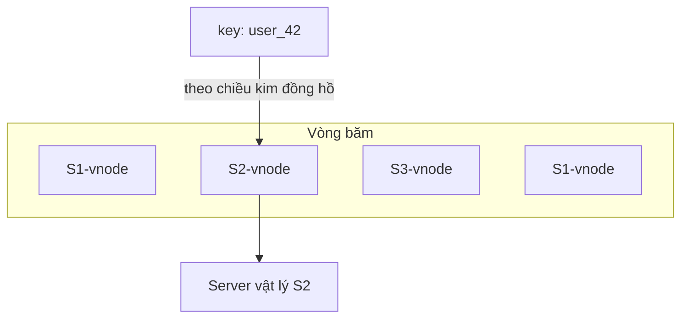

**Đánh đổi:** Số virtual node là tham số phải tinh chỉnh — nhiều thì cân bằng tốt nhưng tốn
bộ nhớ và tra cứu chậm hơn một chút. Consistent hashing được dùng rộng rãi: phân vùng của
Amazon Dynamo, Apache Cassandra, sharding của Discord, CDN Akamai, và load balancer Maglev
của Google. Lợi ích: tối thiểu hoá số key phải di chuyển khi co giãn cụm, dễ mở rộng ngang
và giảm vấn đề hotspot key.

---

## Chương 6: Kho lưu trữ Key-Value (Design a Key-Value Store)

**Vấn đề:** Thiết kế kho key-value phân tán hỗ trợ `put(key, value)` và `get(key)`, lưu dữ
liệu lớn (mỗi cặp key-value nhỏ, dưới 10 KB), độ trễ thấp, tính sẵn sàng cao, tự động mở
rộng theo lưu lượng, và có độ nhất quán (consistency) điều chỉnh được. Đây là chương lý
thuyết nền tảng, tổng hợp nhiều kỹ thuật của hệ phân tán.

**Định lý CAP:** Trong ba thuộc tính Consistency, Availability, Partition tolerance, khi có
phân vùng mạng (network partition — điều không thể tránh) hệ chỉ chọn được hai. Đa số kho
key-value quy mô lớn chọn **AP** (sẵn sàng + chịu phân vùng), hy sinh nhất quán tức thời để
đổi lấy eventual consistency (Dynamo, Cassandra); một số chọn **CP** khi cần strong
consistency (như hệ ngân hàng).

**Các thành phần cốt lõi:**

- **Phân vùng dữ liệu:** consistent hashing (chương 5) để trải key qua các node.
- **Nhân bản (replication):** ghi mỗi key lên N node kế tiếp trên vòng (khác data center để
  chống thảm hoạ).
- **Nhất quán bằng quorum (N, W, R):** N = số bản sao, W = số bản phải xác nhận ghi, R = số
  bản phải xác nhận đọc. Nếu **W + R > N** thì đảm bảo strong consistency (đọc luôn thấy ghi
  mới nhất).
- **Giải bất nhất:** versioning + **vector clock** để phát hiện và hoà giải xung đột.
- **Xử lý lỗi:** lỗi tạm thời dùng **hinted handoff** (node khác giữ hộ, trả sau khi hồi
  phục); lỗi lâu dài dùng đồng bộ **Merkle tree** (so cây băm để chỉ đồng bộ phần khác biệt).
- **Lưu trữ:** mô hình **LSM tree** — ghi vào commit log rồi memtable, flush thành SSTable
  bất biến; dùng **Bloom filter** để nhanh chóng loại các SSTable chắc chắn không chứa key.

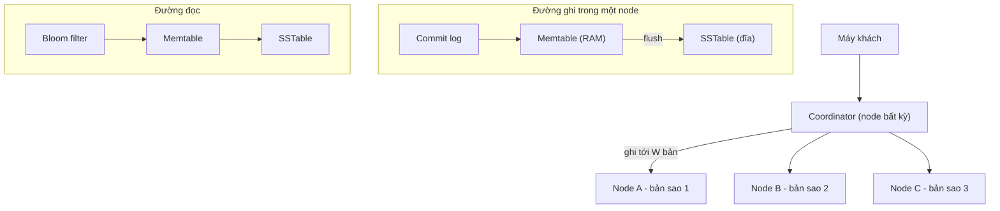

**Đánh đổi cấu hình N/W/R:**

| Cấu hình | Ý nghĩa |
|---|---|
| R = 1, W = N | Đọc rất nhanh, ghi chậm |
| W = 1, R = N | Ghi rất nhanh, đọc chậm |
| W + R > N | Strong consistency |
| W + R ≤ N | Chỉ eventual consistency |

Eventual consistency cho sẵn sàng cao nhưng đẩy gánh nặng hoà giải phiên bản về phía client
(hoặc lần đọc sau). Coordinator đóng vai proxy giữa client và các node trên vòng băm.

---

## Chương 7: Bộ sinh ID duy nhất phân tán (Unique ID Generator in Distributed Systems)

**Vấn đề:** Sinh ID duy nhất trên nhiều máy chủ trong hệ phân tán. Yêu cầu: ID duy nhất
toàn cục, chỉ chứa số, vừa trong 64-bit, tăng dần theo thời gian (sortable by time), và đạt
trên 10.000 ID/giây. Không dùng được `auto_increment` của một DB đơn vì đó là điểm lỗi đơn
và không mở rộng.

**So sánh các phương án:**

| Phương án | Ưu điểm | Nhược điểm |
|---|---|---|
| Multi-master replication | Dùng auto_increment bước k | Khó thêm server, ID không sort theo time |
| UUID (128-bit) | Sinh độc lập, không phối hợp | Không vừa 64-bit, không sort, có thể phi số |
| Ticket server (Flickr) | ID số, đơn giản | Điểm lỗi đơn (SPOF) |
| **Snowflake (chọn)** | Đủ mọi yêu cầu, sort theo time | Phụ thuộc đồng bộ đồng hồ |

**Twitter Snowflake:** chia 64 bit thành: sign (1 bit, luôn 0) + timestamp (41 bit, mili-giây
kể từ custom epoch) + datacenter ID (5 bit → 32 DC) + machine ID (5 bit → 32 máy/DC) +
sequence (12 bit → 4096 ID/ms/máy). 41 bit timestamp cho tuổi thọ ~69 năm.

```python
import time

class Snowflake:
    EPOCH = 1288834974657  # custom epoch (ms) của Twitter
    def __init__(self, datacenter_id: int, machine_id: int):
        self.dc = datacenter_id & 0x1F      # 5 bit
        self.machine = machine_id & 0x1F    # 5 bit
        self.seq = 0
        self.last_ts = -1

    def _now(self) -> int:
        return int(time.time() * 1000)

    def next_id(self) -> int:
        ts = self._now()
        if ts == self.last_ts:
            self.seq = (self.seq + 1) & 0xFFF   # 12 bit
            if self.seq == 0:                   # hết sequence -> chờ ms kế
                while ts <= self.last_ts:
                    ts = self._now()
        else:
            self.seq = 0
        self.last_ts = ts
        return (((ts - self.EPOCH) << 22)
                | (self.dc << 17)
                | (self.machine << 12)
                | self.seq)
```

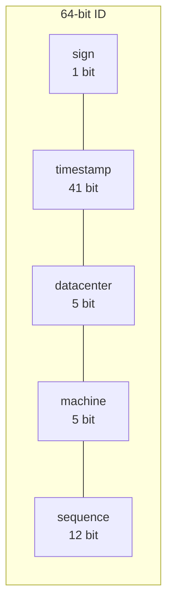

**Đánh đổi:** Snowflake đáp ứng mọi yêu cầu nhưng phụ thuộc đồng bộ đồng hồ (clock sync) —
nếu đồng hồ nhảy lùi (NTP điều chỉnh) có thể sinh ID trùng hoặc không tăng; giải bằng cách
chờ hoặc dùng NTP cẩn thận. Có thể tinh chỉnh độ dài trường: nhiều bit timestamp hơn cho ứng
dụng tuổi thọ dài, ít bit sequence nếu concurrency thấp. Mỗi máy sinh ID độc lập, không cần
phối hợp qua mạng — đó là ưu thế lớn về hiệu năng và độ sẵn sàng.

---

## Chương 8: URL Shortener (Design a URL Shortener)

**Vấn đề:** Thiết kế dịch vụ rút gọn URL kiểu TinyURL/bit.ly: nhận URL dài trả về URL ngắn,
và chuyển hướng (redirect) URL ngắn về URL gốc. Quy mô ~100 triệu URL mới/ngày (≈ 1160
ghi/giây), tỉ lệ đọc:ghi khoảng 10:1, URL ngắn dùng ký tự [0-9, a-z, A-Z] (base 62).

**Ước lượng độ dài hashValue:** Với 100 triệu URL/ngày trong 10 năm ≈ 365 tỉ bản ghi. Cần
62^n ≥ 365 tỉ → n = 7 (62^7 ≈ 3.5 nghìn tỉ) là đủ. Vậy URL ngắn dài 7 ký tự.

**Hai hướng sinh URL ngắn:**

| Hướng | Cách làm | Ưu điểm | Nhược điểm |
|---|---|---|---|
| Hash + giải va chạm | Băm URL, lấy 7 ký tự đầu | Độ dài cố định | Phải kiểm tra va chạm, tốn truy vấn DB |
| Base-62 conversion (chọn) | Sinh ID số duy nhất rồi đổi base 62 | Không có va chạm, không cần kiểm tra | ID dễ đoán tuần tự, độ dài thay đổi |

Base-62 dựa vào bộ sinh ID (chương 7): mỗi URL nhận một ID số duy nhất, đổi sang chuỗi base
62 làm URL ngắn.

```python
CHARS = "0123456789abcdefghijklmnopqrstuvwxyzABCDEFGHIJKLMNOPQRSTUVWXYZ"

def to_base62(num: int) -> str:
    if num == 0:
        return CHARS[0]
    out = []
    while num:
        num, rem = divmod(num, 62)
        out.append(CHARS[rem])
    return "".join(reversed(out))

def to_base10(short: str) -> int:
    num = 0
    for ch in short:
        num = num * 62 + CHARS.index(ch)
    return num

# ví dụ: id 2009215674938 -> "zn9edcu"
```

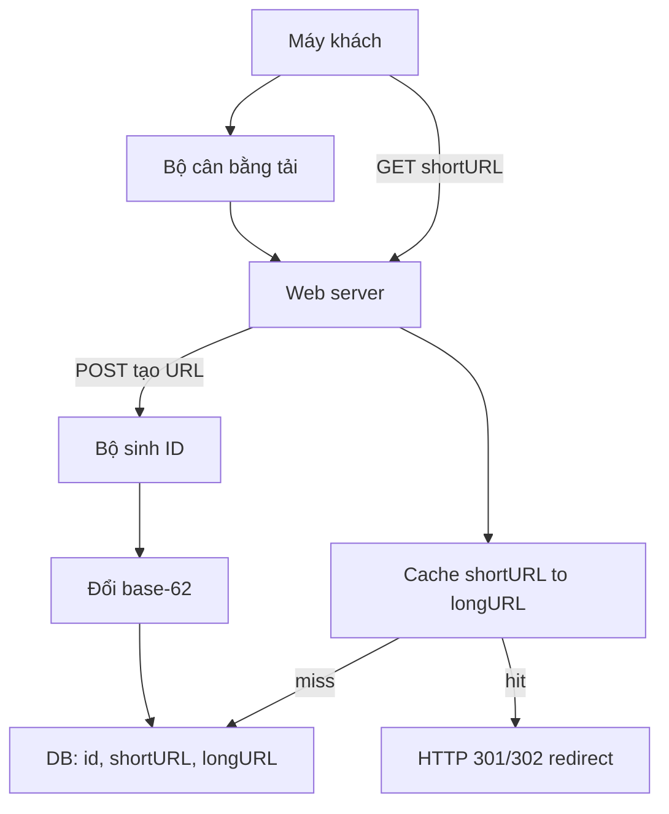

**Đánh đổi redirect:** HTTP **301** (permanent) được trình duyệt cache lâu → giảm tải server
nhưng khó thống kê click; HTTP **302** (temporary) luôn hỏi lại server → theo dõi analytics
tốt hơn nhưng tải cao hơn. Vì đọc nhiều hơn ghi rất nhiều, đặt cache `<shortURL, longURL>`
phía trước DB để phục vụ redirect nhanh. Phần tổng kết bàn thêm về rate limiter (chống lạm
dụng), sharding DB, phân tích analytics và tính sẵn sàng.

---

## Chương 9: Web Crawler (Design a Web Crawler)

**Vấn đề:** Thiết kế web crawler thu thập nội dung web phục vụ lập chỉ mục tìm kiếm (cũng
dùng cho khai phá dữ liệu, giám sát bản quyền, phát hiện spam). Quy mô ~1 tỉ trang/tháng,
chỉ HTML, có xử lý trang mới và trang cập nhật, lưu tối đa 5 năm. Bốn tiêu chí then chốt:
khả năng mở rộng (scalability), lịch sự (politeness), khả năng mở rộng chức năng
(extensibility) và bền vững (robustness).

**Thuật toán nền:** BFS trên đồ thị web — bắt đầu từ seed URLs, tải trang, trích link, thêm
URL mới vào hàng đợi và lặp lại. Nhưng BFS ngây thơ có hai vấn đề: (1) tải dồn dập vào một
host gây "impolite"; (2) không có ưu tiên (mọi URL được đối xử như nhau).

**Các thành phần:**

- **URL Frontier:** hàng đợi thông minh với **front queues** (quản lý ưu tiên) và **back
  queues** (đảm bảo lịch sự — mỗi host một hàng, có delay giữa các lần tải).
- **HTML Downloader** + **DNS Resolver** (cache DNS để tránh nghẽn).
- **Content Parser** → **"Content Seen?"** (khử trùng lặp nội dung bằng hash/checksum).
- **Content Storage** → **URL Extractor** → **"URL Filter"** → **"URL Seen?"** → quay lại
  Frontier.

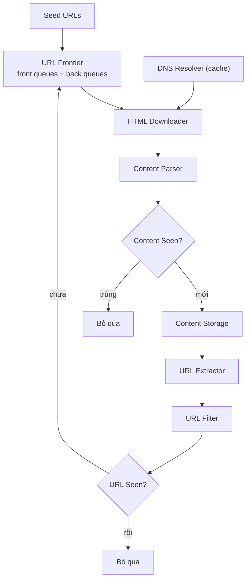

**Kỹ thuật và đánh đổi:** *Lịch sự* — mỗi host chỉ một luồng tải, có khoảng chờ giữa các
request, tôn trọng `robots.txt`. *Ưu tiên* — xếp URL theo PageRank, lưu lượng, tần suất cập
nhật. *Freshness* — recrawl theo lịch sử thay đổi của trang. *Lưu trữ Frontier* theo mô hình
lai: phần lớn trên đĩa (vì hàng trăm triệu URL), đệm một phần trên RAM. *Hiệu năng* — crawl
phân tán, cache DNS, đặt server gần host (locality), timeout ngắn. *Bền vững* — consistent
hashing để phân phối downloader, lưu trạng thái crawl để phục hồi, xử lý ngoại lệ tao nhã.
Cần tránh **bẫy nhện (spider trap)** — URL sinh vô hạn — bằng giới hạn độ dài/độ sâu, lọc
nội dung trùng lặp và dữ liệu nhiễu (quảng cáo, spam).

---

## Chương 10: Hệ thống thông báo (Design a Notification System)

**Vấn đề:** Thiết kế hệ thống gửi thông báo đa kênh ở quy mô lớn — push notification
(iOS qua APNs, Android qua FCM), SMS (Twilio, Nexmo) và email (SendGrid, Mailchimp). Yêu
cầu: đáng tin cậy (không mất thông báo quan trọng), co giãn, tôn trọng cài đặt opt-out của
người dùng, và có khả năng chống spam.

**Thu thập thông tin thiết bị:** Khi người dùng cài app hoặc đăng ký, hệ thống lưu **device
token** (cho push), số điện thoại (SMS), địa chỉ email vào DB, gắn với user_id.

**Luồng và các thành phần (bản cải tiến):** Các dịch vụ sinh sự kiện → **Notification
servers** (xác thực, rate limiting, lấy device token/thông tin liên hệ, dựng nội dung từ
template) → đưa vào **message queue riêng cho từng kênh** (tách rời và đệm để mỗi kênh co
giãn độc lập) → **workers** kéo từ queue → gọi dịch vụ bên thứ ba tương ứng → thiết bị người
dùng.

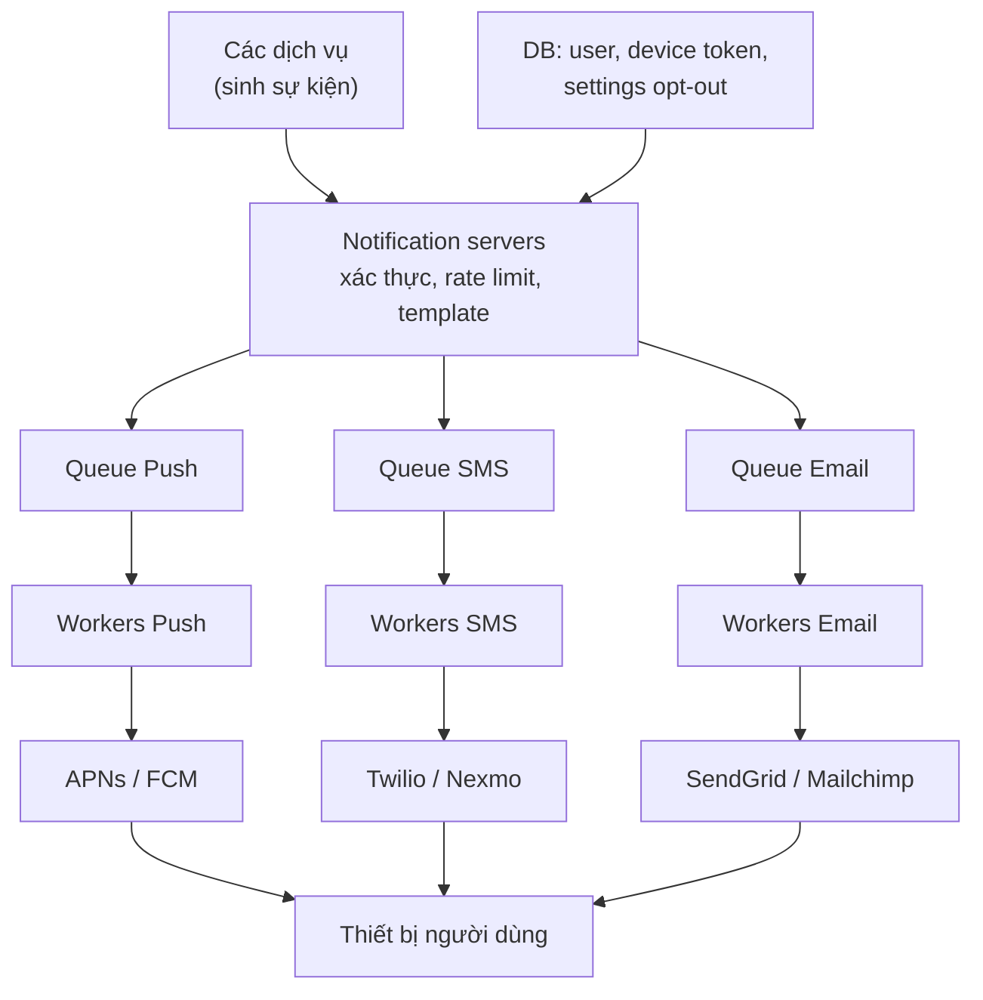

**Đánh đổi độ tin cậy:** Message queue giúp tách rời và co giãn độc lập, nhưng khó đảm bảo
**exactly-once** delivery. Hệ thống chấp nhận **at-least-once** và khử trùng lặp (dedupe)
bằng cách gắn event ID và kiểm tra trước khi gửi. Cần cân bằng giữa retry (tăng độ tin cậy)
và nguy cơ gửi trùng.

**Các cải tiến quan trọng:**

- **Retry:** thất bại thì đưa lại queue; quá số lần cho phép thì cảnh báo dev.
- **Bảo mật:** dùng appKey/appSecret cho API gửi thông báo.
- **Notification template:** tái sử dụng khuôn mẫu để nhất quán và giảm lỗi.
- **Bảng cài đặt (settings):** tôn trọng opt-out theo từng loại/kênh của người dùng.
- **Rate limiting:** giới hạn tần suất thông báo tới mỗi người tránh làm phiền.
- **Giám sát:** theo dõi số thông báo tồn đọng trong queue — nếu lớn thì thêm worker; đo
  open rate, click rate qua analytics.

---

## Chương 11: News Feed (Design a News Feed System)

**Vấn đề:** Thiết kế bảng tin (news feed) kiểu Facebook/Instagram/Twitter — người dùng đăng
bài và xem dòng bài của bạn bè/người theo dõi, sắp theo thứ tự thời gian đảo ngược
(reverse chronological). Quy mô ~10 triệu DAU, mỗi người tối đa 5000 bạn, hỗ trợ ảnh/video.

**Hai luồng chính:**

- **Feed publishing (đăng bài):** User → Load Balancer → Web servers (xác thực, rate
  limiting) → Post service (lưu DB + cache) → **Fanout service** (đẩy bài vào feed của bạn
  bè) → Notification service.
- **Newsfeed building (dựng feed):** User → Web servers → Newsfeed service (đọc danh sách
  post ID từ Newsfeed cache) → hydrate nội dung đầy đủ từ các cache khác.

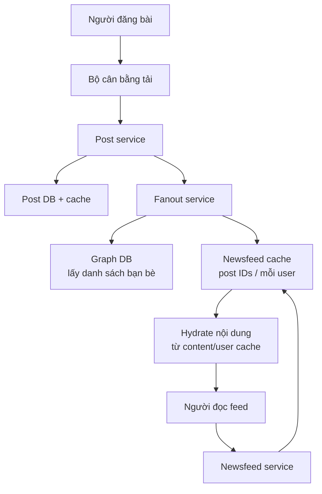

**Đánh đổi — hai mô hình fanout:**

| Mô hình | Cách làm | Ưu điểm | Nhược điểm |
|---|---|---|---|
| Fanout on write (push) | Tính sẵn feed lúc ghi | Đọc feed cực nhanh, realtime | Tốn với người nhiều bạn (hotkey); lãng phí với user không hoạt động |
| Fanout on read (pull) | Tính feed lúc đọc | Không lãng phí, tốt cho người nhiều bạn | Đọc chậm |
| **Lai (hybrid)** | Push cho đa số, pull cho người nổi tiếng | Cân bằng tốt | Phức tạp hơn |

Đa số user dùng **push** để đọc nhanh; với **người nổi tiếng** (hàng triệu follower) dùng
**pull** để tránh cơn bão ghi khi họ đăng bài. Hệ dùng nhiều tầng cache: news feed, content
(hot/normal), social graph, action (đã like/reply?), counters (like/reply/follower). Phần
sâu bàn thêm về mở rộng DB, dedupe bài trùng, và thuật toán xếp hạng feed.

---

## Chương 12: Hệ thống chat (Design a Chat System)

**Vấn đề:** Thiết kế ứng dụng chat hỗ trợ chat 1-1 và nhóm nhỏ, chỉ báo trực tuyến (online
presence), gửi/nhận realtime độ trễ thấp, đồng bộ tin nhắn trên nhiều thiết bị và hỗ trợ
push notification khi offline.

**Cơ chế truyền tin — điểm mấu chốt:** Client gửi tin bằng HTTP thông thường (client chủ
động khởi tạo), nhưng để *nhận* tin realtime cần kênh mà server chủ động đẩy được. Sau khi
loại polling và long polling, chọn **WebSocket** — kết nối bền, hai chiều, khởi tạo từ client
nhưng cho phép cả hai bên gửi bất kỳ lúc nào.

**Phân loại dịch vụ:** (1) *Stateless services* — đăng nhập, đăng ký, hồ sơ, service
discovery, qua API servers + KV store; (2) *Stateful chat service* — giữ kết nối WebSocket
bền với client, mỗi client bám một chat server; (3) *Third-party integration* — push
notification. Tin nhắn lưu trong **key-value store** (HBase như Messenger, Cassandra như
Discord) vì lượng dữ liệu khổng lồ, ghi nhiều và cần truy cập ngẫu nhiên nhanh; dữ liệu
người dùng/bạn bè vẫn để RDBMS.

**Message ID:** phải duy nhất và sắp được theo thời gian — dùng Snowflake toàn cục hoặc bộ
sinh ID cục bộ trong từng kênh/nhóm (đủ vì chỉ cần sort trong phạm vi một cuộc trò chuyện).

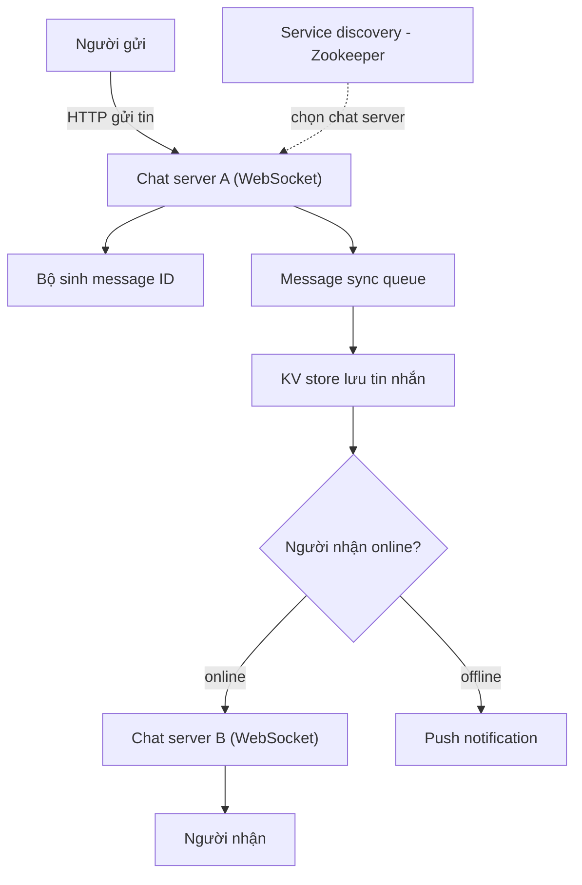

**Đánh đổi:** Chat nhóm nhỏ sao chép tin vào "inbox" (message sync queue) của từng thành
viên — đơn giản nhưng chỉ hợp nhóm nhỏ (WeChat giới hạn 500 người); nhóm cực lớn không thể
sao chép cho từng người. **Online presence** dùng **heartbeat** định kỳ: nếu quá thời gian
không nhận heartbeat mới coi là offline — tránh trạng thái nhấp nháy khi mạng chập chờn.
Presence servers dùng mô hình **publish-subscribe** để fanout thay đổi trạng thái tới bạn bè.

---

## Chương 13: Gợi ý tìm kiếm tự động (Design a Search Autocomplete System)

**Vấn đề:** Thiết kế hệ thống gợi ý (autocomplete / typeahead / search-as-you-type) trả về
top 5 truy vấn phổ biến nhất theo tiền tố (prefix) người dùng đang gõ. Yêu cầu: độ trễ cực
thấp (gợi ý xuất hiện tức thì theo từng phím), quy mô lớn, và gợi ý phản ánh mức độ phổ biến.

**Hai phần lớn:** (1) **Thu thập dữ liệu (data gathering)** — tổng hợp tần suất truy vấn từ
analytics log; (2) **Truy vấn (query)** — trả gợi ý nhanh cho tiền tố.

**Cấu trúc lõi — trie (cây tiền tố):** mỗi nút là một ký tự, đường từ gốc tới nút tạo thành
tiền tố. Để tránh phải duyệt toàn bộ cây con mỗi lần (chậm), **lưu sẵn (cache) top-k truy
vấn phổ biến nhất ngay tại mỗi nút** — khi có tiền tố, chỉ cần đi tới nút tương ứng và đọc
danh sách top-k đã tính sẵn.

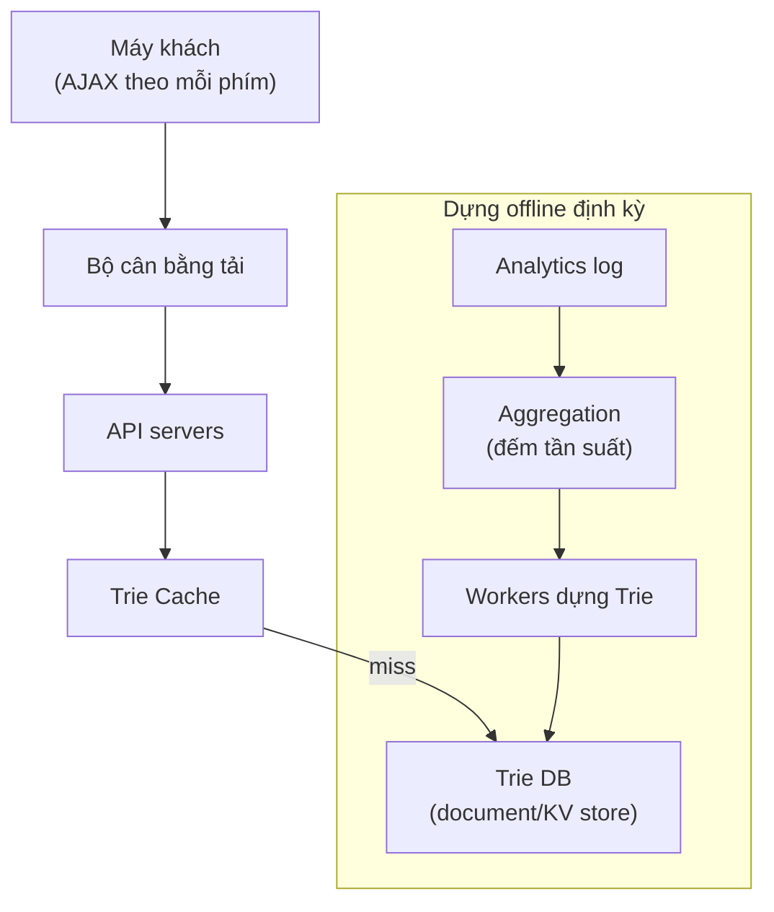

Sơ đồ trie minh hoạ (tiền tố "be" → gợi ý phổ biến):

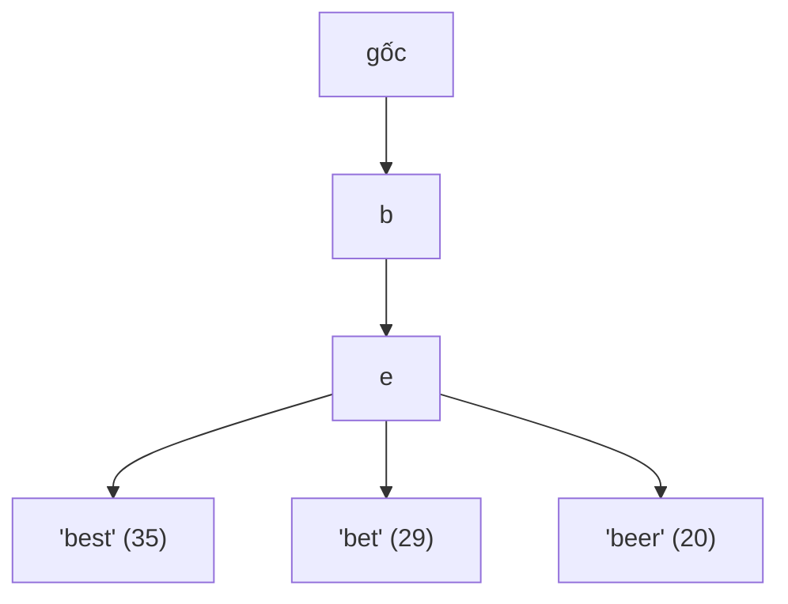

**Đánh đổi:** Lưu top-k tại mỗi nút tăng tốc đọc rất nhiều nhưng tốn bộ nhớ và khiến cập
nhật đắt (đổi một truy vấn phải cập nhật mọi nút tổ tiên). Vì thế thay vì cập nhật realtime,
worker **dựng lại toàn bộ trie định kỳ** (ví dụ hằng tuần) từ dữ liệu tổng hợp rồi nạp vào
Trie DB và Trie Cache. Dùng **data sampling** (chỉ log 1/N request) để giảm tải khi lưu
lượng khổng lồ. Thiết kế cơ bản không hỗ trợ trending/realtime. Tối ưu phía client: AJAX
request, browser caching (Google cache khoảng 1 giờ). Mở rộng lưu trữ bằng **sharding theo
tiền tố** với shard map manager để cân bằng phân phối lệch (từ bắt đầu bằng 'c' nhiều hơn
'x' rất nhiều).

---

## Chương 14: Thiết kế YouTube (Design YouTube)

**Vấn đề:** Thiết kế nền tảng chia sẻ video (áp dụng được cho Netflix/Hulu): tải lên
(upload) và phát trực tuyến (streaming) video mượt mà, quy mô hàng tỉ người dùng và hàng
triệu video, đa thiết bị, độ trễ thấp, độ tin cậy cao và chi phí hợp lý.

**Nguyên tắc "build on the shoulders of giants":** tận dụng dịch vụ đám mây có sẵn (CDN,
blob storage như Amazon S3) thay vì tự xây tất cả — vừa nhanh vừa rẻ ở giai đoạn đầu.

**Hai luồng chính:**

- **Upload:** video gốc lên original storage → **transcoding servers** chuyển mã (encode)
  sang nhiều định dạng/độ phân giải/bitrate → transcoded storage → phân phối lên **CDN**;
  song song, metadata (tên, mô tả, kích thước, URL) cập nhật vào metadata DB/cache qua
  completion queue.
- **Streaming:** phát trực tiếp từ **CDN** (edge server gần người xem nhất) qua giao thức
  streaming (MPEG-DASH, HLS, Apple/Microsoft Smooth Streaming), tải dần từng đoạn thay vì
  tải toàn bộ file.

**Video transcoding bằng DAG:** dùng mô hình **DAG (directed acyclic graph)** để định nghĩa
pipeline xử lý linh hoạt và song song hoá các bước: inspection, video/audio encoding,
thumbnail, watermark. Kiến trúc transcoding gồm preprocessor (chia video theo GOP — group
of pictures), DAG scheduler, resource manager (task queue / worker queue / running queue +
task scheduler), task workers và temporary storage.

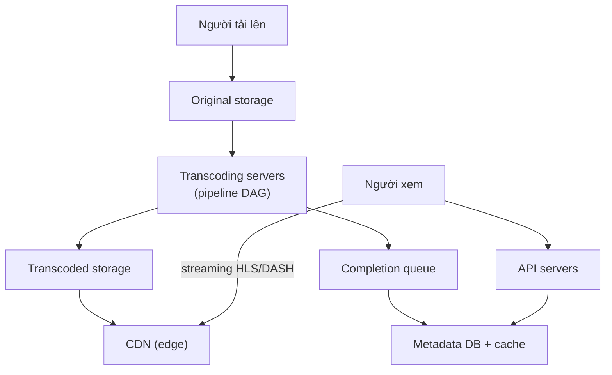

**Đánh đổi:** **Adaptive bitrate streaming** đổi chất lượng theo băng thông thực tế để trải
nghiệm mượt (không giật). Tối ưu chi phí: chỉ đẩy video *phổ biến* lên CDN (chiếm phần lớn
lượt xem), video ít xem phục vụ trực tiếp từ storage server; phân tầng lưu trữ theo tần suất
truy cập (hot/cold). Upload nối tiếp (resumable) để không phải làm lại từ đầu khi mạng gián
đoạn. Xử lý lỗi ở từng tầng để một video hỏng không kéo sập pipeline.

---

## Chương 15: Thiết kế Google Drive (Design Google Drive)

**Vấn đề:** Thiết kế dịch vụ lưu trữ và đồng bộ file (Google Drive/Dropbox): upload/download,
đồng bộ trên nhiều thiết bị, lịch sử phiên bản (revision history), chia sẻ file, và thông
báo khi có thay đổi. Yêu cầu then chốt: tối ưu băng thông, độ tin cậy cao (không mất dữ
liệu) và **nhất quán mạnh (strong consistency)** cho metadata.

**Tiến hoá kiến trúc:** từ single server → sharding metadata theo `user_id`, lưu file trên
**Amazon S3** (nhân bản same-region và cross-region chống mất dữ liệu và giảm độ trễ), thêm
load balancer, tách riêng web servers / metadata DB / file storage.

**Điểm cốt lõi — block servers và delta sync:** file được chia thành các **block** nhỏ
(Dropbox dùng tối đa 4 MB/block); mỗi block được **nén (compression)** và **mã hoá
(encryption)** trước khi lên cloud. Dùng **delta sync** — chỉ đồng bộ những block *thay đổi*
thay vì cả file — giúp tiết kiệm băng thông đáng kể khi file lớn chỉ sửa một phần nhỏ.

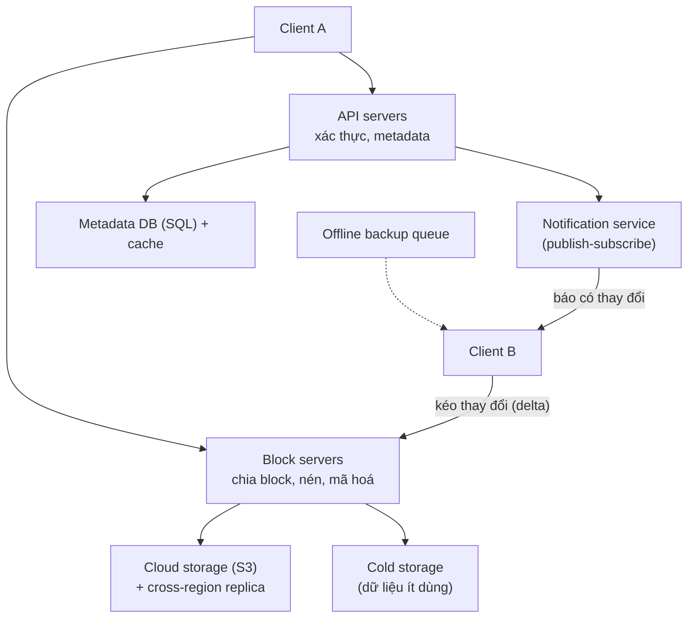

**Đánh đổi nhất quán:** Hệ chọn **strong consistency** cho metadata (không chấp nhận file
hiển thị khác nhau giữa các client) → dùng **cơ sở dữ liệu quan hệ** (hỗ trợ ACID sẵn) và
**vô hiệu hoá cache khi ghi** (thay vì eventual consistency), đánh đổi một phần hiệu năng
đọc để đảm bảo đúng đắn. **Xung đột đồng bộ (sync conflict)** xử lý theo nguyên tắc "phiên
bản được xử lý trước thắng"; phiên bản đến sau nhận thông báo conflict để người dùng tự
merge hoặc override.

**Schema metadata** gồm các bảng: User, Device, Namespace, File, File_version (read-only để
giữ lịch sử phiên bản), Block. **Notification service** dùng mô hình publish-subscribe báo
client kéo thay đổi; **offline backup queue** giữ thay đổi cho client đang offline để đồng
bộ khi trực tuyến lại.

---

## Chương 16: Học tiếp (The Learning Continues)

**Nội dung:** Chương cuối không phải một bài thiết kế mà là định hướng học tập tiếp tục.
Thiết kế hệ thống là kỹ năng rèn luyện lâu dài; không thể "học thuộc" mà phải tích luỹ qua
đọc, thực hành và phản tư về trade-off. Cách hiệu quả nhất là nghiên cứu kiến trúc thực tế
của các công ty lớn và các paper kinh điển.

**Gợi ý của tác giả:**

- Đọc **engineering blog** của các công ty lớn (Facebook, Twitter, Netflix, Amazon, Google,
  Uber, Airbnb, Dropbox, LinkedIn...) để học cách họ giải quyết vấn đề ở quy mô thật.
- Tìm hiểu sâu các nền tảng cốt lõi: cân bằng tải, cơ sở dữ liệu (SQL/NoSQL), caching,
  sharding, replication, hệ phân tán, xử lý dòng dữ liệu (stream processing), đồng thuận
  (consensus — Paxos/Raft), microservices, message queue.
- Đọc các paper được trích dẫn xuyên suốt sách: Dynamo, Bigtable, Cassandra, GFS, MapReduce,
  Kafka, Chubby, Spanner...

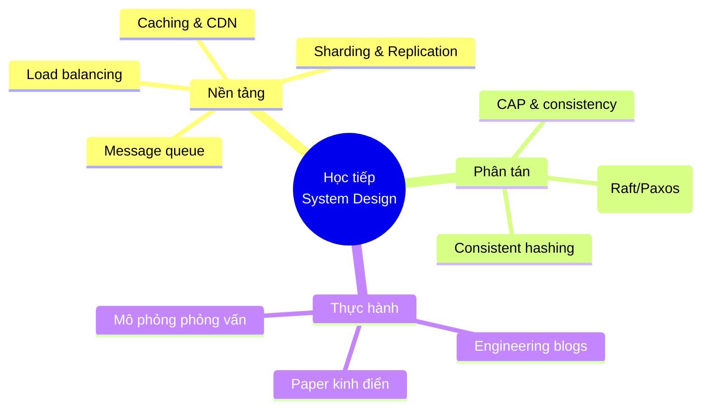

**Thông điệp chính:** Không có thiết kế "đúng" duy nhất; giá trị nằm ở việc hiểu **trade-off**,
biết đặt câu hỏi làm rõ, và liên tục thực hành. Kiến thức nền vững cùng khung tư duy 4 bước
(chương 3) là hành trang để tiếp cận bất kỳ câu hỏi thiết kế hệ thống mới nào.
